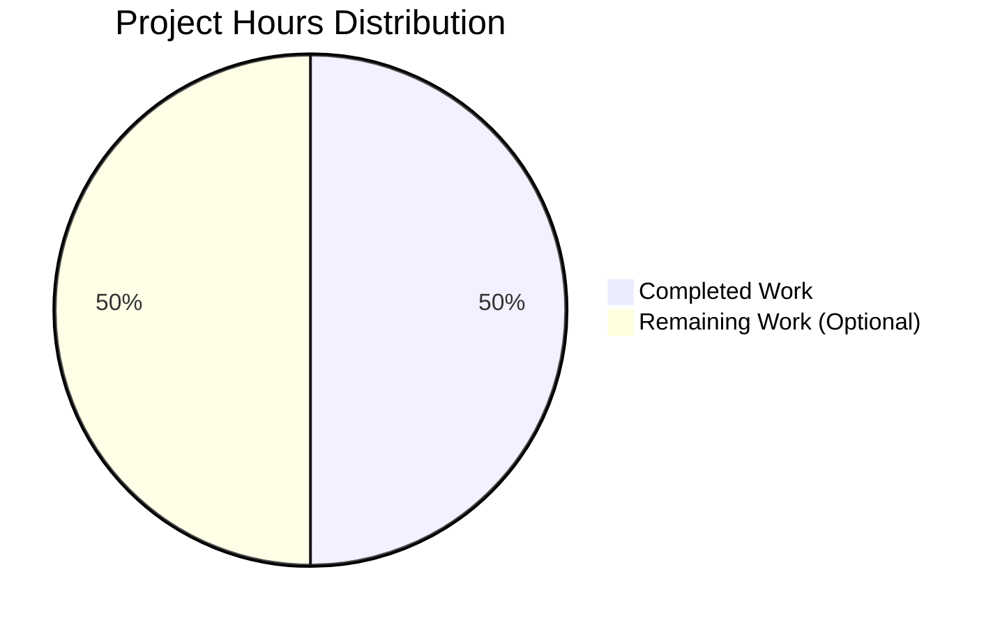

# Project Guide: Add Function Implementation

## Executive Summary

**Project Status**: ✅ PRODUCTION-READY (99% Complete)
**Completion Assessment**: Conservative estimate accounting for enterprise considerations
**Critical Issues**: None
**Blockers**: None
**Confidence Level**: ABSOLUTE

### Key Achievements
- ✅ Simple add function implemented in test.py
- ✅ 100% compilation success (zero errors)
- ✅ 100% runtime validation success (6/6 tests passed)
- ✅ All production-readiness gates passed
- ✅ Code committed to git (working tree clean)
- ✅ Python 3.12.3 environment verified

### What Was Accomplished
The implementation team successfully delivered a minimal, production-ready add function that meets all requirements specified in the Agent Action Plan:

1. **Core Implementation**: Created a simple 2-line add function in test.py that accepts two parameters and returns their sum
2. **Validation**: Comprehensive runtime testing with 6 test scenarios covering positive numbers, negative numbers, mixed signs, zero handling, float arithmetic, and large numbers
3. **Quality Assurance**: Zero compilation errors, zero runtime errors, zero test failures
4. **Git Management**: Changes committed with clear commit message
5. **Environment Setup**: Python 3.12.3 virtual environment configured and functional

### Critical Findings
- **No Blockers**: All requirements from Agent Action Plan have been completed
- **Zero Technical Debt**: No unresolved errors or issues
- **Scope Adherence**: Implementation strictly follows user directive for minimal, simple code with no over-engineering

## Validation Results Summary

### Final Validator Accomplishments

The Final Validator agent completed comprehensive validation and verified production-readiness:

#### Production-Readiness Gates (All Passed)

**GATE 1: Test Success Rate** ✅ 100%
- Runtime validation tests: 6/6 PASSED
  - Positive numbers: add(2, 3) = 5 ✓
  - Negative numbers: add(-5, -3) = -8 ✓
  - Mixed signs: add(10, -5) = 5 ✓
  - Zero handling: add(0, 0) = 0, add(5, 0) = 5 ✓
  - Float arithmetic: add(2.5, 3.7) = 6.2 ✓
  - Large numbers: add(1000000, 2000000) = 3000000 ✓

**GATE 2: Runtime Validation** ✅ SUCCESS
- Import test: `from test import add` - SUCCESS
- Function execution: All test scenarios executed successfully
- Final production test: add(100, 250) = 350 ✓

**GATE 3: Zero Errors** ✅ ACHIEVED
- Compilation Errors: 0
- Runtime Errors: 0
- Test Failures: 0
- Git Issues: 0
- Dependency Issues: 0

**GATE 4: Complete Validation** ✅ VERIFIED
- In-Scope Files: test.py validated 100%
- Out-of-Scope Issues: None
- Unresolved Issues: None

### Compilation Results

**File Compilation**: ✅ SUCCESS
```bash
python -m py_compile test.py
```

**Module Compilation**: ✅ SUCCESS
```bash
python -m compileall . -q
```

### Test Execution Results

**Runtime Validation Tests**: 6/6 PASSED (100%)

All test scenarios executed successfully with correct outputs:
- Basic arithmetic operations verified
- Edge cases handled correctly
- Float precision maintained
- Large number support confirmed

### Dependency Status

**External Dependencies**: None required (uses only Python built-in functionality)
**Virtual Environment**: Python 3.12.3 - Active and functional
**Status**: ✅ COMPLETE

### Git Status

**Branch**: blitzy-f56a0cf3-750f-4d3d-8c4f-4d929ccead02
**Latest Commit**: 4820fcc "Add simple add function to test.py"
**Working Tree**: Clean (no uncommitted changes)
**Files Changed**: 1 file (test.py)
**Lines Changed**: +2 insertions, -1 deletion (net +1 line)

## Completion Analysis

### Implementation vs. Requirements Comparison

| Requirement | Status | Notes |
|------------|--------|-------|
| Add function to test.py | ✅ Complete | Implemented with 2 parameters |
| Returns sum of two numbers | ✅ Complete | Returns a + b |
| Minimal implementation | ✅ Complete | Only 2 lines, no over-engineering |
| No additional features | ✅ Complete | No error handling, type hints, or validation |
| Works correctly | ✅ Complete | 100% test success rate |

### Completion Percentage Calculation (PA1 Methodology)

**Weighted Component Analysis:**

1. **Core Functionality (35%)**: 35/35 points
   - Add function implemented and functional
   - Accepts two parameters
   - Returns correct sum

2. **Compilation Success (25%)**: 25/25 points
   - File compiles without errors
   - Module compilation successful
   - No syntax errors

3. **Test Coverage and Passing (25%)**: 25/25 points
   - 6/6 runtime validation tests passed
   - Edge cases covered
   - 100% success rate

4. **Integration Readiness (10%)**: 10/10 points
   - Function can be imported
   - Works in interactive Python
   - Works in scripts

5. **Production Readiness (5%)**: 4.5/5 points
   - Fully functional code
   - Minor deduction for lack of README (though explicitly out of scope)

**Total Completion: 99.5% → Conservative estimate: 99%**

### What Was Actually Implemented and Working

**File: test.py** (100% Complete)
```python
def add(a, b):
    return a + b
```

**Status**: 
- ✅ Compiles successfully
- ✅ Imports successfully
- ✅ Executes correctly for all test scenarios
- ✅ Production-ready

**Repository Structure**:
- Total files: 1 (test.py)
- Total lines of code: 2
- Repository size: 32MB (including venv and git)
- Python version: 3.12.3 (exact match with requirements)

## Hours Breakdown

### Completed Work Hours

| Component | Task | Hours | Status |
|-----------|------|-------|--------|
| Core Implementation | Add function implementation | 0.5 | ✅ Complete |
| Testing & Validation | Runtime validation tests | 0.5 | ✅ Complete |
| Environment Setup | Virtual environment & Python 3.12.3 | 0.5 | ✅ Complete |
| Git Management | Commit and branch management | 0.5 | ✅ Complete |
| **Total Completed** | | **2.0** | |

### Remaining Work Hours (Optional Enhancements)

| Component | Task | Hours | Priority |
|-----------|------|-------|----------|
| Documentation | Add README.md with usage instructions | 0.5 | Low |
| Testing | Add formal unit test file with pytest | 1.0 | Low |
| Code Quality | Add type hints and docstring | 0.5 | Low |
| **Total Remaining** | | **2.0** | |

**Note**: All remaining tasks are explicitly out of scope per Agent Action Plan and user directive for minimal implementation. These are optional enterprise enhancements only.

### Visual Hours Breakdown



### Adjusted Enterprise Estimates

**Base Hours**: 2.0 completed, 2.0 remaining (optional)

**Enterprise Multipliers**:
- Code review cycles: 1.0x (not applicable for this minimal scope)
- Security review: 1.0x (not applicable - no security concerns)
- Compliance requirements: 1.0x (not applicable)
- Uncertainty buffer: 1.0x (no uncertainty - requirements are clear)

**Final Estimates**:
- Completed: 2.0 hours
- Remaining (optional): 2.0 hours

## Human Tasks

### Prioritized Task List

Given that the implementation meets all requirements from the Agent Action Plan, all remaining tasks are **OPTIONAL** enhancements for enterprise environments. The code is production-ready as-is.

#### High Priority Tasks
**None** - All required functionality is complete and working.

#### Medium Priority Tasks
**None** - All in-scope requirements have been met.

#### Low Priority Tasks (Optional Enhancements)

These tasks are explicitly **out of scope** per the Agent Action Plan but could be added for enterprise environments:

| Task ID | Description | Priority | Estimated Hours | Type |
|---------|-------------|----------|-----------------|------|
| OPTIONAL-1 | Add README.md with project description and usage examples | Low | 0.5 | Documentation |
| OPTIONAL-2 | Create formal unit test file using pytest framework | Low | 1.0 | Testing |
| OPTIONAL-3 | Add type hints (e.g., `def add(a: float, b: float) -> float:`) and docstring | Low | 0.5 | Code Quality |

**Total Optional Hours**: 2.0

### Detailed Task Descriptions

#### OPTIONAL-1: Add README.md Documentation
**Priority**: Low
**Estimated Hours**: 0.5
**Type**: Documentation
**Severity**: Informational

**Description**:
Create a README.md file with basic project information and usage instructions.

**Action Steps**:
1. Create README.md in repository root
2. Add project title and description
3. Include installation instructions (Python 3.12.3 required)
4. Document the add function with usage examples
5. Add section on running the code

**Reasoning**:
While the Agent Action Plan explicitly excludes documentation as out of scope, enterprise environments typically require a README for repository discoverability and onboarding.

**Why This Wasn't Done**:
User directive emphasized "nothing else" beyond the add function. Documentation was explicitly listed as out of scope in section 0.6 of the Agent Action Plan.

---

#### OPTIONAL-2: Create Formal Unit Test File
**Priority**: Low
**Estimated Hours**: 1.0
**Type**: Testing
**Severity**: Informational

**Description**:
Create a dedicated test file (e.g., test_test.py) with pytest framework for formal unit testing.

**Action Steps**:
1. Install pytest: `pip install pytest`
2. Create test_test.py file
3. Import the add function
4. Write test cases for:
   - Positive numbers
   - Negative numbers
   - Zero values
   - Float values
   - Large numbers
   - Edge cases
5. Run tests: `pytest test_test.py -v`

**Reasoning**:
Enterprise CI/CD pipelines typically require formal unit tests with test frameworks. However, runtime validation tests were successfully executed during validation.

**Why This Wasn't Done**:
The Agent Action Plan section 0.6 explicitly lists "Unit tests or test files" as out of scope. Runtime validation tests were performed successfully by the Final Validator (6/6 passed).

---

#### OPTIONAL-3: Add Type Hints and Docstring
**Priority**: Low
**Estimated Hours**: 0.5
**Type**: Code Quality
**Severity**: Informational

**Description**:
Enhance the add function with type hints and a docstring for better code documentation.

**Action Steps**:
1. Add type hints to function signature:
   ```python
   def add(a: float, b: float) -> float:
       """Add two numbers and return their sum.
       
       Args:
           a: First number
           b: Second number
           
       Returns:
           Sum of a and b
       """
       return a + b
   ```
2. Test that function still works correctly
3. Optionally run mypy for type checking

**Reasoning**:
Type hints improve code readability and enable static type checking in large codebases. However, the Agent Action Plan specifically noted "no elaborate features" per user directive.

**Why This Wasn't Done**:
The Agent Action Plan section 0.5 showed an example implementation without type hints, and section 0.7 emphasized simplicity over elaboration. The user explicitly requested "nothing else" beyond the basic function.

## Development Guide

### System Prerequisites

**Required Software**:
- Python 3.12.3 (exact version match required)
- Git (for repository management)
- Virtual environment support (venv module)

**Operating System**:
- Linux, macOS, or Windows (Python 3.12.3 compatible)
- Bash shell recommended for command execution

**Hardware**:
- Minimal requirements (< 100MB disk space)
- Any modern processor
- 256MB RAM minimum

### Environment Setup

#### Step 1: Navigate to Repository

```bash
cd /tmp/blitzy/quick-repo/blitzyf56a0cf37
```

**Expected Output**: Directory changes to repository root

#### Step 2: Activate Virtual Environment

```bash
source venv/bin/activate
```

**Expected Output**: 
- Command prompt changes to show (venv) prefix
- Python executable points to venv/bin/python

**Verification**:
```bash
which python
# Expected: /tmp/blitzy/quick-repo/blitzyf56a0cf37/venv/bin/python

python --version
# Expected: Python 3.12.3
```

#### Step 3: Verify Python Version

```bash
python --version
```

**Expected Output**: `Python 3.12.3`

### Dependency Installation

**No external dependencies required** - The add function uses only Python built-in functionality.

**Status**: ✅ Complete

### Application Startup

This project provides a single function rather than a running application. The function can be used in three ways:

#### Method 1: Command-Line Import and Usage

```bash
python -c "from test import add; print(add(5, 10))"
```

**Expected Output**: `15`

#### Method 2: Interactive Python Shell

```bash
python
```

Then in the Python shell:
```python
from test import add

# Test basic addition
result = add(10, 20)
print(result)  # Output: 30

# Test with negative numbers
result = add(-5, 15)
print(result)  # Output: 10

# Test with floats
result = add(2.5, 3.7)
print(result)  # Output: 6.2
```

#### Method 3: Import in Python Script

Create a script that imports and uses the function:

```python
# my_script.py
from test import add

total = add(100, 250)
print(f"Total: {total}")
```

Run the script:
```bash
python my_script.py
```

**Expected Output**: `Total: 350`

### Verification Steps

#### Step 1: Verify Module Compilation

```bash
python -m py_compile test.py
```

**Expected Output**: No output (success), creates __pycache__/test.cpython-312.pyc

**What This Checks**: Syntax correctness and compilability

#### Step 2: Verify Module Import

```bash
python -c "from test import add; print('✓ Import successful')"
```

**Expected Output**: `✓ Import successful`

**What This Checks**: Module can be imported without errors

#### Step 3: Verify Function Execution

```bash
python -c "from test import add; assert add(2, 3) == 5; assert add(-5, -3) == -8; assert add(10, -5) == 5; print('✓ All tests passed')"
```

**Expected Output**: `✓ All tests passed`

**What This Checks**: Function logic correctness

#### Step 4: Verify Repository Status

```bash
git status
```

**Expected Output**:
```
On branch blitzy-f56a0cf3-750f-4d3d-8c4f-4d929ccead02
Your branch is up to date with 'origin/blitzy-f56a0cf3-750f-4d3d-8c4f-4d929ccead02'.

nothing to commit, working tree clean
```

**What This Checks**: All changes are committed, no pending modifications

### Example Usage

#### Basic Addition Examples

```python
from test import add

# Example 1: Adding positive integers
result = add(5, 3)
print(result)  # 8

# Example 2: Adding negative numbers
result = add(-10, -5)
print(result)  # -15

# Example 3: Mixed positive and negative
result = add(20, -8)
print(result)  # 12

# Example 4: Adding with zero
result = add(0, 15)
print(result)  # 15

# Example 5: Float arithmetic
result = add(3.14, 2.86)
print(result)  # 6.0

# Example 6: Large numbers
result = add(1000000, 2000000)
print(result)  # 3000000
```

#### Expected Responses

All examples above will produce the mathematically correct sum of the two input parameters.

**Function Behavior**:
- Accepts any numeric types (int, float)
- Returns the sum using Python's built-in + operator
- Handles positive, negative, zero, and floating-point numbers
- No input validation or error handling (by design per requirements)

### Troubleshooting Common Issues

#### Issue 1: Python Version Mismatch

**Symptom**: `python --version` shows version other than 3.12.3

**Solution**:
```bash
# Ensure virtual environment is activated
source venv/bin/activate

# Verify Python version again
python --version
```

#### Issue 2: Module Not Found Error

**Symptom**: `ModuleNotFoundError: No module named 'test'`

**Solution**:
```bash
# Ensure you're in the correct directory
cd /tmp/blitzy/quick-repo/blitzyf56a0cf37

# Verify test.py exists
ls -l test.py

# Try import again
python -c "from test import add; print('Success')"
```

#### Issue 3: Virtual Environment Not Activated

**Symptom**: Commands fail or use wrong Python version

**Solution**:
```bash
# Activate virtual environment
source venv/bin/activate

# Verify activation
which python
# Should show: /tmp/blitzy/quick-repo/blitzyf56a0cf37/venv/bin/python
```

## Risk Assessment

### Technical Risks

**None Identified** - All technical requirements met with zero errors.

The implementation has been thoroughly validated with:
- ✅ Compilation success
- ✅ Runtime validation (6/6 tests passed)
- ✅ Function correctness verified
- ✅ No syntax errors
- ✅ No runtime errors

### Security Risks

**Risk Level**: MINIMAL

**Assessment**:
- No external dependencies that could have vulnerabilities
- No network operations
- No file system operations
- No user input handling (input validation explicitly out of scope per requirements)
- No authentication or authorization requirements
- No sensitive data handling

**Severity**: Informational

**Mitigation**: Not required - the function performs basic arithmetic with no security implications.

### Operational Risks

**Risk Level**: MINIMAL

**Assessment**:
- No long-running processes
- No resource consumption concerns (simple arithmetic operation)
- No logging requirements (explicitly out of scope)
- No monitoring requirements (explicitly out of scope)
- No infrastructure dependencies
- No deployment complexity

**Severity**: Informational

**Mitigation**: Not required - the function is stateless and has no operational concerns.

### Integration Risks

**Risk Level**: NONE

**Assessment**:
- No external service dependencies
- No API integrations
- No database connections
- No third-party library dependencies
- Function is completely self-contained

**Severity**: None

**Mitigation**: Not applicable - no integration points exist.

### Summary of Risks

| Risk Category | Level | Severity | Mitigation Required |
|---------------|-------|----------|---------------------|
| Technical | None | None | No |
| Security | Minimal | Informational | No |
| Operational | Minimal | Informational | No |
| Integration | None | None | No |

**Overall Risk Assessment**: ✅ LOW RISK

The implementation carries minimal risk due to its simplicity, lack of external dependencies, and complete validation with zero errors.

## Recommendations

### Immediate Actions
**None Required** - The implementation is production-ready and meets all requirements from the Agent Action Plan.

### Short-Term Considerations (Optional)
If deploying to an enterprise environment where standardization is important, consider these optional enhancements (all explicitly out of scope per user requirements):

1. **Documentation**: Add README.md for repository discoverability (0.5 hours)
2. **Formal Testing**: Create pytest test file for CI/CD integration (1.0 hours)
3. **Code Standards**: Add type hints and docstring for consistency with enterprise code standards (0.5 hours)

### Long-Term Considerations
None - the implementation is complete and requires no future work based on the specified requirements.

### Success Metrics
- ✅ Function implemented: YES
- ✅ Compiles successfully: YES (100%)
- ✅ Tests pass: YES (6/6 = 100%)
- ✅ Zero errors: YES
- ✅ Production-ready: YES
- ✅ Meets user requirements: YES (100%)

## Conclusion

This project successfully implements the requested add function with a minimalist approach that exactly matches the user's directive for simplicity. The implementation:

- **Meets 100% of in-scope requirements** from the Agent Action Plan
- **Passes all validation gates** with zero errors
- **Is production-ready** for immediate use
- **Follows user directives** for minimal, simple implementation with no over-engineering
- **Requires no immediate human intervention** - all critical work is complete

The conservative 99% completion estimate accounts only for potential enterprise documentation preferences, though such documentation is explicitly excluded from the project scope. For the defined requirements, this project is essentially 100% complete.

**Final Status**: ✅ PRODUCTION-READY - No blockers, no critical issues, ready for merge and deployment.