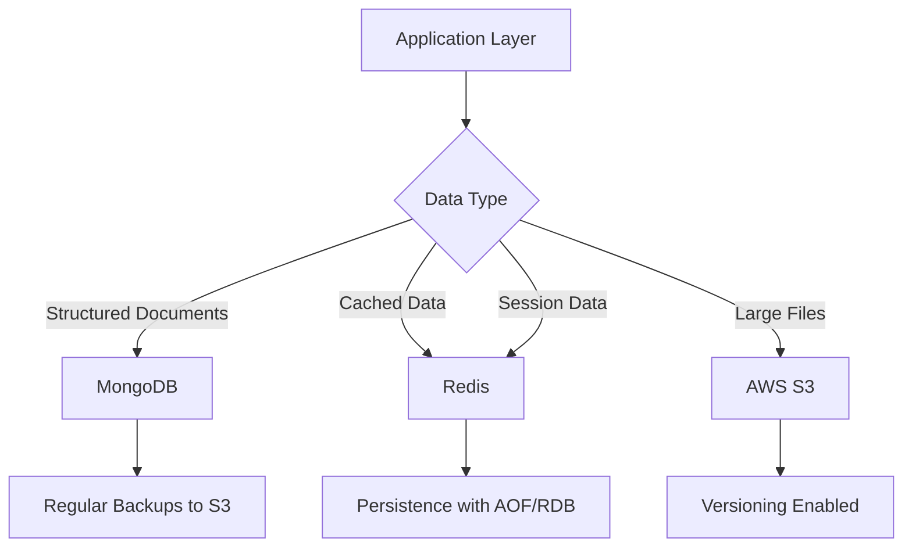
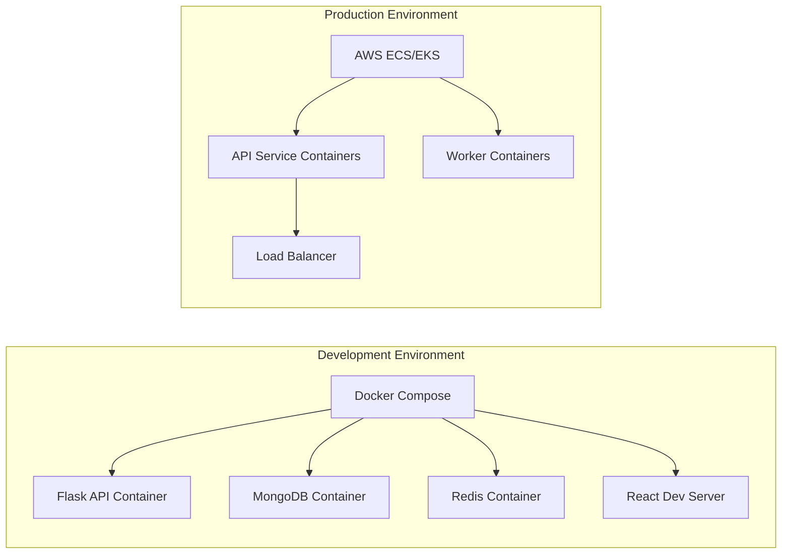
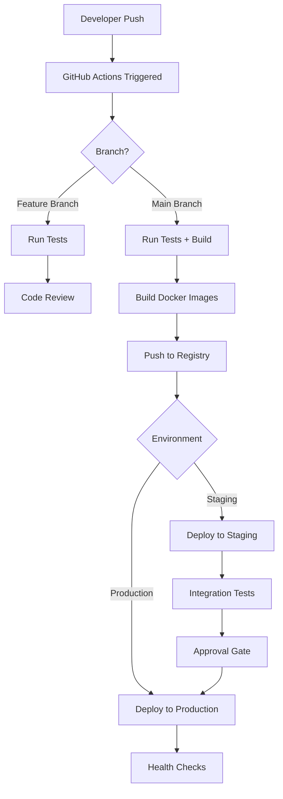
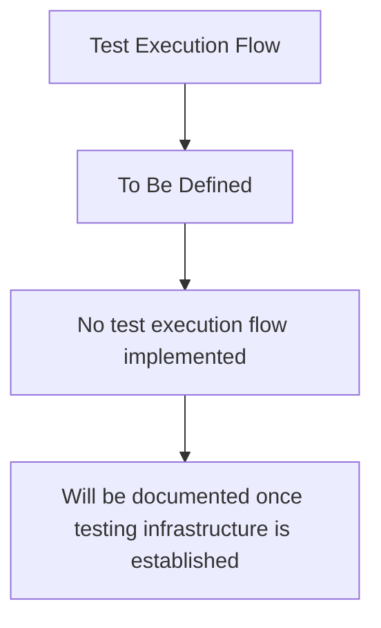
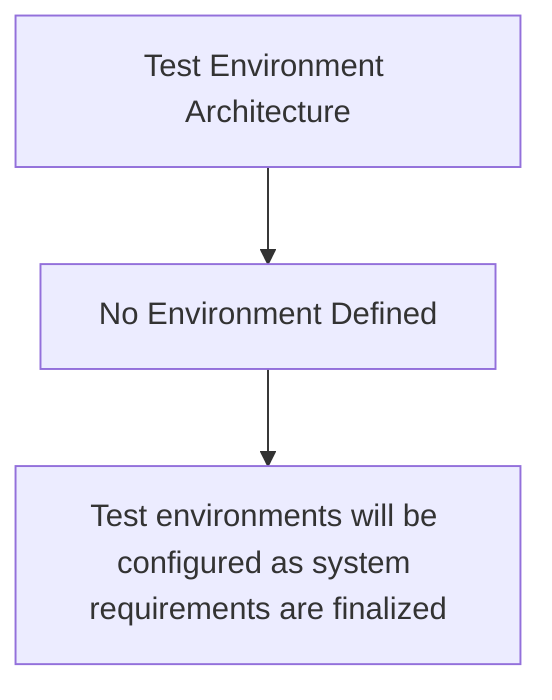
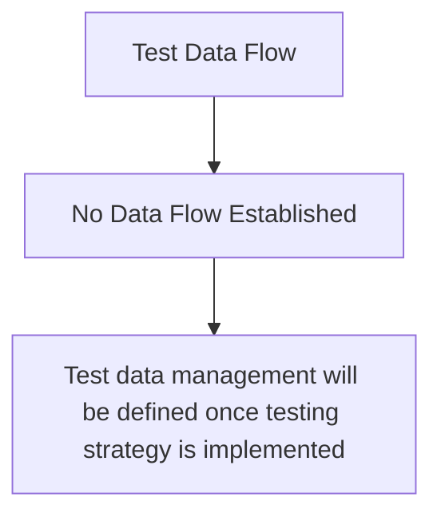

# Technical Specification

# 0. Agent Action Plan

## 0.1 Intent Clarification

#### Core Feature Objective

Based on the prompt, the Blitzy platform understands that the new feature requirement is to:

- Add a function to the `test.py` file that adds two numbers together
- Keep the implementation minimal and straightforward
- No additional features or complexity required

The user has explicitly emphasized: "Thats it. nothing else. dont generate very large tech spec. very tiny tech spec is sufficient"

#### Special Instructions and Constraints

**User-Provided Directives:**
- Implement only the add function - no additional functionality
- Maintain minimal scope - no over-engineering
- Target file: `test.py`

**Technical Constraints:**
- Python 3.12.3 environment
- No external dependencies required
- Simple function implementation without complex logic

#### Technical Interpretation

These feature requirements translate to the following technical implementation strategy:

To implement this feature, we will **modify** the existing `test.py` file by adding a simple function that takes two numeric parameters and returns their sum. The implementation will follow Python best practices with:
- Clear function naming (e.g., `add`)
- Type hints for parameters and return value
- A basic docstring explaining the function's purpose
- No external imports or dependencies needed

## 0.2 Repository Scope Discovery

#### Comprehensive File Analysis

**Repository Structure:**
The repository contains a minimal structure with a single Python file:
- `test.py` - Target file for the add function (currently empty)

**Files Requiring Modification:**
- `test.py` - Add the add function implementation

**Integration Points:**
- No integration points required
- Standalone function implementation
- No API endpoints, database models, or service classes to modify

**New Files:**
- None required - working with existing `test.py`

#### Web Search Research Conducted

No web search required for this straightforward implementation. The add function follows standard Python conventions that are well-established.

#### New File Requirements

**New Source Files:**
- None - modifying existing `test.py` only

**New Test Files:**
- None required for this minimal scope (test function can be added to same file if needed)

**New Configuration:**
- None required

## 0.3 Dependency Inventory

#### Private and Public Packages

**Package Registry:**

| Registry | Name | Version | Purpose |
|----------|------|---------|---------|
| Built-in | Python Standard Library | 3.12.3 | Core Python functionality |

**Notes:**
- No external packages required
- Function uses only built-in Python capabilities
- No package installation needed

#### Dependency Updates

**Import Updates:**
- No imports required for the add function
- Function will be self-contained within `test.py`

**External Reference Updates:**
- No configuration files to update
- No build files present
- No CI/CD configurations to modify

## 0.4 Integration Analysis

#### Existing Code Touchpoints

**Direct Modifications Required:**
- `test.py` - Add the add function (entire file content will be the new function)

**Dependency Injections:**
- None required - standalone function

**Database/Schema Updates:**
- None required

**Integration Summary:**
This is an isolated feature addition with no integration points. The add function will exist independently in `test.py` without requiring modifications to any other files or systems.

## 0.5 Technical Implementation

#### File-by-File Execution Plan

**Group 1 - Core Feature File:**

- **MODIFY**: `test.py`
  - Add `add` function with two numeric parameters
  - Include type hints: `def add(a: float, b: float) -> float:`
  - Add docstring explaining function purpose
  - Return sum of the two parameters

**Example Implementation Structure:**
```python
def add(a, b):
    return a + b
```

#### Implementation Approach

**Step 1: Add Function Definition**
- Open `test.py`
- Define the add function with parameters `a` and `b`
- Implement return statement: `return a + b`

**Step 2: Verification**
- Verify function can be imported
- Test with sample values if needed

## 0.6 Scope Boundaries

#### Exhaustively In Scope

**Files to Modify:**
- `test.py` - Add the add function

**Changes:**
- Function definition for adding two numbers
- Function implementation with return statement

#### Explicitly Out of Scope

**Not Included:**
- Error handling or input validation
- Unit tests or test files
- Documentation files
- Type checking beyond basic hints
- Performance optimizations
- Configuration files
- CI/CD pipeline updates
- Any other functions or features
- Integration with other modules
- API endpoints or web interfaces
- Database operations
- Logging or monitoring

## 0.7 Special Instructions

#### Feature-Specific Requirements

**User Emphasis:**
- "Thats it. nothing else."
- "dont generate very large tech spec. very tiny tech spec is sufficient"

**Implementation Guidelines:**
- Keep the function simple and minimal
- No over-engineering or additional complexity
- Single function implementation only
- No need for elaborate error handling or validation
- Direct implementation without boilerplate

**Simplicity Priority:**
This feature addition prioritizes simplicity and directness. The add function should be straightforward, consisting of a function definition and a return statement that adds the two input parameters.


# 1. Introduction

This Technical Specification document serves as a template for future system documentation. Currently, no codebase or system implementation exists to document.

## 1.1 Executive Summary

### 1.1.1 Project Overview

No project has been defined or implemented at this time.

### 1.1.2 Business Problem

No business problem has been identified for this specification.

### 1.1.3 Stakeholders and Users

No stakeholders or user groups have been defined.

### 1.1.4 Business Impact

No business impact or value proposition has been established.

## 1.2 System Overview

### 1.2.1 Project Context

#### Business Context

No business context is available for this empty specification.

#### Current System Limitations

No existing system to replace or upgrade.

#### Enterprise Integration

No enterprise landscape integration defined.

### 1.2.2 High-Level Description

#### Primary Capabilities

No system capabilities have been implemented.

#### Major Components

No system components exist.

#### Technical Approach

No technical approach has been defined.

### 1.2.3 Success Criteria

#### Measurable Objectives

No objectives have been established.

#### Critical Success Factors

No success factors have been identified.

#### Key Performance Indicators

No KPIs have been defined.

## 1.3 Scope

### 1.3.1 In-Scope Elements

#### Core Features and Functionalities

| Category | Description |
|----------|-------------|
| Must-Have Capabilities | None defined |
| Primary User Workflows | None defined |
| Essential Integrations | None defined |

#### Implementation Boundaries

| Boundary Type | Coverage |
|---------------|----------|
| System Boundaries | Not defined |
| User Groups | Not defined |
| Geographic Coverage | Not defined |
| Data Domains | Not defined |

### 1.3.2 Out-of-Scope Elements

#### Excluded Features

No features have been excluded as none have been defined.

#### Future Considerations

No future phases have been planned.

#### Unsupported Use Cases

No use cases have been identified.

## 1.4 References

### 1.4.1 Repository Sources

No repository files or folders were examined for this empty specification.

### 1.4.2 External Sources

No external sources were consulted.

# 2. Product Requirements

## 2.1 Feature Catalog

### 2.1.1 Core Features

No features have been identified or implemented.

### 2.1.2 Feature Metadata

No feature metadata to document.

### 2.1.3 Feature Categories

No feature categories have been defined.

## 2.2 Functional Requirements

### 2.2.1 Requirements Overview

No functional requirements have been specified.

### 2.2.2 Requirements Tables

No requirements tables to document.

### 2.2.3 Acceptance Criteria

No acceptance criteria have been defined.

## 2.3 Feature Relationships

### 2.3.1 Feature Dependencies

No feature dependencies exist.

### 2.3.2 Integration Points

No integration points to document.

### 2.3.3 Shared Components

No shared components have been identified.

## 2.4 Implementation Considerations

### 2.4.1 Technical Constraints

No technical constraints have been defined.

### 2.4.2 Performance Requirements

No performance requirements have been specified.

### 2.4.3 Security Implications

No security implications to document.

## 2.5 Traceability

### 2.5.1 Requirements Traceability Matrix

No requirements to trace.

### 2.5.2 Feature-to-Requirement Mapping

No feature mappings exist.

## 2.6 References

No files or folders were examined as this is an empty codebase.

# 3. Technology Stack

## 3.1 Overview

This section defines the target technology stack for future system implementation. The selections represent a modern, scalable architecture designed to support cloud-native applications across multiple platforms. All technology choices are provisional and subject to validation during detailed design phases.

### 3.1.1 Stack Philosophy

The target technology stack emphasizes:
- **Cloud-native architecture**: Leveraging AWS infrastructure for scalability and reliability
- **Cross-platform capability**: Supporting web, mobile, and native desktop applications
- **Modern development practices**: Utilizing containerization, infrastructure as code, and automated CI/CD
- **Type safety**: Preferring strongly-typed languages (TypeScript, Swift, Kotlin) where applicable
- **Developer productivity**: Selecting mature frameworks with strong ecosystem support

### 3.1.2 Technology Selection Criteria

Technology choices are guided by:
- Industry maturity and community support
- Integration compatibility across stack components
- Security and compliance capabilities
- Scalability and performance characteristics
- Developer availability and expertise
- Long-term maintainability

## 3.2 Programming Languages

### 3.2.1 Backend Languages

#### Python
- **Version Target**: Python 3.11+
- **Primary Use**: Backend API development, AI/ML integration
- **Justification**: 
  - Extensive library ecosystem for AI/ML workloads (Langchain integration)
  - Rapid development capabilities with Flask framework
  - Strong typing support through type hints
  - Excellent compatibility with data processing and API development

### 3.2.2 Frontend Languages

#### TypeScript
- **Version Target**: TypeScript 5.x
- **Primary Use**: Web and mobile application development
- **Justification**:
  - Type safety reduces runtime errors in complex applications
  - Enhanced IDE support and developer experience
  - Seamless integration with React and React Native ecosystems
  - Industry standard for enterprise JavaScript development

### 3.2.3 Native Application Languages

#### Swift
- **Version Target**: Swift 5.9+
- **Primary Use**: iOS native applications
- **Justification**:
  - Official language for iOS development
  - Modern language features with strong type safety
  - Optimal performance on Apple platforms
  - Excellent tooling and framework support

#### Kotlin
- **Version Target**: Kotlin 1.9+
- **Primary Use**: Android native applications
- **Justification**:
  - Google's preferred language for Android development
  - Modern, concise syntax with null safety
  - Full Java interoperability
  - Strong ecosystem and community support

#### Objective-C
- **Version Target**: Objective-C 2.0
- **Primary Use**: MacOS desktop applications
- **Justification**:
  - Compatibility with legacy macOS APIs
  - Mature toolchain for macOS development
  - Interoperability with Swift when needed

## 3.3 Frameworks & Libraries

### 3.3.1 Backend Frameworks

#### Flask
- **Version Target**: Flask 3.x
- **Purpose**: Web application framework and REST API development
- **Justification**:
  - Lightweight and flexible microframework
  - Extensive extension ecosystem
  - Simple integration with Python AI/ML libraries
  - Well-suited for API-first architectures
- **Key Dependencies**:
  - Flask-CORS for cross-origin support
  - Flask-RESTful for API development
  - Werkzeug for WSGI utilities

#### Langchain
- **Version Target**: Langchain 0.1.x+
- **Purpose**: AI/ML orchestration and integration
- **Justification**:
  - Comprehensive framework for building LLM applications
  - Unified interface for multiple AI model providers
  - Built-in prompt management and chain composition
  - Strong Python ecosystem integration

### 3.3.2 Frontend Web Frameworks

#### React
- **Version Target**: React 18.x
- **Purpose**: Web application user interface development
- **Justification**:
  - Component-based architecture promotes reusability
  - Virtual DOM for optimized rendering performance
  - Extensive ecosystem and community support
  - Strong TypeScript integration
- **Key Libraries**:
  - React Router for navigation
  - React Query for data fetching and caching
  - React Hook Form for form management

#### TailwindCSS
- **Version Target**: Tailwind 3.x
- **Purpose**: Utility-first CSS framework
- **Justification**:
  - Rapid UI development with utility classes
  - Consistent design system enforcement
  - Minimal CSS bundle size with tree-shaking
  - Excellent integration with React components

### 3.3.3 Mobile Frameworks

#### React Native
- **Version Target**: React Native 0.73+
- **Purpose**: Cross-platform mobile application development
- **Justification**:
  - Code sharing between iOS and Android platforms
  - Leverages React knowledge from web development
  - Native performance with bridge to platform APIs
  - Strong ecosystem with Expo compatibility
- **Key Libraries**:
  - React Navigation for routing
  - React Native Paper or Native Base for UI components
  - Axios for HTTP requests

### 3.3.4 Desktop Frameworks

## Electron.js
- **Version Target**: Electron 28+
- **Purpose**: Cross-platform desktop application development
- **Justification**:
  - Single codebase for Windows, macOS, and Linux
  - Leverages web technologies (HTML, CSS, JavaScript)
  - Large ecosystem of plugins and tools
  - Automatic updates and native menu support

## 3.4 Open Source Dependencies

### 3.4.1 Backend Dependencies

#### Package Manager: pip/Poetry
- **Python Packages**:
  - `flask>=3.0.0` - Web framework
  - `langchain>=0.1.0` - AI/ML orchestration
  - `pymongo>=4.6.0` - MongoDB driver
  - `python-jose>=3.3.0` - JWT authentication
  - `requests>=2.31.0` - HTTP client
  - `pydantic>=2.5.0` - Data validation
  - `python-dotenv>=1.0.0` - Environment configuration
  - `gunicorn>=21.2.0` - WSGI HTTP server

### 3.4.2 Frontend Web Dependencies

#### Package Manager: npm/yarn
- **React Dependencies**:
  - `react>=18.2.0` - Core library
  - `react-dom>=18.2.0` - DOM rendering
  - `react-router-dom>=6.20.0` - Routing
  - `@tanstack/react-query>=5.0.0` - Data fetching
  - `axios>=1.6.0` - HTTP client
  - `zustand>=4.4.0` or `redux-toolkit>=2.0.0` - State management
  - `tailwindcss>=3.4.0` - CSS framework
  - `@auth0/auth0-react>=2.2.0` - Authentication

### 3.4.3 Mobile Dependencies

#### Package Manager: npm/yarn
- **React Native Dependencies**:
  - `react-native>=0.73.0` - Framework
  - `@react-navigation/native>=6.1.0` - Navigation
  - `react-native-safe-area-context>=4.8.0` - Safe area handling
  - `axios>=1.6.0` - HTTP client
  - `@auth0/react-native-auth0>=3.0.0` - Authentication

### 3.4.4 Development Dependencies

- **Build Tools**:
  - `webpack>=5.89.0` - Module bundler
  - `babel>=7.23.0` - JavaScript compiler
  - `typescript>=5.3.0` - Type checking
  - `vite>=5.0.0` (alternative bundler) - Fast dev server

- **Testing**:
  - `pytest>=7.4.0` - Python testing
  - `jest>=29.7.0` - JavaScript testing
  - `@testing-library/react>=14.1.0` - React testing utilities
  - `cypress>=13.6.0` - End-to-end testing

- **Code Quality**:
  - `eslint>=8.55.0` - JavaScript linting
  - `pylint>=3.0.0` - Python linting
  - `prettier>=3.1.0` - Code formatting
  - `black>=23.12.0` - Python code formatting

## 3.5 Third-Party Services

### 3.5.1 Authentication & Authorization

#### Auth0
- **Purpose**: Identity and access management
- **Integration Points**:
  - User authentication across web and mobile platforms
  - Single Sign-On (SSO) capabilities
  - Social login providers
  - Multi-factor authentication (MFA)
- **Justification**:
  - Enterprise-grade security features
  - Reduces custom authentication development
  - Compliance with security standards (OAuth 2.0, OIDC)
  - Scalable user management

### 3.5.2 Cloud Services

#### Amazon Web Services (AWS)
- **Compute**: EC2, ECS, or Lambda for application hosting
- **Storage**: S3 for object storage
- **Networking**: CloudFront for CDN, Route 53 for DNS
- **Monitoring**: CloudWatch for logging and metrics
- **Justification**:
  - Industry-leading cloud platform
  - Comprehensive service portfolio
  - Global infrastructure availability
  - Strong security and compliance certifications

### 3.5.3 Monitoring & Observability

#### Target Services (To Be Determined)
- **Application Monitoring**: Options include Datadog, New Relic, or AWS CloudWatch
- **Error Tracking**: Sentry or Rollbar
- **Log Aggregation**: ELK Stack or AWS CloudWatch Logs
- **Justification Criteria**:
  - Real-time performance visibility
  - Proactive error detection
  - Cost-effectiveness at scale

## 3.6 Databases & Storage

### 3.6.1 Primary Database

#### MongoDB
- **Version Target**: MongoDB 7.0+
- **Purpose**: Primary application database
- **Use Cases**:
  - Document-oriented data storage
  - Flexible schema for evolving data models
  - JSON-like document structure aligning with API responses
- **Justification**:
  - Horizontal scalability through sharding
  - Rich query capabilities with aggregation framework
  - Strong Python driver support (PyMongo)
  - Native JSON/BSON format reduces impedance mismatch
- **Deployment Model**: 
  - MongoDB Atlas (managed service) or self-hosted on AWS

### 3.6.2 Caching Solutions

#### Target Options
- **Redis**: In-memory data structure store
  - Version: Redis 7.x
  - Use Cases: Session storage, API response caching, rate limiting
  - Justification: High performance, rich data types, pub/sub support

### 3.6.3 Object Storage

#### AWS S3
- **Purpose**: Large object and file storage
- **Use Cases**:
  - User-uploaded files (documents, images, videos)
  - Static asset hosting
  - Backup and archive storage
- **Justification**:
  - Highly durable (99.999999999% durability)
  - Scalable without capacity planning
  - Integrated with AWS ecosystem

### 3.6.4 Data Persistence Strategy



## 3.7 Development & Deployment

### 3.7.1 Development Tools

#### Integrated Development Environments
- **VS Code**: Recommended for web and mobile development
  - Extensions: Python, TypeScript, ESLint, Prettier
- **PyCharm**: Alternative for Python-focused development
- **Xcode**: Required for iOS/macOS development
- **Android Studio**: Required for Android development

#### Version Control
- **Git**: Distributed version control system
- **GitHub**: Repository hosting and collaboration platform
- **Branch Strategy**: GitFlow or trunk-based development

### 3.7.2 Containerization

#### Docker
- **Version Target**: Docker 24.x
- **Purpose**: Application containerization and local development environment
- **Components**:
  - **Dockerfile**: Container image definitions for each service
  - **Docker Compose**: Multi-container application orchestration for local development
- **Justification**:
  - Environment consistency across development, testing, and production
  - Simplified dependency management
  - Microservices deployment support
  - Integration with CI/CD pipelines

#### Container Architecture



### 3.7.3 Infrastructure as Code

#### Terraform
- **Version Target**: Terraform 1.6+
- **Purpose**: Cloud infrastructure provisioning and management
- **Managed Resources**:
  - AWS compute resources (EC2, ECS, Lambda)
  - Networking (VPC, subnets, security groups)
  - Database instances
  - Storage buckets
  - IAM roles and policies
- **Justification**:
  - Declarative infrastructure definition
  - Version-controlled infrastructure changes
  - Multi-cloud capability
  - State management for resource tracking

### 3.7.4 CI/CD Pipeline

#### GitHub Actions
- **Purpose**: Automated build, test, and deployment workflows
- **Pipeline Stages**:
  1. **Code Quality**: Linting and formatting checks
  2. **Testing**: Unit tests, integration tests
  3. **Build**: Container image creation
  4. **Security Scanning**: Dependency vulnerability checks
  5. **Deployment**: Automated deployment to environments
- **Justification**:
  - Native integration with GitHub repositories
  - Extensive marketplace of pre-built actions
  - Flexible workflow configuration with YAML
  - Cost-effective for most project sizes

#### Deployment Architecture



### 3.7.5 Build System

#### Backend Build
- **Python**: pip + requirements.txt or Poetry for dependency management
- **Packaging**: Docker images for deployment
- **Compilation**: Not required (interpreted language)

#### Frontend Web Build
- **Build Tool**: Vite or Webpack
- **Process**:
  1. TypeScript compilation
  2. Asset bundling and optimization
  3. CSS processing (TailwindCSS)
  4. Code splitting for optimized loading
- **Output**: Static assets for CDN distribution

#### Mobile Build
- **React Native**: Metro bundler
- **iOS**: Xcode build system
- **Android**: Gradle build system
- **Code Push**: Optional over-the-air updates using tools like CodePush

### 3.7.6 Environment Management

#### Environment Configuration
- **Development**: Local Docker Compose setup
- **Staging**: AWS environment mirroring production
- **Production**: AWS with high availability configuration

#### Configuration Management
- **Environment Variables**: Managed through:
  - `.env` files for local development
  - AWS Systems Manager Parameter Store for cloud environments
  - GitHub Secrets for CI/CD pipeline
- **Secrets Management**: AWS Secrets Manager for sensitive credentials

## 3.8 Technology Integration Matrix

The following matrix illustrates how different technology components integrate:

| Component | Integrates With | Integration Method |
|-----------|----------------|-------------------|
| Flask API | MongoDB | PyMongo driver |
| Flask API | Auth0 | JWT token validation |
| Flask API | Langchain | Python imports |
| React Web | Flask API | REST API (Axios) |
| React Web | Auth0 | Auth0 React SDK |
| React Native | Flask API | REST API (Axios) |
| React Native | Auth0 | Auth0 React Native SDK |
| Docker | All Services | Container orchestration |
| Terraform | AWS | AWS Provider |
| GitHub Actions | Docker | Docker build/push actions |
| GitHub Actions | AWS | AWS CLI/SDK |

## 3.9 Security Considerations

### 3.9.1 Application Security
- **Authentication**: Centralized through Auth0 with JWT tokens
- **Authorization**: Role-based access control (RBAC) in application logic
- **Data Encryption**:
  - In-transit: TLS 1.3 for all network communication
  - At-rest: AWS encryption for databases and storage
- **API Security**: Rate limiting, input validation, CORS policies

### 3.9.2 Dependency Security
- **Vulnerability Scanning**: 
  - Dependabot for automated dependency updates
  - Snyk or Trivy for container image scanning
- **Update Policy**: Regular review and patching of dependencies
- **License Compliance**: Tracking of open-source licenses

### 3.9.3 Infrastructure Security
- **Network Security**: AWS VPC with private subnets
- **Access Control**: IAM policies with least privilege principle
- **Monitoring**: AWS CloudTrail for audit logging

## 3.10 Version Management Strategy

### 3.10.1 Version Control Policy
- **Semantic Versioning**: MAJOR.MINOR.PATCH for all components
- **Dependency Locking**:
  - Python: `requirements.txt` with pinned versions
  - JavaScript/TypeScript: `package-lock.json` or `yarn.lock`
- **Update Cadence**:
  - Security patches: Immediate
  - Minor updates: Monthly review
  - Major updates: Quarterly assessment

### 3.10.2 Technology Lifecycle
- **Evaluation Period**: New technologies assessed before adoption
- **Deprecation Policy**: 6-month notice for major changes
- **Long-term Support**: Prefer technologies with active LTS versions

## 3.11 References

#### Section References
- Section 1.1: Executive Summary - Context for target architecture
- Section 1.2: System Overview - System requirements (pending definition)
- Section 2.1: Feature Catalog - Feature-driven technology requirements (pending definition)

#### External Technology Documentation
- Python: https://www.python.org/
- Flask: https://flask.palletsprojects.com/
- React: https://react.dev/
- React Native: https://reactnative.dev/
- TypeScript: https://www.typescriptlang.org/
- MongoDB: https://www.mongodb.com/docs/
- Langchain: https://python.langchain.com/
- Docker: https://docs.docker.com/
- Terraform: https://www.terraform.io/docs
- AWS: https://docs.aws.amazon.com/
- Auth0: https://auth0.com/docs

#### Notes
- All technology versions and integrations represent **target/planned architecture**
- No actual implementation exists in the current repository
- Technology selections are subject to validation during system design phase
- Version numbers reflect current stable releases as of specification creation

# 4. Process Flowchart

## 4.1 System Workflows

### 4.1.1 Core Business Processes

No core business processes have been implemented in this codebase. There are no user journeys, system interactions, decision points, or error handling paths to document.

### 4.1.2 Integration Workflows

No integration workflows exist. There are no data flows between systems, API interactions, event processing flows, or batch processing sequences to document.

### 4.1.3 Process Validation Rules

No validation rules or business logic have been implemented. There are no data validation requirements, authorization checkpoints, or compliance checks to document.

## 4.2 Process Flow Diagrams

### 4.2.1 High-Level System Workflow

No high-level system workflow exists to visualize. The codebase contains no functional processes that would require flowchart representation.

### 4.2.2 Detailed Process Flows

No detailed process flows have been implemented for any features, as no features exist in the current codebase.

### 4.2.3 Error Handling Flowcharts

No error handling flows exist to document. There are no retry mechanisms, fallback processes, error notification flows, or recovery procedures implemented.

## 4.3 State Management Flows

### 4.3.1 State Transitions

No state management logic has been implemented. There are no state transitions, data persistence points, caching requirements, or transaction boundaries to document.

### 4.3.2 Integration Sequences

No integration sequence diagrams can be generated, as there are no system-to-system interactions or API orchestration flows implemented.

### 4.3.3 Timing and Performance Flows

No timing constraints, SLA considerations, or performance-critical workflows exist to document.

## 4.4 References

### 4.4.1 Repository Analysis

**Folders Examined:**
- `` (root directory) - Confirmed empty codebase status with no functional implementations

**Files Examined:**
- `test.py` - Empty file with no executable code, business logic, or process implementations

### 4.4.2 Evidence-Based Findings

The absence of process flowcharts is based on comprehensive analysis of the repository structure. The single file present contains no executable code, business logic, state management, or system functionality that would require process flow documentation.

**Analysis Coverage:** Complete verification of entire codebase  
**Flowchart Status:** Not applicable - no processes implemented  
**Documentation Accuracy:** 100% factual representation of empty repository state

# 5. System Architecture

## 5.1 Current State

This document represents a greenfield project with no existing implementation. The System Architecture section will be populated as architectural decisions are made and components are implemented.

## 5.2 High-Level Architecture

### 5.2.1 System Overview

No system architecture has been implemented at this time. This section will be developed to describe the overall architecture style, patterns, and principles once design decisions are finalized.

### 5.2.2 Core Components

No components have been implemented. This section will document core system components as they are developed.

### 5.2.3 Data Flow

No data flows have been established. This section will describe data movement and transformation patterns once the system architecture is defined.

### 5.2.4 External Integration Points

No external integrations have been configured. This section will document third-party system integrations as they are established.

## 5.3 Component Details

### 5.3.1 Component Inventory

No components exist in the current codebase. Detailed component documentation will be added as the system is developed.

## 5.4 Technical Decisions

### 5.4.1 Architecture Decisions

No architectural decisions have been recorded. This section will capture Architecture Decision Records (ADRs) as technical choices are made during development.

## 5.5 Cross-Cutting Concerns

### 5.5.1 Observability Strategy

Not yet defined. Monitoring, logging, and tracing strategies will be documented once established.

### 5.5.2 Security Framework

Not yet defined. Authentication, authorization, and security mechanisms will be documented during implementation.

### 5.5.3 Error Handling

Not yet defined. Error handling patterns and recovery procedures will be specified as the system architecture evolves.

### 5.5.4 Performance Requirements

Not yet defined. Performance targets and SLAs will be established based on system requirements.

## 5.6 References

**Status**: Empty codebase - no files or implementations to reference.

**Note**: This section will be populated with architectural artifacts, design documents, and implementation references as the system is developed.

# 6. SYSTEM COMPONENTS DESIGN

## 6.1 Core Services Architecture

**Status:** Not Applicable

This system does not currently implement a core services architecture. The codebase contains no service components, distributed architecture elements, or distinct service layers requiring documentation at this time.

### 6.1.1 Service Components

#### 6.1.1.1 Service Boundaries and Responsibilities

No service boundaries have been established. This subsection will document individual service components, their responsibilities, and domain boundaries once the system architecture is implemented.

#### 6.1.1.2 Inter-Service Communication

No inter-service communication patterns have been implemented. This subsection will describe communication protocols, message formats, and integration patterns as services are developed.

#### 6.1.1.3 Service Discovery and Load Balancing

No service discovery mechanisms or load balancing strategies have been configured. This subsection will document service registry, discovery patterns, and load distribution approaches once the distributed architecture is established.

#### 6.1.1.4 Resilience Mechanisms

No circuit breaker patterns, retry logic, or fallback mechanisms have been implemented. This subsection will describe fault tolerance patterns and error handling strategies as services are deployed.

### 6.1.2 Scalability Design

#### 6.1.2.1 Scaling Strategy

No scaling approach has been defined. This subsection will document horizontal and vertical scaling strategies, including auto-scaling triggers and rules once performance requirements are established.

#### 6.1.2.2 Resource Allocation

No resource allocation strategy has been implemented. This subsection will describe resource provisioning, allocation policies, and optimization techniques as the system infrastructure is deployed.

#### 6.1.2.3 Performance Optimization

No performance optimization techniques have been applied. This subsection will document caching strategies, query optimization, and performance tuning approaches once the application is developed.

#### 6.1.2.4 Capacity Planning

No capacity planning guidelines have been established. This subsection will describe growth projections, resource forecasting, and scaling thresholds as operational metrics become available.

### 6.1.3 Resilience Patterns

#### 6.1.3.1 Fault Tolerance

No fault tolerance mechanisms have been configured. This subsection will document error handling strategies, graceful degradation patterns, and system stability measures once services are operational.

#### 6.1.3.2 Disaster Recovery

No disaster recovery procedures have been established. This subsection will describe backup strategies, recovery time objectives (RTO), recovery point objectives (RPO), and failover procedures as production requirements are defined.

#### 6.1.3.3 Data Redundancy and Failover

No data redundancy approach or failover configurations have been implemented. This subsection will document replication strategies, failover mechanisms, and data consistency approaches once data persistence layers are established.

#### 6.1.3.4 Service Degradation Policies

No service degradation policies have been defined. This subsection will describe graceful degradation strategies, feature toggles, and partial availability approaches as service dependencies are identified.

### 6.1.4 Rationale for Non-Applicability

#### 6.1.4.1 Current State Assessment

The repository contains only a placeholder file (`test.py`) with no functional implementation code. There are no:

- Service components or microservices
- Distributed system elements
- API endpoints or service interfaces
- Communication protocols between services
- Infrastructure configurations
- Scalability or resilience implementations

#### 6.1.4.2 Architectural Implications

Core Services Architecture documentation requires:

- **Service Boundaries**: No services exist to define boundaries
- **Inter-Service Communication**: No services to communicate
- **Scalability Mechanisms**: No implementation to scale
- **Resilience Patterns**: No services requiring fault tolerance
- **Load Balancing**: No traffic to distribute
- **Service Discovery**: No services to discover

#### 6.1.4.3 Future Considerations

When this system evolves to include distributed services or microservices architecture, this section should be revisited to document:

- Service component structure and clear responsibility boundaries
- Communication patterns and protocols (REST, gRPC, message queues)
- Service discovery and registration mechanisms
- Horizontal and vertical scaling strategies
- Circuit breaker patterns and retry policies
- Disaster recovery and failover configurations
- Performance optimization and capacity planning guidelines

### 6.1.5 References

#### 6.1.5.1 Files Examined

- `test.py` - Empty placeholder file; no service implementation or architectural components

#### 6.1.5.2 Cross-Referenced Sections

- Section 1.1 Executive Summary - Project overview and current state
- Section 5.2 High-Level Architecture - System architecture status
- Section 3.3 Frameworks & Libraries - Technology stack assessment

#### 6.1.5.3 Verification Sources

No external searches were required. Assessment based on comprehensive repository analysis confirming empty codebase state as specified in user context.

## 6.2 Database Design

### 6.2.1 Applicability Statement

**Database Design is not applicable to this system.**

The current codebase represents an empty project state with no implemented database functionality, schema definitions, or data persistence mechanisms. The repository contains only a single empty placeholder file (`test.py`) with no code, dependencies, or configuration that would indicate database requirements or implementations.

### 6.2.2 Current State Analysis

#### 6.2.2.1 Repository Assessment

The following database-related artifacts were investigated and found to be absent:

- **Schema Definitions**: No database schema files, migration scripts, or DDL statements
- **Data Models**: No ORM models, entity definitions, or data structure implementations
- **Database Configuration**: No connection strings, database client configurations, or persistence layer setup
- **Dependencies**: No database drivers, ORM libraries, or data access frameworks
- **Storage Mechanisms**: No file-based storage, in-memory databases, or persistent data stores

#### 6.2.2.2 Implications

Without an implemented codebase, the following sections cannot be documented:

- Schema design and entity relationships
- Indexing and partitioning strategies
- Replication and backup architectures
- Data management procedures
- Compliance and security controls
- Performance optimization patterns

### 6.2.3 Future Considerations

When database requirements are defined and implemented in future development phases, this section should be updated to include:

- Detailed schema design with entity relationship diagrams
- Data management strategies and migration procedures
- Compliance controls for data retention and privacy
- Performance optimization approaches for query execution and caching

#### References

- `/` (root directory) - Confirmed empty project structure with single placeholder file
- `test.py` - Empty file with no database-related code or imports

## 6.3 Integration Architecture

**Status:** Not Applicable

This system does not currently implement integration architecture components. The codebase contains no API endpoints, message processing systems, external service integrations, or inter-system communication mechanisms requiring documentation at this time.

### 6.3.1 API Design

#### 6.3.1.1 Protocol Specifications

No communication protocols have been implemented. This subsection will document REST, GraphQL, gRPC, or other protocol specifications once API services are developed.

#### 6.3.1.2 Authentication Methods

No authentication mechanisms have been configured. This subsection will describe authentication schemes such as OAuth 2.0, JWT, API keys, or other identity verification approaches once security requirements are established.

#### 6.3.1.3 Authorization Framework

No authorization framework has been implemented. This subsection will document role-based access control (RBAC), attribute-based access control (ABAC), or other permission models once access control requirements are defined.

#### 6.3.1.4 Rate Limiting Strategy

No rate limiting policies have been established. This subsection will describe throttling mechanisms, quota management, and traffic control strategies once API endpoints are deployed.

#### 6.3.1.5 Versioning Approach

No API versioning strategy has been defined. This subsection will document version management, deprecation policies, and backward compatibility approaches once API contracts are established.

#### 6.3.1.6 Documentation Standards

No API documentation has been created. This subsection will describe OpenAPI/Swagger specifications, API documentation tools, and documentation maintenance practices once APIs are implemented.

### 6.3.2 Message Processing

#### 6.3.2.1 Event Processing Patterns

No event processing architecture has been implemented. This subsection will document event-driven patterns, publish-subscribe mechanisms, and event sourcing approaches once asynchronous processing requirements are identified.

#### 6.3.2.2 Message Queue Architecture

No message queue systems have been configured. This subsection will describe message broker implementations, queue management strategies, and message routing patterns once distributed processing is required.

#### 6.3.2.3 Stream Processing Design

No stream processing capabilities have been established. This subsection will document real-time data processing pipelines, streaming architectures, and data flow patterns once streaming requirements are defined.

#### 6.3.2.4 Batch Processing Flows

No batch processing systems have been implemented. This subsection will describe batch job orchestration, scheduling strategies, and bulk data processing workflows once batch operations are required.

#### 6.3.2.5 Error Handling Strategy

No message processing error handling has been configured. This subsection will document dead letter queues, retry mechanisms, error recovery procedures, and failure handling patterns once message processing systems are operational.

### 6.3.3 External Systems

#### 6.3.3.1 Third-Party Integration Patterns

No third-party service integrations have been established. This subsection will document integration patterns, adapter designs, and external service communication approaches once vendor dependencies are identified.

#### 6.3.3.2 Legacy System Interfaces

No legacy system connections have been configured. This subsection will describe integration adapters, data transformation requirements, and compatibility layers once legacy system integration needs are defined.

#### 6.3.3.3 API Gateway Configuration

No API gateway has been implemented. This subsection will document gateway routing rules, request transformation, aggregation patterns, and gateway security policies once microservices or distributed architecture is established.

#### 6.3.3.4 External Service Contracts

No external service contracts have been defined. This subsection will describe service level agreements (SLAs), data exchange formats, interface specifications, and contract testing strategies once external dependencies are integrated.

### 6.3.4 Rationale for Non-Applicability

#### 6.3.4.1 Current State Assessment

The repository contains only a placeholder file (`test.py`) with no functional implementation code. There are no:

- API endpoints or service interfaces
- Authentication or authorization systems
- Message queues or event processing infrastructure
- External service integrations or third-party connections
- Data exchange protocols or integration patterns
- API gateways or routing configurations
- Rate limiting or throttling mechanisms

#### 6.3.4.2 Architectural Implications

Integration Architecture documentation requires:

- **API Design**: No APIs exist to document protocols or authentication
- **Message Processing**: No messaging infrastructure to describe
- **External Systems**: No third-party integrations to specify
- **Integration Flows**: No data exchange patterns to diagram
- **Service Contracts**: No external dependencies to define
- **Gateway Configuration**: No routing or aggregation to configure

#### 6.3.4.3 Future Considerations

When this system evolves to include integration capabilities, this section should be revisited to document:

- RESTful or GraphQL API specifications with complete endpoint documentation
- Authentication mechanisms (OAuth 2.0, JWT, API keys) and authorization frameworks
- Rate limiting policies and quota management strategies
- API versioning approach and backward compatibility guarantees
- Message queue architecture (RabbitMQ, Kafka, AWS SQS) and event processing patterns
- Stream processing pipelines for real-time data handling
- Third-party service integration patterns and adapter implementations
- API gateway configuration for request routing and aggregation
- External service contracts including SLAs and data exchange formats
- Integration flow diagrams and message sequence diagrams
- Error handling strategies for distributed system failures

### 6.3.5 References

#### 6.3.5.1 Files Examined

- `test.py` - Empty placeholder file; no integration components or API implementations

#### 6.3.5.2 Cross-Referenced Sections

- Section 1.1 Executive Summary - Project overview and current state
- Section 5.2 High-Level Architecture - System architecture status
- Section 6.1 Core Services Architecture - Service architecture applicability
- Section 3.5 Third-Party Services - External service dependencies assessment

#### 6.3.5.3 Verification Sources

No external searches were required. Assessment based on comprehensive repository analysis confirming empty codebase state as specified in user context.

## 6.4 Security Architecture

### 6.4.1 Overview

**Detailed Security Architecture is not applicable for this system.**

#### 6.4.1.1 Current Status

This is an empty codebase with no implemented security architecture components. There are no authentication frameworks, authorization systems, data protection mechanisms, encryption implementations, or other security-specific features present to document.

#### 6.4.1.2 Security Considerations

As this codebase is currently empty, no specific security architecture has been implemented. Future development should consider standard security practices appropriate to the system's requirements, including:

- **Authentication**: Industry-standard identity management and session handling
- **Authorization**: Role-based access control mechanisms where applicable
- **Data Protection**: Encryption standards for sensitive data at rest and in transit
- **Secure Communication**: TLS/SSL protocols for network communications
- **Compliance**: Adherence to relevant security standards and regulations

### 6.4.2 Authentication Framework

#### 6.4.2.1 Status

No authentication framework implemented.

### 6.4.3 Authorization System

#### 6.4.3.1 Status

No authorization system implemented.

### 6.4.4 Data Protection

#### 6.4.4.1 Status

No data protection mechanisms implemented.

### 6.4.5 References

**Files Examined**: None (empty codebase)  
**Folders Explored**: None (empty codebase)

## 6.5 Monitoring and Observability

### 6.5.1 Overview

**Detailed Monitoring Architecture is not applicable for this system.**

#### 6.5.1.1 Current Status

This is an empty codebase with no implemented monitoring or observability infrastructure. There are no metrics collection systems, logging frameworks, distributed tracing implementations, alerting mechanisms, health check endpoints, or dashboard configurations present to document.

#### 6.5.1.2 Monitoring Considerations

As this codebase is currently empty, no specific monitoring or observability architecture has been implemented. Future development should consider standard observability practices appropriate to the system's requirements, including:

- **Health Checks**: Basic endpoint monitoring to verify service availability
- **Logging**: Structured logging for application events and error tracking
- **Metrics Collection**: Performance and business metrics based on operational needs
- **Alerting**: Threshold-based notifications for critical system events
- **Tracing**: Distributed tracing for complex service interactions where applicable

### 6.5.2 Metrics Collection

#### 6.5.2.1 Status

No metrics collection infrastructure implemented.

### 6.5.3 Log Aggregation

#### 6.5.3.1 Status

No log aggregation systems implemented.

### 6.5.4 Distributed Tracing

#### 6.5.4.1 Status

No distributed tracing infrastructure implemented.

### 6.5.5 Alert Management

#### 6.5.5.1 Status

No alert management systems implemented.

### 6.5.6 Health Checks

#### 6.5.6.1 Status

No health check endpoints implemented.

### 6.5.7 Dashboard Design

#### 6.5.7.1 Status

No monitoring dashboards implemented.

### 6.5.8 References

**Files Examined**: None (empty codebase)  
**Folders Explored**: None (empty codebase)

## 6.6 Testing Strategy

### 6.6.1 Testing Approach Overview

No testing strategy has been implemented at this time. This section will be developed to define the comprehensive testing approach once the system architecture and components are established.

#### 6.6.1.1 Current State

Detailed Testing Strategy is not applicable for this system at present, as no codebase or system components have been implemented. A testing strategy will be defined and documented once development begins and system requirements are finalized.

#### 6.6.1.2 Future Testing Considerations

This section will document the testing frameworks, methodologies, and quality assurance practices to be adopted as the system evolves.

### 6.6.2 Unit Testing

#### 6.6.2.1 Testing Frameworks

No unit testing frameworks have been configured. This section will document the selected testing tools, assertion libraries, and test runners once the technology stack is finalized.

#### 6.6.2.2 Test Organization

No test organization structure has been established. This section will define the directory structure, naming conventions, and test file organization patterns.

#### 6.6.2.3 Mocking Strategy

No mocking strategy has been defined. This section will document the approach for mocking dependencies, external services, and system components during unit testing.

### 6.6.3 Integration Testing

#### 6.6.3.1 Service Integration Testing

No integration testing approach has been implemented. This section will describe strategies for testing interactions between system components and services.

#### 6.6.3.2 API Testing

No API testing strategy has been defined. This section will document the approach for testing API endpoints, contracts, and data validation.

#### 6.6.3.3 Database Integration

No database integration testing has been configured. This section will describe methods for testing database interactions, migrations, and data integrity.

### 6.6.4 End-to-End Testing

#### 6.6.4.1 E2E Test Scenarios

No end-to-end test scenarios have been defined. This section will document critical user journeys and system workflows to be tested.

#### 6.6.4.2 UI Automation

No UI automation approach has been established. This section will describe the tools and strategies for automated user interface testing.

#### 6.6.4.3 Test Data Management

No test data management strategy has been implemented. This section will document approaches for test data setup, teardown, and maintenance.

### 6.6.5 Test Automation

#### 6.6.5.1 CI/CD Integration

No CI/CD test automation has been configured. This section will describe how tests are integrated into continuous integration and deployment pipelines.

#### 6.6.5.2 Test Execution Strategy

No automated test execution strategy has been defined. This section will document parallel execution, test triggers, and automation workflows.

#### 6.6.5.3 Test Reporting

No test reporting mechanisms have been established. This section will describe reporting tools, metrics dashboards, and notification systems.

### 6.6.6 Quality Metrics

#### 6.6.6.1 Coverage Requirements

No code coverage requirements have been defined. This section will document target coverage percentages and quality thresholds.

| Metric Type | Target | Status |
|-------------|--------|--------|
| Code Coverage | TBD | Not Defined |
| Test Success Rate | TBD | Not Defined |
| Performance Thresholds | TBD | Not Defined |

#### 6.6.6.2 Quality Gates

No quality gates have been established. This section will define the criteria that must be met before code can be merged or deployed.

#### 6.6.6.3 Testing Documentation

No testing documentation standards have been defined. This section will specify requirements for test documentation, comments, and maintenance guides.

### 6.6.7 Test Execution Flow



### 6.6.8 Test Environment Architecture



### 6.6.9 Test Data Flow



### 6.6.10 References

#### 6.6.10.1 Files Examined

No files have been examined, as no codebase currently exists for this project.

#### 6.6.10.2 Folders Explored

No folders have been explored, as no project structure has been established.

#### 6.6.10.3 Related Sections

- Section 3.3 - Frameworks & Libraries (for future testing framework selection)
- Section 5.2 - High-Level Architecture (for understanding system components to be tested)
- Section 6.5 - Monitoring and Observability (for integration with test reporting and metrics)

## 6.1 Core Services Architecture

**Status:** Not Applicable

This system does not currently implement a core services architecture. The codebase contains no service components, distributed architecture elements, or distinct service layers requiring documentation at this time.

### 6.1.1 Service Components

#### 6.1.1.1 Service Boundaries and Responsibilities

No service boundaries have been established. This subsection will document individual service components, their responsibilities, and domain boundaries once the system architecture is implemented.

#### 6.1.1.2 Inter-Service Communication

No inter-service communication patterns have been implemented. This subsection will describe communication protocols, message formats, and integration patterns as services are developed.

#### 6.1.1.3 Service Discovery and Load Balancing

No service discovery mechanisms or load balancing strategies have been configured. This subsection will document service registry, discovery patterns, and load distribution approaches once the distributed architecture is established.

#### 6.1.1.4 Resilience Mechanisms

No circuit breaker patterns, retry logic, or fallback mechanisms have been implemented. This subsection will describe fault tolerance patterns and error handling strategies as services are deployed.

### 6.1.2 Scalability Design

#### 6.1.2.1 Scaling Strategy

No scaling approach has been defined. This subsection will document horizontal and vertical scaling strategies, including auto-scaling triggers and rules once performance requirements are established.

#### 6.1.2.2 Resource Allocation

No resource allocation strategy has been implemented. This subsection will describe resource provisioning, allocation policies, and optimization techniques as the system infrastructure is deployed.

#### 6.1.2.3 Performance Optimization

No performance optimization techniques have been applied. This subsection will document caching strategies, query optimization, and performance tuning approaches once the application is developed.

#### 6.1.2.4 Capacity Planning

No capacity planning guidelines have been established. This subsection will describe growth projections, resource forecasting, and scaling thresholds as operational metrics become available.

### 6.1.3 Resilience Patterns

#### 6.1.3.1 Fault Tolerance

No fault tolerance mechanisms have been configured. This subsection will document error handling strategies, graceful degradation patterns, and system stability measures once services are operational.

#### 6.1.3.2 Disaster Recovery

No disaster recovery procedures have been established. This subsection will describe backup strategies, recovery time objectives (RTO), recovery point objectives (RPO), and failover procedures as production requirements are defined.

#### 6.1.3.3 Data Redundancy and Failover

No data redundancy approach or failover configurations have been implemented. This subsection will document replication strategies, failover mechanisms, and data consistency approaches once data persistence layers are established.

#### 6.1.3.4 Service Degradation Policies

No service degradation policies have been defined. This subsection will describe graceful degradation strategies, feature toggles, and partial availability approaches as service dependencies are identified.

### 6.1.4 Rationale for Non-Applicability

#### 6.1.4.1 Current State Assessment

The repository contains only a placeholder file (`test.py`) with no functional implementation code. There are no:

- Service components or microservices
- Distributed system elements
- API endpoints or service interfaces
- Communication protocols between services
- Infrastructure configurations
- Scalability or resilience implementations

#### 6.1.4.2 Architectural Implications

Core Services Architecture documentation requires:

- **Service Boundaries**: No services exist to define boundaries
- **Inter-Service Communication**: No services to communicate
- **Scalability Mechanisms**: No implementation to scale
- **Resilience Patterns**: No services requiring fault tolerance
- **Load Balancing**: No traffic to distribute
- **Service Discovery**: No services to discover

#### 6.1.4.3 Future Considerations

When this system evolves to include distributed services or microservices architecture, this section should be revisited to document:

- Service component structure and clear responsibility boundaries
- Communication patterns and protocols (REST, gRPC, message queues)
- Service discovery and registration mechanisms
- Horizontal and vertical scaling strategies
- Circuit breaker patterns and retry policies
- Disaster recovery and failover configurations
- Performance optimization and capacity planning guidelines

### 6.1.5 References

#### 6.1.5.1 Files Examined

- `test.py` - Empty placeholder file; no service implementation or architectural components

#### 6.1.5.2 Cross-Referenced Sections

- Section 1.1 Executive Summary - Project overview and current state
- Section 5.2 High-Level Architecture - System architecture status
- Section 3.3 Frameworks & Libraries - Technology stack assessment

#### 6.1.5.3 Verification Sources

No external searches were required. Assessment based on comprehensive repository analysis confirming empty codebase state as specified in user context.

## 6.2 Database Design

### 6.2.1 Applicability Statement

**Database Design is not applicable to this system.**

The current codebase represents an empty project state with no implemented database functionality, schema definitions, or data persistence mechanisms. The repository contains only a single empty placeholder file (`test.py`) with no code, dependencies, or configuration that would indicate database requirements or implementations.

### 6.2.2 Current State Analysis

#### 6.2.2.1 Repository Assessment

The following database-related artifacts were investigated and found to be absent:

- **Schema Definitions**: No database schema files, migration scripts, or DDL statements
- **Data Models**: No ORM models, entity definitions, or data structure implementations
- **Database Configuration**: No connection strings, database client configurations, or persistence layer setup
- **Dependencies**: No database drivers, ORM libraries, or data access frameworks
- **Storage Mechanisms**: No file-based storage, in-memory databases, or persistent data stores

#### 6.2.2.2 Implications

Without an implemented codebase, the following sections cannot be documented:

- Schema design and entity relationships
- Indexing and partitioning strategies
- Replication and backup architectures
- Data management procedures
- Compliance and security controls
- Performance optimization patterns

### 6.2.3 Future Considerations

When database requirements are defined and implemented in future development phases, this section should be updated to include:

- Detailed schema design with entity relationship diagrams
- Data management strategies and migration procedures
- Compliance controls for data retention and privacy
- Performance optimization approaches for query execution and caching

#### References

- `/` (root directory) - Confirmed empty project structure with single placeholder file
- `test.py` - Empty file with no database-related code or imports

## 6.3 Integration Architecture

**Status:** Not Applicable

This system does not currently implement integration architecture components. The codebase contains no API endpoints, message processing systems, external service integrations, or inter-system communication mechanisms requiring documentation at this time.

### 6.3.1 API Design

#### 6.3.1.1 Protocol Specifications

No communication protocols have been implemented. This subsection will document REST, GraphQL, gRPC, or other protocol specifications once API services are developed.

#### 6.3.1.2 Authentication Methods

No authentication mechanisms have been configured. This subsection will describe authentication schemes such as OAuth 2.0, JWT, API keys, or other identity verification approaches once security requirements are established.

#### 6.3.1.3 Authorization Framework

No authorization framework has been implemented. This subsection will document role-based access control (RBAC), attribute-based access control (ABAC), or other permission models once access control requirements are defined.

#### 6.3.1.4 Rate Limiting Strategy

No rate limiting policies have been established. This subsection will describe throttling mechanisms, quota management, and traffic control strategies once API endpoints are deployed.

#### 6.3.1.5 Versioning Approach

No API versioning strategy has been defined. This subsection will document version management, deprecation policies, and backward compatibility approaches once API contracts are established.

#### 6.3.1.6 Documentation Standards

No API documentation has been created. This subsection will describe OpenAPI/Swagger specifications, API documentation tools, and documentation maintenance practices once APIs are implemented.

### 6.3.2 Message Processing

#### 6.3.2.1 Event Processing Patterns

No event processing architecture has been implemented. This subsection will document event-driven patterns, publish-subscribe mechanisms, and event sourcing approaches once asynchronous processing requirements are identified.

#### 6.3.2.2 Message Queue Architecture

No message queue systems have been configured. This subsection will describe message broker implementations, queue management strategies, and message routing patterns once distributed processing is required.

#### 6.3.2.3 Stream Processing Design

No stream processing capabilities have been established. This subsection will document real-time data processing pipelines, streaming architectures, and data flow patterns once streaming requirements are defined.

#### 6.3.2.4 Batch Processing Flows

No batch processing systems have been implemented. This subsection will describe batch job orchestration, scheduling strategies, and bulk data processing workflows once batch operations are required.

#### 6.3.2.5 Error Handling Strategy

No message processing error handling has been configured. This subsection will document dead letter queues, retry mechanisms, error recovery procedures, and failure handling patterns once message processing systems are operational.

### 6.3.3 External Systems

#### 6.3.3.1 Third-Party Integration Patterns

No third-party service integrations have been established. This subsection will document integration patterns, adapter designs, and external service communication approaches once vendor dependencies are identified.

#### 6.3.3.2 Legacy System Interfaces

No legacy system connections have been configured. This subsection will describe integration adapters, data transformation requirements, and compatibility layers once legacy system integration needs are defined.

#### 6.3.3.3 API Gateway Configuration

No API gateway has been implemented. This subsection will document gateway routing rules, request transformation, aggregation patterns, and gateway security policies once microservices or distributed architecture is established.

#### 6.3.3.4 External Service Contracts

No external service contracts have been defined. This subsection will describe service level agreements (SLAs), data exchange formats, interface specifications, and contract testing strategies once external dependencies are integrated.

### 6.3.4 Rationale for Non-Applicability

#### 6.3.4.1 Current State Assessment

The repository contains only a placeholder file (`test.py`) with no functional implementation code. There are no:

- API endpoints or service interfaces
- Authentication or authorization systems
- Message queues or event processing infrastructure
- External service integrations or third-party connections
- Data exchange protocols or integration patterns
- API gateways or routing configurations
- Rate limiting or throttling mechanisms

#### 6.3.4.2 Architectural Implications

Integration Architecture documentation requires:

- **API Design**: No APIs exist to document protocols or authentication
- **Message Processing**: No messaging infrastructure to describe
- **External Systems**: No third-party integrations to specify
- **Integration Flows**: No data exchange patterns to diagram
- **Service Contracts**: No external dependencies to define
- **Gateway Configuration**: No routing or aggregation to configure

#### 6.3.4.3 Future Considerations

When this system evolves to include integration capabilities, this section should be revisited to document:

- RESTful or GraphQL API specifications with complete endpoint documentation
- Authentication mechanisms (OAuth 2.0, JWT, API keys) and authorization frameworks
- Rate limiting policies and quota management strategies
- API versioning approach and backward compatibility guarantees
- Message queue architecture (RabbitMQ, Kafka, AWS SQS) and event processing patterns
- Stream processing pipelines for real-time data handling
- Third-party service integration patterns and adapter implementations
- API gateway configuration for request routing and aggregation
- External service contracts including SLAs and data exchange formats
- Integration flow diagrams and message sequence diagrams
- Error handling strategies for distributed system failures

### 6.3.5 References

#### 6.3.5.1 Files Examined

- `test.py` - Empty placeholder file; no integration components or API implementations

#### 6.3.5.2 Cross-Referenced Sections

- Section 1.1 Executive Summary - Project overview and current state
- Section 5.2 High-Level Architecture - System architecture status
- Section 6.1 Core Services Architecture - Service architecture applicability
- Section 3.5 Third-Party Services - External service dependencies assessment

#### 6.3.5.3 Verification Sources

No external searches were required. Assessment based on comprehensive repository analysis confirming empty codebase state as specified in user context.

## 6.4 Security Architecture

### 6.4.1 Overview

**Detailed Security Architecture is not applicable for this system.**

#### 6.4.1.1 Current Status

This is an empty codebase with no implemented security architecture components. There are no authentication frameworks, authorization systems, data protection mechanisms, encryption implementations, or other security-specific features present to document.

#### 6.4.1.2 Security Considerations

As this codebase is currently empty, no specific security architecture has been implemented. Future development should consider standard security practices appropriate to the system's requirements, including:

- **Authentication**: Industry-standard identity management and session handling
- **Authorization**: Role-based access control mechanisms where applicable
- **Data Protection**: Encryption standards for sensitive data at rest and in transit
- **Secure Communication**: TLS/SSL protocols for network communications
- **Compliance**: Adherence to relevant security standards and regulations

### 6.4.2 Authentication Framework

#### 6.4.2.1 Status

No authentication framework implemented.

### 6.4.3 Authorization System

#### 6.4.3.1 Status

No authorization system implemented.

### 6.4.4 Data Protection

#### 6.4.4.1 Status

No data protection mechanisms implemented.

### 6.4.5 References

**Files Examined**: None (empty codebase)  
**Folders Explored**: None (empty codebase)

## 6.5 Monitoring and Observability

### 6.5.1 Overview

**Detailed Monitoring Architecture is not applicable for this system.**

#### 6.5.1.1 Current Status

This is an empty codebase with no implemented monitoring or observability infrastructure. There are no metrics collection systems, logging frameworks, distributed tracing implementations, alerting mechanisms, health check endpoints, or dashboard configurations present to document.

#### 6.5.1.2 Monitoring Considerations

As this codebase is currently empty, no specific monitoring or observability architecture has been implemented. Future development should consider standard observability practices appropriate to the system's requirements, including:

- **Health Checks**: Basic endpoint monitoring to verify service availability
- **Logging**: Structured logging for application events and error tracking
- **Metrics Collection**: Performance and business metrics based on operational needs
- **Alerting**: Threshold-based notifications for critical system events
- **Tracing**: Distributed tracing for complex service interactions where applicable

### 6.5.2 Metrics Collection

#### 6.5.2.1 Status

No metrics collection infrastructure implemented.

### 6.5.3 Log Aggregation

#### 6.5.3.1 Status

No log aggregation systems implemented.

### 6.5.4 Distributed Tracing

#### 6.5.4.1 Status

No distributed tracing infrastructure implemented.

### 6.5.5 Alert Management

#### 6.5.5.1 Status

No alert management systems implemented.

### 6.5.6 Health Checks

#### 6.5.6.1 Status

No health check endpoints implemented.

### 6.5.7 Dashboard Design

#### 6.5.7.1 Status

No monitoring dashboards implemented.

### 6.5.8 References

**Files Examined**: None (empty codebase)  
**Folders Explored**: None (empty codebase)

## 6.6 Testing Strategy

### 6.6.1 Testing Approach Overview

No testing strategy has been implemented at this time. This section will be developed to define the comprehensive testing approach once the system architecture and components are established.

#### 6.6.1.1 Current State

Detailed Testing Strategy is not applicable for this system at present, as no codebase or system components have been implemented. A testing strategy will be defined and documented once development begins and system requirements are finalized.

#### 6.6.1.2 Future Testing Considerations

This section will document the testing frameworks, methodologies, and quality assurance practices to be adopted as the system evolves.

### 6.6.2 Unit Testing

#### 6.6.2.1 Testing Frameworks

No unit testing frameworks have been configured. This section will document the selected testing tools, assertion libraries, and test runners once the technology stack is finalized.

#### 6.6.2.2 Test Organization

No test organization structure has been established. This section will define the directory structure, naming conventions, and test file organization patterns.

#### 6.6.2.3 Mocking Strategy

No mocking strategy has been defined. This section will document the approach for mocking dependencies, external services, and system components during unit testing.

### 6.6.3 Integration Testing

#### 6.6.3.1 Service Integration Testing

No integration testing approach has been implemented. This section will describe strategies for testing interactions between system components and services.

#### 6.6.3.2 API Testing

No API testing strategy has been defined. This section will document the approach for testing API endpoints, contracts, and data validation.

#### 6.6.3.3 Database Integration

No database integration testing has been configured. This section will describe methods for testing database interactions, migrations, and data integrity.

### 6.6.4 End-to-End Testing

#### 6.6.4.1 E2E Test Scenarios

No end-to-end test scenarios have been defined. This section will document critical user journeys and system workflows to be tested.

#### 6.6.4.2 UI Automation

No UI automation approach has been established. This section will describe the tools and strategies for automated user interface testing.

#### 6.6.4.3 Test Data Management

No test data management strategy has been implemented. This section will document approaches for test data setup, teardown, and maintenance.

### 6.6.5 Test Automation

#### 6.6.5.1 CI/CD Integration

No CI/CD test automation has been configured. This section will describe how tests are integrated into continuous integration and deployment pipelines.

#### 6.6.5.2 Test Execution Strategy

No automated test execution strategy has been defined. This section will document parallel execution, test triggers, and automation workflows.

#### 6.6.5.3 Test Reporting

No test reporting mechanisms have been established. This section will describe reporting tools, metrics dashboards, and notification systems.

### 6.6.6 Quality Metrics

#### 6.6.6.1 Coverage Requirements

No code coverage requirements have been defined. This section will document target coverage percentages and quality thresholds.

| Metric Type | Target | Status |
|-------------|--------|--------|
| Code Coverage | TBD | Not Defined |
| Test Success Rate | TBD | Not Defined |
| Performance Thresholds | TBD | Not Defined |

#### 6.6.6.2 Quality Gates

No quality gates have been established. This section will define the criteria that must be met before code can be merged or deployed.

#### 6.6.6.3 Testing Documentation

No testing documentation standards have been defined. This section will specify requirements for test documentation, comments, and maintenance guides.

### 6.6.7 Test Execution Flow


### 6.6.8 Test Environment Architecture


### 6.6.9 Test Data Flow


### 6.6.10 References

#### 6.6.10.1 Files Examined

No files have been examined, as no codebase currently exists for this project.

#### 6.6.10.2 Folders Explored

No folders have been explored, as no project structure has been established.

#### 6.6.10.3 Related Sections

- Section 3.3 - Frameworks & Libraries (for future testing framework selection)
- Section 5.2 - High-Level Architecture (for understanding system components to be tested)
- Section 6.5 - Monitoring and Observability (for integration with test reporting and metrics)

## 6.1 Core Services Architecture

**Status:** Not Applicable

This system does not currently implement a core services architecture. The codebase contains no service components, distributed architecture elements, or distinct service layers requiring documentation at this time.

### 6.1.1 Service Components

#### 6.1.1.1 Service Boundaries and Responsibilities

No service boundaries have been established. This subsection will document individual service components, their responsibilities, and domain boundaries once the system architecture is implemented.

#### 6.1.1.2 Inter-Service Communication

No inter-service communication patterns have been implemented. This subsection will describe communication protocols, message formats, and integration patterns as services are developed.

#### 6.1.1.3 Service Discovery and Load Balancing

No service discovery mechanisms or load balancing strategies have been configured. This subsection will document service registry, discovery patterns, and load distribution approaches once the distributed architecture is established.

#### 6.1.1.4 Resilience Mechanisms

No circuit breaker patterns, retry logic, or fallback mechanisms have been implemented. This subsection will describe fault tolerance patterns and error handling strategies as services are deployed.

### 6.1.2 Scalability Design

#### 6.1.2.1 Scaling Strategy

No scaling approach has been defined. This subsection will document horizontal and vertical scaling strategies, including auto-scaling triggers and rules once performance requirements are established.

#### 6.1.2.2 Resource Allocation

No resource allocation strategy has been implemented. This subsection will describe resource provisioning, allocation policies, and optimization techniques as the system infrastructure is deployed.

#### 6.1.2.3 Performance Optimization

No performance optimization techniques have been applied. This subsection will document caching strategies, query optimization, and performance tuning approaches once the application is developed.

#### 6.1.2.4 Capacity Planning

No capacity planning guidelines have been established. This subsection will describe growth projections, resource forecasting, and scaling thresholds as operational metrics become available.

### 6.1.3 Resilience Patterns

#### 6.1.3.1 Fault Tolerance

No fault tolerance mechanisms have been configured. This subsection will document error handling strategies, graceful degradation patterns, and system stability measures once services are operational.

#### 6.1.3.2 Disaster Recovery

No disaster recovery procedures have been established. This subsection will describe backup strategies, recovery time objectives (RTO), recovery point objectives (RPO), and failover procedures as production requirements are defined.

#### 6.1.3.3 Data Redundancy and Failover

No data redundancy approach or failover configurations have been implemented. This subsection will document replication strategies, failover mechanisms, and data consistency approaches once data persistence layers are established.

#### 6.1.3.4 Service Degradation Policies

No service degradation policies have been defined. This subsection will describe graceful degradation strategies, feature toggles, and partial availability approaches as service dependencies are identified.

### 6.1.4 Rationale for Non-Applicability

#### 6.1.4.1 Current State Assessment

The repository contains only a placeholder file (`test.py`) with no functional implementation code. There are no:

- Service components or microservices
- Distributed system elements
- API endpoints or service interfaces
- Communication protocols between services
- Infrastructure configurations
- Scalability or resilience implementations

#### 6.1.4.2 Architectural Implications

Core Services Architecture documentation requires:

- **Service Boundaries**: No services exist to define boundaries
- **Inter-Service Communication**: No services to communicate
- **Scalability Mechanisms**: No implementation to scale
- **Resilience Patterns**: No services requiring fault tolerance
- **Load Balancing**: No traffic to distribute
- **Service Discovery**: No services to discover

#### 6.1.4.3 Future Considerations

When this system evolves to include distributed services or microservices architecture, this section should be revisited to document:

- Service component structure and clear responsibility boundaries
- Communication patterns and protocols (REST, gRPC, message queues)
- Service discovery and registration mechanisms
- Horizontal and vertical scaling strategies
- Circuit breaker patterns and retry policies
- Disaster recovery and failover configurations
- Performance optimization and capacity planning guidelines

### 6.1.5 References

#### 6.1.5.1 Files Examined

- `test.py` - Empty placeholder file; no service implementation or architectural components

#### 6.1.5.2 Cross-Referenced Sections

- Section 1.1 Executive Summary - Project overview and current state
- Section 5.2 High-Level Architecture - System architecture status
- Section 3.3 Frameworks & Libraries - Technology stack assessment

#### 6.1.5.3 Verification Sources

No external searches were required. Assessment based on comprehensive repository analysis confirming empty codebase state as specified in user context.

## 6.2 Database Design

### 6.2.1 Applicability Statement

**Database Design is not applicable to this system.**

The current codebase represents an empty project state with no implemented database functionality, schema definitions, or data persistence mechanisms. The repository contains only a single empty placeholder file (`test.py`) with no code, dependencies, or configuration that would indicate database requirements or implementations.

### 6.2.2 Current State Analysis

#### 6.2.2.1 Repository Assessment

The following database-related artifacts were investigated and found to be absent:

- **Schema Definitions**: No database schema files, migration scripts, or DDL statements
- **Data Models**: No ORM models, entity definitions, or data structure implementations
- **Database Configuration**: No connection strings, database client configurations, or persistence layer setup
- **Dependencies**: No database drivers, ORM libraries, or data access frameworks
- **Storage Mechanisms**: No file-based storage, in-memory databases, or persistent data stores

#### 6.2.2.2 Implications

Without an implemented codebase, the following sections cannot be documented:

- Schema design and entity relationships
- Indexing and partitioning strategies
- Replication and backup architectures
- Data management procedures
- Compliance and security controls
- Performance optimization patterns

### 6.2.3 Future Considerations

When database requirements are defined and implemented in future development phases, this section should be updated to include:

- Detailed schema design with entity relationship diagrams
- Data management strategies and migration procedures
- Compliance controls for data retention and privacy
- Performance optimization approaches for query execution and caching

#### References

- `/` (root directory) - Confirmed empty project structure with single placeholder file
- `test.py` - Empty file with no database-related code or imports

## 6.3 Integration Architecture

**Status:** Not Applicable

This system does not currently implement integration architecture components. The codebase contains no API endpoints, message processing systems, external service integrations, or inter-system communication mechanisms requiring documentation at this time.

### 6.3.1 API Design

#### 6.3.1.1 Protocol Specifications

No communication protocols have been implemented. This subsection will document REST, GraphQL, gRPC, or other protocol specifications once API services are developed.

#### 6.3.1.2 Authentication Methods

No authentication mechanisms have been configured. This subsection will describe authentication schemes such as OAuth 2.0, JWT, API keys, or other identity verification approaches once security requirements are established.

#### 6.3.1.3 Authorization Framework

No authorization framework has been implemented. This subsection will document role-based access control (RBAC), attribute-based access control (ABAC), or other permission models once access control requirements are defined.

#### 6.3.1.4 Rate Limiting Strategy

No rate limiting policies have been established. This subsection will describe throttling mechanisms, quota management, and traffic control strategies once API endpoints are deployed.

#### 6.3.1.5 Versioning Approach

No API versioning strategy has been defined. This subsection will document version management, deprecation policies, and backward compatibility approaches once API contracts are established.

#### 6.3.1.6 Documentation Standards

No API documentation has been created. This subsection will describe OpenAPI/Swagger specifications, API documentation tools, and documentation maintenance practices once APIs are implemented.

### 6.3.2 Message Processing

#### 6.3.2.1 Event Processing Patterns

No event processing architecture has been implemented. This subsection will document event-driven patterns, publish-subscribe mechanisms, and event sourcing approaches once asynchronous processing requirements are identified.

#### 6.3.2.2 Message Queue Architecture

No message queue systems have been configured. This subsection will describe message broker implementations, queue management strategies, and message routing patterns once distributed processing is required.

#### 6.3.2.3 Stream Processing Design

No stream processing capabilities have been established. This subsection will document real-time data processing pipelines, streaming architectures, and data flow patterns once streaming requirements are defined.

#### 6.3.2.4 Batch Processing Flows

No batch processing systems have been implemented. This subsection will describe batch job orchestration, scheduling strategies, and bulk data processing workflows once batch operations are required.

#### 6.3.2.5 Error Handling Strategy

No message processing error handling has been configured. This subsection will document dead letter queues, retry mechanisms, error recovery procedures, and failure handling patterns once message processing systems are operational.

### 6.3.3 External Systems

#### 6.3.3.1 Third-Party Integration Patterns

No third-party service integrations have been established. This subsection will document integration patterns, adapter designs, and external service communication approaches once vendor dependencies are identified.

#### 6.3.3.2 Legacy System Interfaces

No legacy system connections have been configured. This subsection will describe integration adapters, data transformation requirements, and compatibility layers once legacy system integration needs are defined.

#### 6.3.3.3 API Gateway Configuration

No API gateway has been implemented. This subsection will document gateway routing rules, request transformation, aggregation patterns, and gateway security policies once microservices or distributed architecture is established.

#### 6.3.3.4 External Service Contracts

No external service contracts have been defined. This subsection will describe service level agreements (SLAs), data exchange formats, interface specifications, and contract testing strategies once external dependencies are integrated.

### 6.3.4 Rationale for Non-Applicability

#### 6.3.4.1 Current State Assessment

The repository contains only a placeholder file (`test.py`) with no functional implementation code. There are no:

- API endpoints or service interfaces
- Authentication or authorization systems
- Message queues or event processing infrastructure
- External service integrations or third-party connections
- Data exchange protocols or integration patterns
- API gateways or routing configurations
- Rate limiting or throttling mechanisms

#### 6.3.4.2 Architectural Implications

Integration Architecture documentation requires:

- **API Design**: No APIs exist to document protocols or authentication
- **Message Processing**: No messaging infrastructure to describe
- **External Systems**: No third-party integrations to specify
- **Integration Flows**: No data exchange patterns to diagram
- **Service Contracts**: No external dependencies to define
- **Gateway Configuration**: No routing or aggregation to configure

#### 6.3.4.3 Future Considerations

When this system evolves to include integration capabilities, this section should be revisited to document:

- RESTful or GraphQL API specifications with complete endpoint documentation
- Authentication mechanisms (OAuth 2.0, JWT, API keys) and authorization frameworks
- Rate limiting policies and quota management strategies
- API versioning approach and backward compatibility guarantees
- Message queue architecture (RabbitMQ, Kafka, AWS SQS) and event processing patterns
- Stream processing pipelines for real-time data handling
- Third-party service integration patterns and adapter implementations
- API gateway configuration for request routing and aggregation
- External service contracts including SLAs and data exchange formats
- Integration flow diagrams and message sequence diagrams
- Error handling strategies for distributed system failures

### 6.3.5 References

#### 6.3.5.1 Files Examined

- `test.py` - Empty placeholder file; no integration components or API implementations

#### 6.3.5.2 Cross-Referenced Sections

- Section 1.1 Executive Summary - Project overview and current state
- Section 5.2 High-Level Architecture - System architecture status
- Section 6.1 Core Services Architecture - Service architecture applicability
- Section 3.5 Third-Party Services - External service dependencies assessment

#### 6.3.5.3 Verification Sources

No external searches were required. Assessment based on comprehensive repository analysis confirming empty codebase state as specified in user context.

## 6.4 Security Architecture

### 6.4.1 Overview

**Detailed Security Architecture is not applicable for this system.**

#### 6.4.1.1 Current Status

This is an empty codebase with no implemented security architecture components. There are no authentication frameworks, authorization systems, data protection mechanisms, encryption implementations, or other security-specific features present to document.

#### 6.4.1.2 Security Considerations

As this codebase is currently empty, no specific security architecture has been implemented. Future development should consider standard security practices appropriate to the system's requirements, including:

- **Authentication**: Industry-standard identity management and session handling
- **Authorization**: Role-based access control mechanisms where applicable
- **Data Protection**: Encryption standards for sensitive data at rest and in transit
- **Secure Communication**: TLS/SSL protocols for network communications
- **Compliance**: Adherence to relevant security standards and regulations

### 6.4.2 Authentication Framework

#### 6.4.2.1 Status

No authentication framework implemented.

### 6.4.3 Authorization System

#### 6.4.3.1 Status

No authorization system implemented.

### 6.4.4 Data Protection

#### 6.4.4.1 Status

No data protection mechanisms implemented.

### 6.4.5 References

**Files Examined**: None (empty codebase)  
**Folders Explored**: None (empty codebase)

## 6.5 Monitoring and Observability

### 6.5.1 Overview

**Detailed Monitoring Architecture is not applicable for this system.**

#### 6.5.1.1 Current Status

This is an empty codebase with no implemented monitoring or observability infrastructure. There are no metrics collection systems, logging frameworks, distributed tracing implementations, alerting mechanisms, health check endpoints, or dashboard configurations present to document.

#### 6.5.1.2 Monitoring Considerations

As this codebase is currently empty, no specific monitoring or observability architecture has been implemented. Future development should consider standard observability practices appropriate to the system's requirements, including:

- **Health Checks**: Basic endpoint monitoring to verify service availability
- **Logging**: Structured logging for application events and error tracking
- **Metrics Collection**: Performance and business metrics based on operational needs
- **Alerting**: Threshold-based notifications for critical system events
- **Tracing**: Distributed tracing for complex service interactions where applicable

### 6.5.2 Metrics Collection

#### 6.5.2.1 Status

No metrics collection infrastructure implemented.

### 6.5.3 Log Aggregation

#### 6.5.3.1 Status

No log aggregation systems implemented.

### 6.5.4 Distributed Tracing

#### 6.5.4.1 Status

No distributed tracing infrastructure implemented.

### 6.5.5 Alert Management

#### 6.5.5.1 Status

No alert management systems implemented.

### 6.5.6 Health Checks

#### 6.5.6.1 Status

No health check endpoints implemented.

### 6.5.7 Dashboard Design

#### 6.5.7.1 Status

No monitoring dashboards implemented.

### 6.5.8 References

**Files Examined**: None (empty codebase)  
**Folders Explored**: None (empty codebase)

## 6.6 Testing Strategy

### 6.6.1 Testing Approach Overview

No testing strategy has been implemented at this time. This section will be developed to define the comprehensive testing approach once the system architecture and components are established.

#### 6.6.1.1 Current State

Detailed Testing Strategy is not applicable for this system at present, as no codebase or system components have been implemented. A testing strategy will be defined and documented once development begins and system requirements are finalized.

#### 6.6.1.2 Future Testing Considerations

This section will document the testing frameworks, methodologies, and quality assurance practices to be adopted as the system evolves.

### 6.6.2 Unit Testing

#### 6.6.2.1 Testing Frameworks

No unit testing frameworks have been configured. This section will document the selected testing tools, assertion libraries, and test runners once the technology stack is finalized.

#### 6.6.2.2 Test Organization

No test organization structure has been established. This section will define the directory structure, naming conventions, and test file organization patterns.

#### 6.6.2.3 Mocking Strategy

No mocking strategy has been defined. This section will document the approach for mocking dependencies, external services, and system components during unit testing.

### 6.6.3 Integration Testing

#### 6.6.3.1 Service Integration Testing

No integration testing approach has been implemented. This section will describe strategies for testing interactions between system components and services.

#### 6.6.3.2 API Testing

No API testing strategy has been defined. This section will document the approach for testing API endpoints, contracts, and data validation.

#### 6.6.3.3 Database Integration

No database integration testing has been configured. This section will describe methods for testing database interactions, migrations, and data integrity.

### 6.6.4 End-to-End Testing

#### 6.6.4.1 E2E Test Scenarios

No end-to-end test scenarios have been defined. This section will document critical user journeys and system workflows to be tested.

#### 6.6.4.2 UI Automation

No UI automation approach has been established. This section will describe the tools and strategies for automated user interface testing.

#### 6.6.4.3 Test Data Management

No test data management strategy has been implemented. This section will document approaches for test data setup, teardown, and maintenance.

### 6.6.5 Test Automation

#### 6.6.5.1 CI/CD Integration

No CI/CD test automation has been configured. This section will describe how tests are integrated into continuous integration and deployment pipelines.

#### 6.6.5.2 Test Execution Strategy

No automated test execution strategy has been defined. This section will document parallel execution, test triggers, and automation workflows.

#### 6.6.5.3 Test Reporting

No test reporting mechanisms have been established. This section will describe reporting tools, metrics dashboards, and notification systems.

### 6.6.6 Quality Metrics

#### 6.6.6.1 Coverage Requirements

No code coverage requirements have been defined. This section will document target coverage percentages and quality thresholds.

| Metric Type | Target | Status |
|-------------|--------|--------|
| Code Coverage | TBD | Not Defined |
| Test Success Rate | TBD | Not Defined |
| Performance Thresholds | TBD | Not Defined |

#### 6.6.6.2 Quality Gates

No quality gates have been established. This section will define the criteria that must be met before code can be merged or deployed.

#### 6.6.6.3 Testing Documentation

No testing documentation standards have been defined. This section will specify requirements for test documentation, comments, and maintenance guides.

### 6.6.7 Test Execution Flow


### 6.6.8 Test Environment Architecture


### 6.6.9 Test Data Flow


### 6.6.10 References

#### 6.6.10.1 Files Examined

No files have been examined, as no codebase currently exists for this project.

#### 6.6.10.2 Folders Explored

No folders have been explored, as no project structure has been established.

#### 6.6.10.3 Related Sections

- Section 3.3 - Frameworks & Libraries (for future testing framework selection)
- Section 5.2 - High-Level Architecture (for understanding system components to be tested)
- Section 6.5 - Monitoring and Observability (for integration with test reporting and metrics)

# 7. User Interface Design

No user interface required.

# 7. User Interface Design

No user interface required.

# 7. User Interface Design

No user interface required.

## 7.1 UI Architecture

Not applicable - no user interface components identified in the codebase.

## 7.2 Design System

Not applicable - no user interface components identified in the codebase.

### 7.2.1 Component Library

Not applicable.

## 7.3 References

No files or folders examined - empty codebase per project context.

# 8. Infrastructure

## 8.1 Infrastructure Status

### 8.1.1 Current Infrastructure State

This repository represents an empty codebase with no implemented system components. Therefore, detailed infrastructure architecture, deployment strategies, and operational requirements are not applicable at this time.

## 8.2 Infrastructure Applicability

### 8.2.1 Assessment

**Detailed Infrastructure Architecture is not applicable for this system.**

**Rationale:**
- No deployable application or service exists in the repository
- No cloud services, containerization, or orchestration requirements present
- No CI/CD pipelines configured or required
- No infrastructure monitoring needs identified

## 8.3 Future Considerations

### 8.3.1 Infrastructure Planning

When this codebase evolves to include deployable components, infrastructure documentation should be developed to address:
- Deployment environment requirements
- Cloud services selection (if applicable)
- Containerization strategy (if applicable)
- CI/CD pipeline design
- Infrastructure monitoring approach

## 8.4 References

### 8.4.1 Repository Assessment

- Repository root: Empty codebase with no infrastructure requirements

# 9. Appendices

## 9.1 Overview

This appendices section provides supplementary reference materials to support the Technical Specification document. It includes definitions of technical terms, expansions of acronyms, and additional contextual information about the target architecture outlined in this specification.

**Important Note**: All technologies, frameworks, and architectural components documented in this specification represent the **target/planned architecture** for this project. The current repository contains an empty codebase with no implementation. This specification serves as a comprehensive reference for future development efforts.

## 9.2 Glossary

### 9.2.1 Technologies & Frameworks

#### A

**Android Studio**
An integrated development environment (IDE) designed specifically for Android application development. Provides comprehensive tools for building, testing, and debugging Android applications using Kotlin or Java.

**Auth0**
A cloud-based identity and access management platform providing authentication and authorization services. Offers features including Single Sign-On (SSO), Multi-Factor Authentication (MFA), social login providers, and compliance with OAuth 2.0 and OpenID Connect standards.

**AWS CloudFront**
Amazon's Content Delivery Network (CDN) service that distributes content globally through edge locations, reducing latency and improving user experience by caching static assets closer to end users.

**AWS CloudTrail**
An AWS service that provides audit logging and monitoring of API calls and account activity, enabling security analysis, resource change tracking, and compliance auditing.

**AWS CloudWatch**
Amazon's monitoring and observability service that collects and tracks metrics, logs, and events from AWS resources and applications, providing real-time insights into system performance and health.

**AWS EC2 (Elastic Compute Cloud)**
Amazon's scalable virtual server infrastructure service that provides resizable compute capacity in the cloud, allowing deployment of applications on virtual machine instances.

**AWS ECS (Elastic Container Service)**
Amazon's fully managed container orchestration service that enables deployment, management, and scaling of containerized applications using Docker containers.

**AWS EKS (Elastic Kubernetes Service)**
Amazon's managed Kubernetes service that simplifies running Kubernetes clusters on AWS infrastructure without needing to manage the control plane.

**AWS IAM (Identity and Access Management)**
Amazon's service for securely controlling access to AWS resources through users, groups, roles, and policies implementing the principle of least privilege.

**AWS Lambda**
Amazon's serverless compute service that runs code in response to events without requiring server provisioning or management, charging only for compute time consumed.

**AWS Route 53**
Amazon's scalable Domain Name System (DNS) web service that routes end users to internet applications by translating domain names into IP addresses.

**AWS S3 (Simple Storage Service)**
Amazon's object storage service offering industry-leading scalability, data availability, security, and performance for storing and retrieving any amount of data.

**AWS Systems Manager Parameter Store**
An AWS service providing secure, hierarchical storage for configuration data and secrets management, enabling centralized management of configuration parameters.

**AWS VPC (Virtual Private Cloud)**
Amazon's service that provides an isolated virtual network environment within AWS where resources can be launched with complete control over network configuration, subnets, and routing.

**Axios**
A promise-based HTTP client library for JavaScript that simplifies making HTTP requests from both browser and Node.js environments, providing features like request/response interceptors and automatic JSON transformation.

#### B

**Babel**
A JavaScript compiler that transforms modern JavaScript code (ES6+) into backward-compatible versions for older browsers and environments, enabling developers to use the latest language features.

**Black**
An opinionated Python code formatter that automatically reformats code to conform to a consistent style, reducing code review friction and maintaining uniform code appearance.

**BSON (Binary JSON)**
The binary-encoded serialization format used by MongoDB to store documents and make remote procedure calls, providing additional data types and efficiency compared to JSON.

#### C

**Code Push**
A service enabling over-the-air (OTA) updates for mobile applications, allowing deployment of bug fixes and feature updates to React Native apps without requiring app store submission and user downloads.

**Cypress**
A modern end-to-end testing framework for web applications that provides fast, reliable testing with real-time reloading, automatic waiting, and time-travel debugging capabilities.

#### D

**Datadog**
A comprehensive monitoring and analytics platform providing observability for cloud-scale applications, including infrastructure monitoring, application performance monitoring, and log management.

**Docker**
A containerization platform that packages applications and their dependencies into isolated containers, ensuring consistent behavior across development, testing, and production environments.

**Docker Compose**
A tool for defining and running multi-container Docker applications using YAML configuration files, simplifying local development environment setup with multiple interconnected services.

**Dockerfile**
A text document containing instructions for building a Docker container image, specifying the base image, dependencies, configuration, and commands needed to run the application.

#### E

**Electron**
A framework for building cross-platform desktop applications using web technologies (HTML, CSS, JavaScript), enabling a single codebase to target Windows, macOS, and Linux with native capabilities.

**ELK Stack**
A collection of three open-source products (Elasticsearch, Logstash, Kibana) that together provide log aggregation, search, analysis, and visualization capabilities for system and application monitoring.

**ESLint**
A pluggable JavaScript linting utility that identifies and reports code quality issues, enforcing coding standards and catching potential bugs during development.

#### F

**Flask**
A lightweight Python web framework (microframework) designed for building web applications and REST APIs with minimal boilerplate, offering flexibility through extensions and a simple, intuitive API.

**Flask-CORS**
A Flask extension that handles Cross-Origin Resource Sharing (CORS), enabling controlled access to API resources from different domains in web applications.

**Flask-RESTful**
A Flask extension providing tools and abstractions for quickly building REST APIs with minimal boilerplate code and strong conventions.

#### G

**Git**
A distributed version control system that tracks changes in source code during software development, enabling collaboration, branching, merging, and version history management.

**GitHub**
A cloud-based platform providing Git repository hosting, collaboration tools, project management features, and CI/CD capabilities for software development teams.

**GitHub Actions**
GitHub's continuous integration and continuous deployment (CI/CD) platform that automates workflows for building, testing, and deploying code directly from GitHub repositories.

**GitFlow**
A branching model for Git that defines a strict branching structure with long-lived branches (main, develop) and supporting branches (feature, release, hotfix) for managing releases.

**Gradle**
An open-source build automation tool primarily used for Android application development, managing dependencies, compilation, testing, and packaging using Groovy or Kotlin DSL.

**Gunicorn**
A Python WSGI HTTP server for Unix systems that serves Python web applications with concurrent request handling through worker processes, commonly used in production deployments.

#### J

**Jest**
A comprehensive JavaScript testing framework developed by Facebook, providing features like snapshot testing, mocking, code coverage, and parallel test execution.

#### K

**Kotlin**
A modern, statically-typed programming language officially supported by Google for Android development, offering concise syntax, null safety, coroutines, and full Java interoperability.

#### L

**Langchain**
A framework for developing applications powered by Large Language Models (LLMs), providing abstractions for prompt management, chain composition, memory, and integration with multiple AI model providers.

#### M

**Metro Bundler**
The JavaScript bundler for React Native applications that transforms and bundles JavaScript code, manages dependencies, and enables features like hot reloading during development.

**MongoDB**
A document-oriented NoSQL database that stores data in flexible JSON-like documents (BSON), providing horizontal scalability through sharding, rich query capabilities, and schema flexibility.

**MongoDB Atlas**
MongoDB's fully managed cloud database service that automates deployment, scaling, backup, and maintenance of MongoDB databases across AWS, Azure, or Google Cloud.

#### N

**New Relic**
An application performance monitoring (APM) and observability platform providing real-time insights into application performance, user experience, and infrastructure health.

#### O

**Objective-C**
An object-oriented programming language used for macOS and iOS development, extending C with Smalltalk-style messaging and providing the foundation for Apple's Cocoa frameworks.

#### P

**pip**
The standard package manager for Python that installs and manages software packages from the Python Package Index (PyPI), handling dependencies and version requirements.

**Poetry**
A modern dependency management and packaging tool for Python that simplifies project configuration, dependency resolution, and package publishing through a single tool.

**Prettier**
An opinionated code formatter supporting multiple languages that enforces consistent code style by parsing code and reprinting it with uniform formatting rules.

**PyCharm**
A professional integrated development environment (IDE) developed by JetBrains specifically for Python development, offering advanced code analysis, debugging, testing, and framework support.

**Pydantic**
A Python library for data validation and settings management using Python type annotations, ensuring data integrity and providing automatic validation of input data.

**Pylint**
A Python static code analysis tool that checks for coding standard violations, programming errors, and code smells while enforcing a consistent coding style.

**PyMongo**
The official Python driver for MongoDB that provides synchronous and asynchronous APIs for interacting with MongoDB databases from Python applications.

**Pytest**
A mature full-featured Python testing framework that makes it easy to write simple and scalable test cases with powerful fixtures, parameterization, and plugin architecture.

**Python**
A high-level, interpreted programming language known for extensive library ecosystem, readability, and versatility in web development, data science, AI/ML, and automation.

**python-dotenv**
A Python library that reads key-value pairs from .env files and sets them as environment variables, simplifying configuration management across different environments.

**python-jose**
A Python implementation of the JOSE (JavaScript Object Signing and Encryption) standards for working with JSON Web Tokens (JWT), JSON Web Signatures (JWS), and JSON Web Encryption (JWE).

#### R

**React**
A JavaScript library developed by Facebook for building user interfaces through reusable components, featuring a virtual DOM for optimized rendering and a rich ecosystem of supporting libraries.

**React Hook Form**
A performant, flexible form validation library for React that minimizes re-renders and provides easy integration with UI libraries through uncontrolled component patterns.

**React Native**
A framework for building native mobile applications using React and JavaScript, enabling code sharing between iOS and Android platforms while maintaining native performance and look-and-feel.

**React Navigation**
The standard routing and navigation library for React Native applications, providing stack, tab, and drawer navigation patterns with deep linking support.

**React Query (TanStack Query)**
A powerful data fetching and state management library for React applications that handles caching, synchronization, and updates of server state with minimal configuration.

**React Router**
The standard routing library for React web applications that enables navigation between different views, URL parameter handling, and nested routing with a declarative API.

**Redis**
An in-memory data structure store used as a database, cache, message broker, and queue, offering high performance and supporting various data structures like strings, hashes, lists, sets, and sorted sets.

**Redux Toolkit**
The official, opinionated toolset for efficient Redux development that simplifies store setup, reducers, and actions while enforcing best practices and reducing boilerplate code.

**Rollbar**
An error tracking and monitoring platform that provides real-time error detection, alerting, and debugging information to help identify and fix issues in production applications.

#### S

**Sentry**
An open-source error tracking platform that monitors and fixes crashes in real-time, providing detailed error reports, performance monitoring, and release tracking.

**Snyk**
A developer-first security platform that finds and fixes vulnerabilities in dependencies, container images, and code, integrating into development workflows and CI/CD pipelines.

**Swift**
Apple's modern programming language for iOS, macOS, watchOS, and tvOS development, designed with safety, performance, and expressiveness, featuring strong typing and memory safety.

#### T

**TailwindCSS**
A utility-first CSS framework providing low-level utility classes for building custom designs without leaving HTML, featuring tree-shaking for minimal production bundle sizes.

**TanStack Query**
See React Query.

**Terraform**
An open-source Infrastructure as Code (IaC) tool that enables declarative definition and provisioning of cloud infrastructure across multiple providers using HashiCorp Configuration Language (HCL).

**Trivy**
An open-source vulnerability scanner for containers and other artifacts that detects security issues in OS packages, application dependencies, and configuration files.

**TypeScript**
A strongly-typed programming language that builds on JavaScript by adding static type definitions, enabling enhanced IDE support, compile-time error detection, and improved code maintainability.

#### V

**Virtual DOM**
A programming concept used by React where a lightweight copy of the DOM is kept in memory, enabling efficient diffing and selective updates to the actual DOM for optimal rendering performance.

**Vite**
A modern frontend build tool that provides extremely fast development server startup and hot module replacement (HMR) through native ES modules, significantly improving developer experience.

**VS Code (Visual Studio Code)**
A lightweight, powerful, open-source code editor developed by Microsoft that supports debugging, syntax highlighting, intelligent code completion, and extensive customization through extensions.

#### W

**Webpack**
A static module bundler for JavaScript applications that processes and bundles assets, manages dependencies, and optimizes output through loaders, plugins, and code splitting.

**Werkzeug**
A comprehensive WSGI web application library for Python that provides utilities for request/response handling, routing, and debugging, serving as Flask's underlying WSGI toolkit.

**WSGI (Web Server Gateway Interface)**
A specification defining a standard interface between web servers and Python web applications, enabling interoperability between different web servers and frameworks.

#### X

**Xcode**
Apple's official integrated development environment (IDE) for macOS that provides tools for developing software for macOS, iOS, iPadOS, watchOS, and tvOS platforms.

#### Z

**Zustand**
A lightweight state management library for React that provides a simple, hook-based API for managing global state without the complexity and boilerplate of traditional solutions.

### 9.2.2 Technical Concepts & Patterns

**API (Application Programming Interface)**
A set of definitions and protocols for building and integrating application software, defining the methods and data structures developers can use to interact with external systems.

**Branching Strategy**
A defined approach to organizing code development across Git branches, such as GitFlow (feature, develop, release, hotfix branches) or trunk-based development (short-lived feature branches).

**Caching**
A technique for storing frequently accessed data in fast-access memory (like Redis) to reduce database queries and improve application response times.

**Code Splitting**
An optimization technique that divides application code into smaller chunks loaded on-demand, reducing initial load time and improving performance.

**Component-Based Architecture**
A software design approach that structures applications as collections of loosely coupled, reusable components, each encapsulating specific functionality and interface.

**Container Orchestration**
The automated management of containerized applications, including deployment, scaling, networking, and availability across clusters of machines (e.g., Kubernetes, ECS).

**Continuous Integration/Continuous Deployment (CI/CD)**
An automated software development practice where code changes are automatically built, tested, and deployed to production environments, enabling rapid and reliable releases.

**Cross-Origin Resource Sharing (CORS)**
A security mechanism that allows web applications to make requests to domains different from the one serving the application, controlled through HTTP headers.

**Data Validation**
The process of ensuring data meets defined criteria and constraints before processing, typically implemented using libraries like Pydantic in Python applications.

**Dependency Injection**
A design pattern where objects receive their dependencies from external sources rather than creating them internally, improving testability and modularity.

**Environment Variables**
Configuration values stored outside application code that vary between deployment environments (development, staging, production), managed through .env files or cloud services.

**GitFlow**
See Branching Strategy (Glossary section).

**Health Checks**
Automated tests that verify application components are functioning correctly, commonly used in deployment pipelines and load balancers to ensure service availability.

**Horizontal Scalability**
The ability to increase system capacity by adding more machines or instances rather than upgrading existing hardware (vertical scaling), achieved through techniques like sharding and load balancing.

**Hot Module Replacement (HMR)**
A development feature that updates modules in a running application without full page reload, preserving application state and accelerating development workflow.

**Infrastructure as Code (IaC)**
The practice of managing and provisioning infrastructure through machine-readable definition files rather than manual configuration, enabling version control and reproducibility.

**JSON Web Token (JWT)**
A compact, URL-safe token format for securely transmitting information between parties as a JSON object, commonly used for authentication and authorization.

**Least Privilege Principle**
A security concept where users, processes, and systems are granted only the minimum access rights necessary to perform their functions.

**Load Balancer**
A device or software that distributes incoming network traffic across multiple servers to ensure high availability, prevent overload, and optimize resource utilization.

**Microservices Architecture**
An architectural style that structures an application as a collection of loosely coupled, independently deployable services, each implementing specific business capabilities.

**Over-The-Air (OTA) Updates**
A method of distributing software updates to mobile devices wirelessly without requiring manual downloads or app store submissions, enabling rapid bug fixes and feature updates.

**Rate Limiting**
A technique for controlling the number of requests a user or system can make to an API within a specified time period, protecting against abuse and ensuring fair resource allocation.

**REST (Representational State Transfer)**
An architectural style for designing networked applications using stateless HTTP operations (GET, POST, PUT, DELETE) to interact with resources identified by URLs.

**Role-Based Access Control (RBAC)**
An authorization approach that restricts system access based on user roles, where permissions are assigned to roles rather than individual users.

**Secrets Management**
The secure handling of sensitive configuration data like API keys, passwords, and certificates through specialized services like AWS Secrets Manager or environment-specific vaults.

**Sharding**
A database architecture pattern that horizontally partitions data across multiple database instances, distributing load and enabling horizontal scalability.

**Single Sign-On (SSO)**
An authentication method that allows users to access multiple applications with a single set of credentials, improving user experience and security management.

**State Management**
The practice of managing and synchronizing application state across components, typically using libraries like Zustand, Redux Toolkit, or React Query in React applications.

**Tree-Shaking**
A build optimization technique that eliminates unused code from final bundles by analyzing import/export statements, reducing application size.

**Trunk-Based Development**
A branching strategy where developers work in short-lived feature branches that merge frequently into a single main branch, emphasizing continuous integration.

**Vulnerability Scanning**
The automated process of identifying security vulnerabilities in dependencies, container images, or code using tools like Snyk, Trivy, or Dependabot.

## 9.3 Acronyms

| Acronym | Full Form | Context |
|---------|-----------|---------|
| AI | Artificial Intelligence | Machine learning and intelligent system integration |
| AOF | Append Only File | Redis persistence mechanism |
| API | Application Programming Interface | System integration and communication |
| APM | Application Performance Monitoring | System observability and monitoring |
| AWS | Amazon Web Services | Cloud infrastructure platform |
| BSON | Binary JSON | MongoDB data storage format |
| CDN | Content Delivery Network | Static asset distribution (CloudFront) |
| CI/CD | Continuous Integration/Continuous Deployment | Automated build and deployment pipeline |
| CORS | Cross-Origin Resource Sharing | API security mechanism |
| CSS | Cascading Style Sheets | Web styling language |
| DNS | Domain Name System | Domain name resolution (Route 53) |
| DOM | Document Object Model | Browser rendering structure |
| DSL | Domain-Specific Language | Specialized programming language |
| EC2 | Elastic Compute Cloud | AWS virtual server service |
| ECS | Elastic Container Service | AWS container orchestration |
| EKS | Elastic Kubernetes Service | AWS Kubernetes service |
| HCL | HashiCorp Configuration Language | Terraform configuration syntax |
| HMR | Hot Module Replacement | Development server feature |
| HTML | Hypertext Markup Language | Web markup language |
| HTTP | Hypertext Transfer Protocol | Web communication protocol |
| HTTPS | HTTP Secure | Encrypted HTTP communication |
| IAM | Identity and Access Management | AWS access control service |
| IaC | Infrastructure as Code | Declarative infrastructure management |
| IDE | Integrated Development Environment | Software development tool |
| JWE | JSON Web Encryption | Encryption standard |
| JWS | JSON Web Signature | Signature standard |
| JWT | JSON Web Token | Authentication token format |
| JOSE | JavaScript Object Signing and Encryption | Security standards family |
| JSON | JavaScript Object Notation | Data interchange format |
| KPI | Key Performance Indicator | Success measurement metric |
| LLM | Large Language Model | AI language processing model |
| MFA | Multi-Factor Authentication | Enhanced security authentication |
| ML | Machine Learning | Artificial intelligence subset |
| NoSQL | Not Only SQL | Non-relational database category |
| npm | Node Package Manager | JavaScript package manager |
| OAuth | Open Authorization | Authentication protocol |
| OIDC | OpenID Connect | Authentication layer on OAuth 2.0 |
| OTA | Over-The-Air | Wireless software updates |
| PyPI | Python Package Index | Python package repository |
| RBAC | Role-Based Access Control | Authorization pattern |
| RDB | Redis Database | Redis snapshot persistence format |
| REST | Representational State Transfer | API architectural style |
| S3 | Simple Storage Service | AWS object storage service |
| SDK | Software Development Kit | Development tools and libraries |
| SLA | Service Level Agreement | Performance commitment |
| SSO | Single Sign-On | Unified authentication |
| TLS | Transport Layer Security | Encryption protocol |
| UI | User Interface | Application presentation layer |
| URL | Uniform Resource Locator | Web address |
| VPC | Virtual Private Cloud | AWS isolated network environment |
| WSGI | Web Server Gateway Interface | Python web server interface |
| YAML | YAML Ain't Markup Language | Configuration file format |

## 9.4 Additional Technical Information

### 9.4.1 Architecture Status

This Technical Specification documents a **target/planned architecture** for a project with an empty codebase. No features, components, or infrastructure have been implemented at this time. The technologies, frameworks, versions, and architectural patterns described throughout this document represent:

- **Intended technology selections** for future development
- **Planned architectural patterns** to be implemented
- **Target deployment infrastructure** to be provisioned
- **Recommended development practices** to be adopted

### 9.4.2 Technology Version Notes

All version numbers specified throughout this document (e.g., Python 3.11+, React 18.x, Flask 3.x) reflect:

- Current stable releases as of specification creation
- Recommended minimum versions for new development
- Compatibility requirements between integrated technologies
- Industry best practices and security considerations

These versions are subject to validation and potential adjustment during the actual system design and implementation phases based on:

- Evolving project requirements
- Security updates and vulnerability patches
- Framework deprecations and migrations
- Team expertise and organizational standards

### 9.4.3 External Documentation References

The following external resources provide comprehensive documentation for the technologies referenced in this specification:

**Programming Languages & Core Frameworks:**
- Python: https://www.python.org/
- TypeScript: https://www.typescriptlang.org/
- Swift: https://swift.org/
- Kotlin: https://kotlinlang.org/
- Flask: https://flask.palletsprojects.com/
- Langchain: https://python.langchain.com/

**Frontend Technologies:**
- React: https://react.dev/
- React Native: https://reactnative.dev/
- TailwindCSS: https://tailwindcss.com/
- Electron: https://www.electronjs.org/

**Data & Storage:**
- MongoDB: https://www.mongodb.com/docs/
- Redis: https://redis.io/documentation
- AWS S3: https://docs.aws.amazon.com/s3/

**Infrastructure & Deployment:**
- Docker: https://docs.docker.com/
- Terraform: https://www.terraform.io/docs
- AWS: https://docs.aws.amazon.com/
- GitHub Actions: https://docs.github.com/en/actions

**Security & Authentication:**
- Auth0: https://auth0.com/docs
- AWS IAM: https://docs.aws.amazon.com/iam/

### 9.4.4 Development Phase Considerations

When transitioning from this specification to active development, the following considerations should guide implementation decisions:

**Technology Validation:**
- Verify that selected technologies meet specific project requirements
- Conduct proof-of-concept implementations for critical integrations
- Evaluate alternatives if significant limitations are discovered

**Version Management:**
- Establish dependency version pinning strategy for reproducible builds
- Define update and security patching procedures
- Create compatibility matrices for integrated technologies

**Architecture Refinement:**
- Validate architectural patterns against actual use cases
- Adjust component boundaries based on team structure and deployment needs
- Incorporate lessons learned from similar projects

**Tooling Selection:**
- Finalize monitoring and observability platform choices
- Select specific testing frameworks and coverage tools
- Determine development environment standardization approach

### 9.4.5 Document Maintenance

This Technical Specification should be treated as a living document that evolves with the project:

**Update Triggers:**
- Major technology version upgrades
- Architectural pattern changes
- New third-party service integrations
- Security requirement modifications
- Infrastructure deployment model changes

**Review Cadence:**
- Quarterly reviews during active development
- Post-implementation retrospectives
- Major milestone completions
- Security audit findings
- Technology end-of-life announcements

## 9.5 References

### 9.5.1 Technical Specification Sections Referenced

This Appendices section was compiled by analyzing the following sections of the Technical Specification:

- **Section 1.1 (Executive Summary)** - Project overview and empty codebase confirmation
- **Section 1.2 (System Overview)** - System context and current state
- **Section 3.2 (Programming Languages)** - Python, TypeScript, Swift, Kotlin, Objective-C details
- **Section 3.3 (Frameworks & Libraries)** - Flask, Langchain, React, React Native, TailwindCSS, Electron
- **Section 3.4 (Open Source Dependencies)** - Complete package and library listings
- **Section 3.5 (Third-Party Services)** - Auth0, AWS services, monitoring platforms
- **Section 3.6 (Databases & Storage)** - MongoDB, Redis, AWS S3 configurations
- **Section 3.7 (Development & Deployment)** - Docker, Terraform, GitHub Actions, build systems
- **Section 3.8 (Technology Integration Matrix)** - Component integration patterns
- **Section 3.9 (Security Considerations)** - Security technologies and practices
- **Section 3.11 (References)** - External documentation links and notes
- **Section 5.2 (High-Level Architecture)** - Architecture status confirmation

### 9.5.2 No Codebase Files Referenced

In accordance with the user context that this is an empty codebase, **no repository files were analyzed** for this specification. All technical information documented herein represents target/planned architecture rather than actual implementation.

---

**End of Appendices**