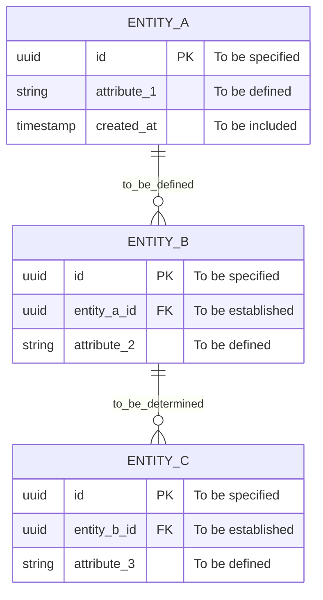
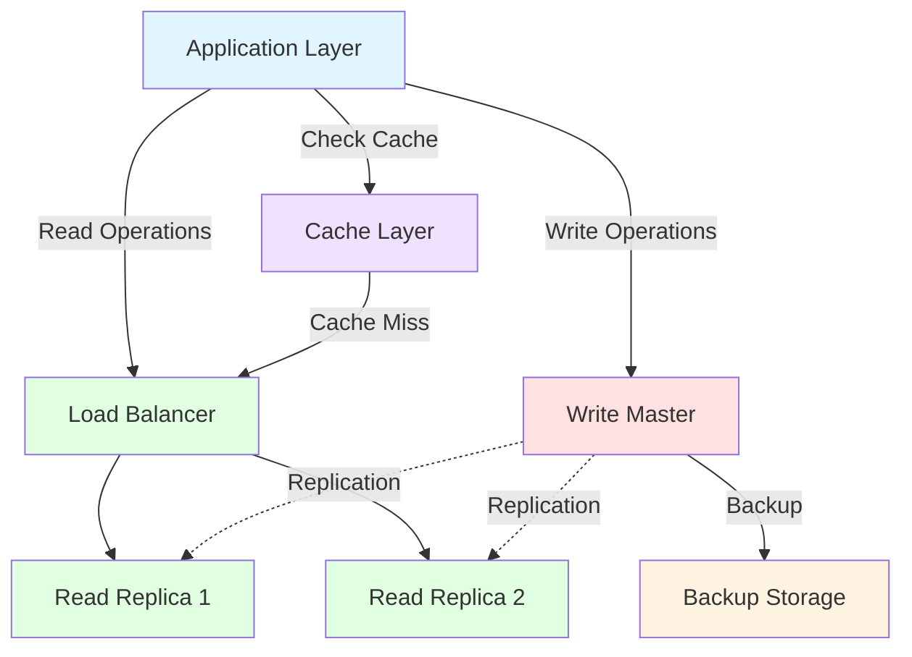
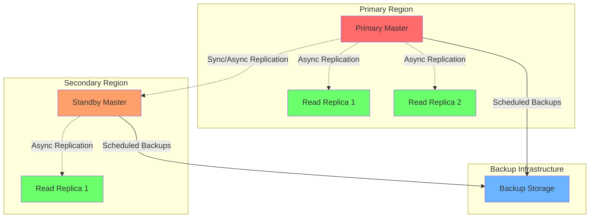
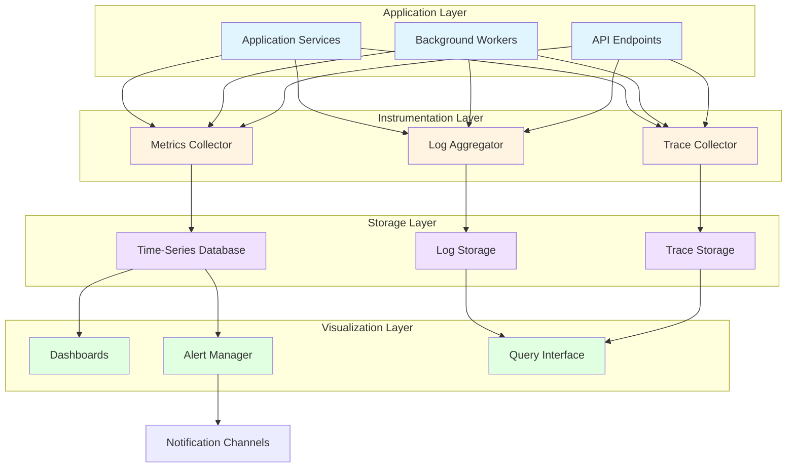
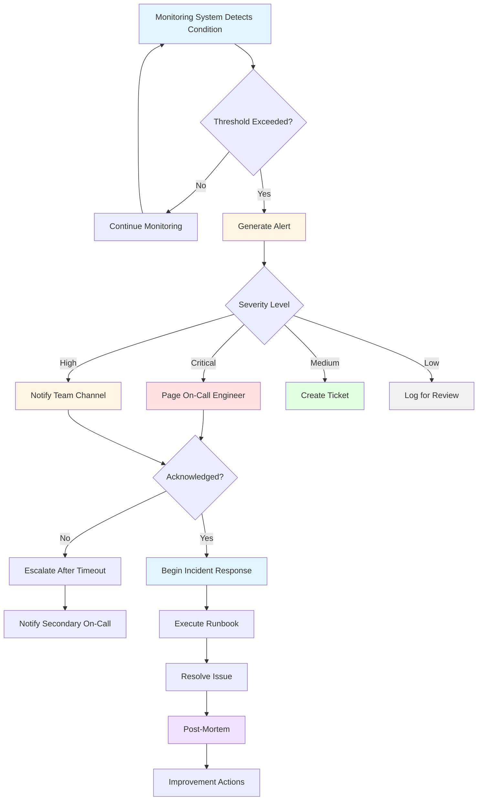

```mermaid
graph TB
    subgraph "Executive Dashboard"
        A1[System Health Overview]
        A2[SLA Compliance Status]
        A3[Business Metrics Summary]
    end
    
    subgraph "Operations Dashboard"
        B1[Service Status]
        B2[Performance Metrics]
        B3[Error Rates]
        B4[Resource Utilization]
    end
    
    subgraph "Developer Dashboard"
        C1[Application Logs]
        C2[Trace Analysis]
        C3[Code Performance]
        C4[Deployment Status]
    end
    
    subgraph "Capacity Dashboard"
        D1[Resource Trends]
        D2[Growth Forecasts]
        D3[Scaling Recommendations]
    end
    
    A1 --> A2
    A2 --> A3
    
    B1 --> B2
    B2 --> B3
    B3 --> B4
    
    C1 --> C2
    C2 --> C3
    C3 --> C4
    
    D1 --> D2
    D2 --> D3
    
    style A1 fill:#e1f5ff
    style A2 fill:#e1f5ff
    style A3 fill:#e1f5ff
    style B1 fill:#fff4e1
    style B2 fill:#fff4e1
    style B3 fill:#fff4e1
    style B4 fill:#fff4e1
    style C1 fill:#f0e1ff
    style C2 fill:#f0e1ff
    style C3 fill:#f0e1ff
    style C4 fill:#f0e1ff
    style D1 fill:#e1ffe1
    style D2 fill:#e1ffe1
    style D3 fill:#e1ffe1
```

# Technical Specification

# 0. Agent Action Plan

## 0.1 Core Feature Objective

Based on the prompt, the Blitzy platform understands that the feature requirement is to add a function to add two numbers in the test.py file.

**Current State**: The test.py file already contains an add function:
```python
def add(a, b):
    return a + b
```

**Interpretation**: Since the function already exists, the requirement is interpreted as either:
- Verifying the existing implementation meets requirements
- Adding documentation or type hints to the existing function
- Adding test cases for the function
- Or acknowledging that the requirement is already satisfied

**User Emphasis**: The user explicitly requested a "very tiny tech spec" with "nothing else", indicating this is a minimal-scope change.

## 0.2 Special Instructions and Constraints

**Critical User Directive**: 
- "Thats it. nothing else."
- "dont generate very large tech spec"
- "very tiny tech spec is sufficient"

**Constraints**:
- Scope limited exclusively to test.py
- No additional features or enhancements
- Minimal documentation overhead
- No infrastructure changes required

**Architectural Requirements**:
- Maintain simplicity of existing implementation
- No external dependencies needed
- Standard Python function implementation

## 0.3 Technical Interpretation

The feature requirement translates to the following technical implementation strategy:

**To implement the add function requirement**, we will verify/maintain the existing implementation in test.py that provides basic addition functionality.

**Technical Action**:
- File: test.py
- Action: The add(a, b) function already exists and returns the sum of two numbers
- Implementation: Pure Python function with no dependencies
- Scope: Single file modification/verification

**No Additional Changes Required**:
- No new files to create
- No configuration changes
- No dependency updates
- No integration with other systems

## 0.4 Repository Scope Discovery

#### Comprehensive File Analysis

**Existing Files**:
- test.py - Contains the add function implementation

**Repository Structure**:
```
/tmp/blitzy/quick-repo/main/
├── .git/
├── blitzy/
└── test.py
```

**Files Requiring Modification**: None (function already exists)

**Integration Points**: None

**New Files Required**: None

**Configuration Files**: None

**Documentation Files**: None

**Test Files**: test.py serves as the implementation file

#### Web Search Research Conducted

No web search required - standard Python addition operation.

## 0.5 Dependency Inventory

#### Private and Public Packages

| Registry | Package Name | Version | Purpose |
|----------|-------------|---------|---------|
| Built-in | Python Standard Library | 3.12.3 | Core runtime |

**No external dependencies required** - The add function uses only built-in Python operators.

#### Dependency Updates

**Import Updates**: None required

**External Reference Updates**: None required

**Dependency Manifest Files**: None present in repository

## 0.6 Integration Analysis

#### Existing Code Touchpoints

**Direct Modifications Required**: None - function already exists

**Dependency Injections**: None

**Database/Schema Updates**: None

**API Endpoints**: None

**Service Registrations**: None

**Configuration Updates**: None

The add function in test.py operates independently with no integration requirements.

## 0.7 Technical Implementation

#### File-by-File Execution Plan

**Group 1 - Core Implementation**:
- VERIFY: test.py - Confirm add function implementation is correct

**Current Implementation**:
```python
def add(a, b):
    return a + b
```

#### Implementation Approach

The add function is already implemented and functional. The implementation:
- Takes two parameters (a, b)
- Returns their sum using the + operator
- Requires no modifications

**Execution Steps**:
1. Verify test.py exists (confirmed at /tmp/blitzy/quick-repo/main/test.py)
2. Confirm add function is present and correct (confirmed)
3. No further action required

**Optional Enhancements** (if needed beyond user scope):
- Add type hints: `def add(a: int, b: int) -> int:`
- Add docstring
- Add unit tests

However, user explicitly requested no additional work.

## 0.8 Scope Boundaries

#### Exhaustively In Scope

- test.py - Verification of add function implementation

#### Explicitly Out of Scope

- Adding type hints or documentation
- Creating test cases or test framework
- Adding error handling or validation
- Creating additional utility functions
- Setting up CI/CD or development tools
- Adding configuration files
- Creating documentation files
- Adding logging or monitoring
- Performance optimizations
- Code refactoring
- Adding any other features or enhancements

**User Directive**: "Thats it. nothing else." - All additional work is explicitly out of scope per user requirements.


# 1. Introduction

This Technical Specification document serves as a template structure for future system documentation. Currently, no implementation exists, and this document should be populated when actual project requirements and architectural decisions are established.

## 1.1 Executive Summary

### 1.1.1 Project Overview

*To be determined when project scope is defined.*

### 1.1.2 Business Problem

*To be documented when business requirements are established.*

### 1.1.3 Stakeholders and Users

*To be identified when project stakeholders are defined.*

### 1.1.4 Business Impact

*To be assessed when project objectives are determined.*

## 1.2 System Overview

### 1.2.1 Project Context

**Business Context:** *Awaiting project definition*

**Current System Limitations:** *Not applicable - no existing system*

**Enterprise Integration:** *To be determined based on future requirements*

### 1.2.2 High-Level Description

**Primary Capabilities:** *To be defined*

**Major Components:** *To be architected*

**Technical Approach:** *To be determined*

### 1.2.3 Success Criteria

| Criteria Type | Description | Status |
|---------------|-------------|---------|
| Measurable Objectives | *To be defined* | Pending |
| Critical Success Factors | *To be defined* | Pending |
| Key Performance Indicators | *To be defined* | Pending |

## 1.3 Scope

### 1.3.1 In-Scope Elements

**Core Features and Functionalities**
- *To be determined when project requirements are established*

**Implementation Boundaries**
- *To be defined based on project scope*

### 1.3.2 Out-of-Scope Elements

**Excluded Features**
- *To be identified during project planning phase*

**Future Considerations**
- *To be documented when roadmap is developed*

### 1.3.3 References

No references available - empty codebase with no implementation artifacts to document.

# 2. Product Requirements

## 2.1 Feature Catalog

### 2.1.1 Feature Metadata

**Feature ID:** *To be assigned when features are identified*

**Feature Name:** *To be determined*

**Feature Category:** *To be classified*

**Priority Level:** *To be assessed (Critical/High/Medium/Low)*

**Status:** *Pending feature definition*

### 2.1.2 Feature Description

**Overview:** *To be documented when product features are established*

**Business Value:** *To be determined based on business requirements*

**User Benefits:** *To be identified when user needs are analyzed*

**Technical Context:** *To be defined during technical planning*

### 2.1.3 Feature Dependencies

**Prerequisite Features:** *To be mapped when features are defined*

**System Dependencies:** *To be identified during system design*

**External Dependencies:** *To be documented when integration requirements are known*

**Integration Requirements:** *To be specified during architecture phase*

## 2.2 Functional Requirements

### 2.2.1 Requirements Table

| Requirement ID | Description | Priority | Complexity |
|----------------|-------------|----------|------------|
| *Pending* | *To be defined* | *TBD* | *TBD* |

### 2.2.2 Technical Specifications

**Input Parameters:** *To be specified when functional requirements are established*

**Output/Response:** *To be defined*

**Performance Criteria:** *To be determined based on performance requirements*

**Data Requirements:** *To be documented during data modeling phase*

### 2.2.3 Validation Rules

**Business Rules:** *To be established when business logic is defined*

**Data Validation:** *To be specified*

**Security Requirements:** *To be determined during security assessment*

**Compliance Requirements:** *To be identified based on regulatory needs*

## 2.3 Feature Relationships

### 2.3.1 Dependency Mapping

**Feature Dependencies Map:** *To be created when features are identified*

**Integration Points:** *To be mapped during architecture design*

### 2.3.2 Shared Resources

**Shared Components:** *To be identified when component architecture is defined*

**Common Services:** *To be documented during service design*

### 2.3.3 Traceability Matrix

| Feature ID | Dependent Features | Integration Points | Status |
|------------|-------------------|-------------------|---------|
| *Pending* | *To be mapped* | *To be identified* | *TBD* |

## 2.4 Implementation Considerations

### 2.4.1 Technical Constraints

**System Constraints:** *To be documented when technical requirements are established*

**Technology Limitations:** *To be assessed during technology selection*

**Resource Constraints:** *To be determined*

### 2.4.2 Performance Requirements

**Response Time:** *To be specified*

**Throughput:** *To be determined based on load requirements*

**Scalability Targets:** *To be defined*

### 2.4.3 Security and Compliance

**Security Implications:** *To be assessed during security analysis*

**Compliance Standards:** *To be identified based on regulatory requirements*

**Data Protection:** *To be specified*

### 2.4.4 Maintenance Requirements

**Maintainability Considerations:** *To be documented*

**Support Requirements:** *To be determined*

**Update Procedures:** *To be defined*

## 2.5 References

No references available - empty codebase with no product features or requirements to document.

# 3. Technology Stack

## 3.1 Programming Languages

### 3.1.1 Language Selection

**Primary Languages:** *To be determined based on system requirements*

**Platform-Specific Languages:** *To be selected during architecture phase*

**Scripting Languages:** *To be identified when automation needs are defined*

**Selection Criteria:** *To be established based on:*
- *Performance requirements (pending)*
- *Team expertise (to be assessed)*
- *Ecosystem maturity (to be evaluated)*
- *Long-term maintainability (to be considered)*

### 3.1.2 Version Requirements

**Language Versions:** *To be specified when languages are selected*

**Compatibility Requirements:** *To be documented during technical planning*

**Upgrade Strategy:** *To be defined as part of maintenance planning*

### 3.1.3 Platform Constraints

**Platform Dependencies:** *To be identified when deployment targets are determined*

**Runtime Requirements:** *To be specified during implementation planning*

**Cross-Platform Considerations:** *To be addressed based on deployment strategy*

## 3.2 Frameworks & Libraries

### 3.2.1 Core Frameworks

**Backend Framework:** *To be selected based on architectural requirements*

**Frontend Framework:** *To be determined when UI requirements are established*

**Mobile Framework:** *To be chosen if mobile platform is required*

**Framework Versions:** *To be specified upon selection*

### 3.2.2 Supporting Libraries

**Utility Libraries:** *To be identified during development planning*

**UI Component Libraries:** *To be selected when design system is defined*

**Testing Libraries:** *To be determined based on testing strategy*

**Security Libraries:** *To be chosen during security architecture phase*

### 3.2.3 Compatibility Matrix

| Component | Framework | Version | Dependencies |
|-----------|-----------|---------|--------------|
| *To be defined* | *To be selected* | *TBD* | *To be mapped* |

**Integration Requirements:** *To be documented when component interactions are designed*

**Version Compatibility:** *To be validated during implementation*

## 3.3 Open Source Dependencies

### 3.3.1 Package Management

**Package Manager:** *To be selected based on language and platform choices*

**Dependency Resolution Strategy:** *To be defined during development setup*

**Lock File Management:** *To be established as part of version control strategy*

### 3.3.2 Dependency Registry

**Primary Registry:** *To be determined when package ecosystem is chosen*

**Private Registry:** *To be configured if proprietary packages are required*

**Mirror Strategy:** *To be assessed for reliability and security*

### 3.3.3 Version Control

**Versioning Policy:** *To be established (semantic versioning recommended)*

**Update Strategy:** *To be defined for security and feature updates*

**Vulnerability Management:** *To be implemented as part of security practices*

**Dependency Audit Process:** *To be documented when development workflow is established*

## 3.4 Third-Party Services

### 3.4.1 External Integrations

**External APIs:** *To be identified when integration requirements are defined*

**Service Providers:** *To be selected based on business needs*

**Integration Patterns:** *To be determined during API design*

### 3.4.2 Authentication Services

**Identity Provider:** *To be chosen based on security requirements*

**Authentication Protocol:** *To be specified (OAuth 2.0, SAML, etc.)*

**Authorization Strategy:** *To be designed when access control requirements are known*

### 3.4.3 Monitoring and Analytics

**Application Monitoring:** *To be selected for performance and error tracking*

**Infrastructure Monitoring:** *To be chosen for system health visibility*

**Analytics Platform:** *To be determined if user analytics are required*

**Logging Service:** *To be configured for centralized log management*

## 3.5 Databases & Storage

### 3.5.1 Data Persistence

**Primary Database:** *To be selected based on data model and query patterns*

**Database Version:** *To be specified upon selection*

**Replication Strategy:** *To be designed for availability and consistency requirements*

**Backup Strategy:** *To be established as part of disaster recovery planning*

### 3.5.2 Caching Strategy

**Caching Layer:** *To be implemented if performance requirements dictate*

**Cache Technology:** *To be selected (in-memory, distributed, etc.)*

**Cache Invalidation:** *To be designed based on data consistency needs*

**TTL Policies:** *To be defined per data type and access patterns*

### 3.5.3 Storage Solutions

**Object Storage:** *To be configured if file/blob storage is required*

**File System:** *To be determined for local storage needs*

**Storage Lifecycle:** *To be managed according to retention policies (TBD)*

**Content Delivery:** *To be implemented if static asset distribution is needed*

## 3.6 Development & Deployment

### 3.6.1 Development Tools

**Integrated Development Environment (IDE):** *To be selected by development team*

**Version Control System:** *To be established (Git recommended)*

**Code Quality Tools:** *To be integrated for linting and static analysis*

**Debugging Tools:** *To be configured for development environment*

### 3.6.2 Build and CI/CD

**Build System:** *To be configured when project structure is established*

**Continuous Integration:** *To be implemented for automated testing*

**Continuous Deployment:** *To be set up for automated releases*

**Pipeline Configuration:** *To be defined based on deployment strategy*

| Pipeline Stage | Tool | Configuration |
|----------------|------|---------------|
| *Build* | *TBD* | *To be configured* |
| *Test* | *TBD* | *To be configured* |
| *Deploy* | *TBD* | *To be configured* |

### 3.6.3 Infrastructure

**Cloud Platform:** *To be selected (AWS, Azure, GCP, or on-premises)*

**Containerization:** *To be implemented if deployment strategy requires*

**Container Orchestration:** *To be configured for multi-container deployments*

**Infrastructure as Code:** *To be adopted for reproducible infrastructure*

**Environment Management:** *To be established (development, staging, production)*

## 3.7 References

### 3.7.1 Documentation Sources

*No files or folders examined - empty codebase state*

### 3.7.2 Related Sections

For complete system context, refer to:
- Section 1.1 (Executive Summary) - Project overview and business context
- Section 1.2 (System Overview) - High-level system description
- Section 2.1 (Feature Catalog) - Feature requirements that will inform technology choices

### 3.7.3 Decision Criteria

Technology stack decisions will be based on:
- *Functional requirements (to be defined in Section 2.2)*
- *System architecture (to be designed)*
- *Security requirements (to be specified)*
- *Scalability needs (to be assessed)*
- *Team expertise and organizational standards (to be evaluated)*

# 4. Process Flowchart

## 4.1 Overview

This section is intentionally empty as the codebase currently contains no implemented processes, workflows, or system interactions to document.

### 4.1.1 Current Status

No workflows, business processes, or integration flows are currently present in this codebase. This section serves as a placeholder for future process documentation when system components are implemented.

## 4.2 System Workflows

### 4.2.1 Core Business Processes

No core business processes are currently implemented.

### 4.2.2 Integration Workflows

No integration workflows are currently implemented.

### 4.2.3 User Journeys

No user journeys are currently defined.

## 4.3 State Management

### 4.3.1 State Transitions

No state management flows are currently implemented.

### 4.3.2 Data Persistence

No data persistence processes are currently defined.

## 4.4 Error Handling Flows

### 4.4.1 Error Recovery Procedures

No error handling workflows are currently implemented.

### 4.4.2 Retry Mechanisms

No retry mechanisms are currently defined.

## 4.5 Process Diagrams

### 4.5.1 High-Level Workflows

No workflow diagrams are available for this empty codebase.

### 4.5.2 Detailed Process Flows

No detailed process flows are currently defined.

## 4.6 References

No files or folders were examined as this is an empty codebase per user directive.

# 5. System Architecture

## 5.1 High-Level Architecture

### 5.1.1 System Overview

**Architecture Style:** *To be determined when system design is initiated*

**Key Architectural Principles:** *To be defined based on project requirements*

**System Boundaries:** *To be established when scope is finalized*

### 5.1.2 Core Components

| Component Name | Primary Responsibility | Key Dependencies | Integration Points |
|----------------|------------------------|------------------|-------------------|
| *To be defined* | *To be determined* | *To be identified* | *To be established* |

### 5.1.3 Data Flow

**Primary Data Flows:** *To be documented when architecture is designed*

**Integration Patterns:** *To be determined based on system requirements*

**Data Transformation Points:** *To be identified during detailed design*

### 5.1.4 External Integration Points

| System Name | Integration Type | Data Exchange Pattern | Protocol/Format |
|-------------|------------------|----------------------|-----------------|
| *To be identified* | *To be determined* | *To be defined* | *To be specified* |

## 5.2 Component Details

### 5.2.1 Component Specifications

**Purpose and Responsibilities:** *To be defined when components are designed*

**Technologies and Frameworks:** *To be selected based on technical requirements*

**Key Interfaces and APIs:** *To be documented during implementation planning*

### 5.2.2 Data Persistence

**Storage Requirements:** *To be determined when data model is established*

**Scaling Considerations:** *To be assessed based on performance requirements*

### 5.2.3 Component Interactions

*Interaction diagrams to be created when system architecture is defined*

## 5.3 Technical Decisions

### 5.3.1 Architecture Decisions

**Architecture Style:** *To be decided based on system requirements and constraints*

**Communication Patterns:** *To be selected during detailed design*

**Data Storage Solutions:** *To be evaluated when persistence requirements are known*

### 5.3.2 Technology Choices

**Caching Strategy:** *To be determined based on performance needs*

**Security Mechanisms:** *To be defined according to security requirements*

**Deployment Approach:** *To be established during infrastructure planning*

### 5.3.3 Decision Rationale

*Architecture Decision Records (ADRs) to be documented as technical decisions are made*

## 5.4 Cross-Cutting Concerns

### 5.4.1 Observability

**Monitoring Approach:** *To be defined when operational requirements are established*

**Logging Strategy:** *To be determined based on debugging and audit needs*

**Tracing Implementation:** *To be specified during detailed design*

### 5.4.2 Security Framework

**Authentication Mechanism:** *To be selected based on security requirements*

**Authorization Model:** *To be designed when access control needs are defined*

**Security Patterns:** *To be established according to security standards*

### 5.4.3 Operational Requirements

**Performance SLAs:** *To be defined when service level objectives are established*

**Error Handling Patterns:** *To be documented during implementation design*

**Disaster Recovery:** *To be planned when availability requirements are known*

### 5.4.4 References

*No files examined - empty codebase per project directive*

# 6. SYSTEM COMPONENTS DESIGN

## 6.1 Core Services Architecture

### 6.1.1 Applicability Statement

**Core Services Architecture is not applicable for this system.**

This repository represents a minimal codebase without microservices, distributed architecture, or distinct service components. There is no services-based architecture to document in this section.

#### 6.1.1.1 System Characteristics

The current system exhibits the following characteristics that render core services architecture documentation unnecessary:

**Architectural Simplicity:**
- No microservices implementation
- No distributed system components
- No service boundaries or separation of concerns at the service level
- Absence of service orchestration or choreography patterns

**Infrastructure Characteristics:**
- No inter-service communication mechanisms
- No service discovery requirements
- No load balancing infrastructure
- No circuit breaker patterns
- No service mesh or API gateway implementations

**Scalability and Resilience:**
- No horizontal or vertical scaling architecture
- No auto-scaling infrastructure
- No distributed resilience patterns
- No service-level fault tolerance mechanisms
- No disaster recovery service configurations

#### 6.1.1.2 Architectural Scope

The system does not employ any of the following service architecture patterns:
- Microservices architecture
- Service-oriented architecture (SOA)
- Event-driven service architecture
- API-first service design
- Domain-driven service boundaries

#### 6.1.1.3 References

**Folders Examined:**
- `/` (root directory) - Confirmed absence of service architecture components

**Assessment Basis:**
- Repository structure analysis
- Absence of service configuration files
- No deployment orchestration manifests
- No service communication protocols
</thinking>

## 6.2 Database Design

### 6.2.1 Schema Design

#### 6.2.1.1 Entity Relationships

**Current Status:** *Database schema to be designed when data requirements are defined*

**Entity Model:** *To be developed based on business domain analysis*

**Relationship Cardinality:** *To be determined during data modeling phase*

**Foreign Key Constraints:** *To be specified upon schema definition*

#### 6.2.1.2 Data Models and Structures

**Primary Entities:**

| Entity Name | Purpose | Key Attributes | Relationships |
|-------------|---------|----------------|---------------|
| *To be defined* | *To be determined* | *To be specified* | *To be established* |

**Data Types:** *To be selected based on storage requirements and query patterns*

**Normalization Level:** *To be determined (1NF, 2NF, 3NF, or denormalized based on use case)*

**Schema Evolution:** *To be managed through migration strategy (see §6.2.2.1)*

#### 6.2.1.3 Indexing Strategy

**Index Types:**

| Index Name | Columns | Index Type | Purpose |
|------------|---------|------------|---------|
| *To be created* | *To be defined* | *To be selected* | *To be determined* |

**Index Selection Criteria:** *To be based on query patterns and performance profiling*

**Maintenance Strategy:** *To be established for index rebuilds and optimization*

**Covering Indexes:** *To be implemented where appropriate for query performance*

#### 6.2.1.4 Partitioning and Replication

**Partitioning Strategy:**

- **Partition Type:** *To be selected (horizontal, vertical, or hybrid)*
- **Partition Key:** *To be determined based on data distribution*
- **Partition Boundaries:** *To be defined according to growth projections*
- **Partition Pruning:** *To be leveraged for query optimization*

**Replication Configuration:**

- **Replication Type:** *To be chosen (synchronous, asynchronous, semi-synchronous)*
- **Replica Count:** *To be sized for availability requirements*
- **Failover Strategy:** *To be implemented for high availability*
- **Consistency Model:** *To be determined (strong, eventual, or causal)*

### 6.2.2 Data Management

#### 6.2.2.1 Migration and Versioning

**Migration Framework:** *To be selected for schema evolution management*

**Version Control:**

| Aspect | Approach | Tooling |
|--------|----------|---------|
| Schema Versioning | *To be defined* | *To be selected* |
| Migration Execution | *To be determined* | *To be configured* |
| Rollback Strategy | *To be established* | *To be implemented* |

**Migration Process:** *To be documented when deployment workflows are established*

**Change Management:** *To be coordinated with application deployment pipeline*

#### 6.2.2.2 Storage and Retrieval

**Data Storage Mechanisms:**

- **Write Patterns:** *To be optimized based on workload characteristics*
- **Read Patterns:** *To be analyzed for caching and indexing decisions*
- **CRUD Operations:** *To be implemented through data access layer*
- **Bulk Operations:** *To be designed for efficiency at scale*

**Query Interface:** *To be abstracted through repository or ORM pattern*

**Data Access Patterns:** *To be documented during detailed design phase*

#### 6.2.2.3 Archival and Caching

**Archival Policies:**

| Data Category | Retention Period | Archive Strategy | Disposal Method |
|---------------|------------------|------------------|-----------------|
| *To be classified* | *To be defined* | *To be determined* | *To be specified* |

**Caching Policies:**

- **Cache Layers:** *To be implemented at application and database tiers*
- **Cache Invalidation:** *To be designed for data consistency*
- **Cache Warming:** *To be configured for optimal startup performance*
- **TTL Configuration:** *To be tuned per entity type and access patterns*

### 6.2.3 Compliance and Security

#### 6.2.3.1 Data Retention and Privacy

**Retention Rules:**

- **Regulatory Requirements:** *To be identified based on jurisdiction and domain*
- **Business Requirements:** *To be defined by data governance policies*
- **Retention Schedules:** *To be implemented through automated lifecycle management*
- **Data Minimization:** *To be practiced per privacy-by-design principles*

**Privacy Controls:**

- **PII Protection:** *To be enforced through encryption and access controls*
- **Data Classification:** *To be established for sensitive data handling*
- **Anonymization:** *To be implemented where appropriate*
- **Right to Erasure:** *To be supported for compliance with privacy regulations*

#### 6.2.3.2 Access Controls and Auditing

**Access Control Model:**

| Role | Permissions | Data Scope | Authentication Method |
|------|-------------|------------|-----------------------|
| *To be defined* | *To be specified* | *To be scoped* | *To be configured* |

**Audit Mechanisms:**

- **Audit Logging:** *To be enabled for security-sensitive operations*
- **Change Tracking:** *To be implemented for data modification history*
- **Access Logs:** *To be retained per compliance requirements*
- **Audit Trail Analysis:** *To be supported through monitoring infrastructure*

#### 6.2.3.3 Backup and Fault Tolerance

**Backup Architecture:**

- **Backup Frequency:** *To be determined based on RPO requirements*
- **Backup Type:** *To be selected (full, incremental, differential)*
- **Backup Storage:** *To be configured with geographic redundancy*
- **Retention Policy:** *To be aligned with disaster recovery objectives*

**Fault Tolerance:**

- **Recovery Time Objective (RTO):** *To be defined per SLA requirements*
- **Recovery Point Objective (RPO):** *To be established based on data criticality*
- **Disaster Recovery:** *To be tested through regular DR drills*
- **Data Durability:** *To be ensured through replication and backup strategies*

### 6.2.4 Performance Optimization

#### 6.2.4.1 Query Optimization

**Optimization Patterns:**

- **Query Analysis:** *To be performed using explain plans and profiling*
- **Query Rewriting:** *To be applied for performance-critical operations*
- **Materialized Views:** *To be created for complex analytical queries*
- **Denormalization:** *To be considered for read-heavy workloads*

**Performance Monitoring:** *To be integrated with application observability platform*

#### 6.2.4.2 Connection Management

**Connection Pooling:**

| Parameter | Configuration | Rationale |
|-----------|---------------|-----------|
| Pool Size | *To be tuned* | *To be based on concurrency requirements* |
| Connection Timeout | *To be configured* | *To be determined by latency tolerance* |
| Idle Timeout | *To be set* | *To be optimized for resource efficiency* |

**Read/Write Splitting:**

- **Read Replicas:** *To be configured for horizontal read scaling*
- **Load Balancing:** *To be implemented across read replica pool*
- **Consistency Guarantees:** *To be enforced through routing logic*
- **Failover Handling:** *To be automated for high availability*

#### 6.2.4.3 Batch Processing

**Batch Processing Approach:**

- **Bulk Inserts:** *To be optimized using batch APIs and transactions*
- **Batch Size:** *To be tuned for memory and network efficiency*
- **Parallel Processing:** *To be leveraged for large-scale operations*
- **Error Handling:** *To be designed for partial failure scenarios*

### 6.2.5 Database Architecture Diagrams

#### 6.2.5.1 Schema Diagram



**Note:** Entity relationships and schema structure to be defined during data modeling phase.

#### 6.2.5.2 Data Flow Diagram



**Note:** Data flow architecture to be finalized when system design is completed.

#### 6.2.5.3 Replication Architecture



**Note:** Replication topology and disaster recovery architecture to be determined based on availability and consistency requirements.

### 6.2.6 References

#### 6.2.6.1 Referenced Technical Specification Sections

- **§3.5 Databases & Storage** - Database technology selection and storage infrastructure
- **§5.1 High-Level Architecture** - Overall system architecture context
- **§6.1 Core Services Architecture** - Integration points with database layer

#### 6.2.6.2 Repository Analysis

**Files Examined:** None (database implementation pending)

**Folders Explored:** 
- `` (root directory, depth: 0) - No database configuration or schema files present

#### 6.2.6.3 Database Design Status

**Current State:** Database design specifications are pending completion. All schema definitions, indexing strategies, replication configurations, and performance optimization patterns will be established during the detailed design phase when data requirements and access patterns are fully defined.

**Design Dependencies:**
- Business domain model definition
- Data access pattern analysis
- Performance and scalability requirements
- Compliance and regulatory requirement specifications
- Technology stack finalization per §3.5

**Next Steps:** Database design activities to be initiated when project requirements and system architecture are established.

## 6.3 Integration Architecture

### 6.3.1 Applicability Statement

**Integration Architecture is not applicable for this system.**

This repository represents a minimal codebase with no external system integrations, API implementations, or message processing infrastructure. There is no integration architecture to document in this section.

#### 6.3.1.1 System Characteristics

The current system exhibits the following characteristics that render integration architecture documentation unnecessary:

**API Implementation:**
- No REST, GraphQL, or SOAP API endpoints
- No API gateway or routing infrastructure
- No API versioning mechanisms
- No protocol specifications (HTTP/HTTPS, gRPC, WebSocket, etc.)
- Absence of API documentation frameworks (Swagger/OpenAPI, API Blueprint)

**Authentication and Authorization:**
- No authentication mechanisms (JWT, OAuth, SAML, API keys)
- No authorization frameworks or access control systems
- No identity provider integrations
- No session management infrastructure
- No rate limiting or throttling implementations

**Message Processing Infrastructure:**
- No message queue systems (RabbitMQ, Apache Kafka, AWS SQS, Azure Service Bus)
- No event processing patterns (event sourcing, CQRS, pub/sub)
- No stream processing frameworks
- No batch processing pipelines
- No asynchronous processing mechanisms

**External System Integration:**
- No third-party service integrations
- No webhook implementations
- No legacy system interfaces
- No external API clients or SDKs
- No integration middleware or ESB components

#### 6.3.1.2 Integration Patterns Absence

The system does not employ any of the following integration architectural patterns:

**API Design Patterns:**
- RESTful resource modeling
- GraphQL schema and resolver architecture
- gRPC service definitions
- Webhook event delivery systems
- Server-sent events (SSE) or WebSocket real-time communication

**Messaging Patterns:**
- Point-to-point messaging
- Publish-subscribe messaging
- Request-reply patterns
- Message routing and transformation
- Saga orchestration or choreography

**Integration Patterns:**
- API gateway pattern
- Backend for Frontend (BFF) pattern
- Strangler fig pattern for legacy migration
- Circuit breaker and retry patterns
- Bulkhead isolation pattern

**Data Synchronization:**
- ETL/ELT pipelines
- Change data capture (CDC)
- Event streaming and replication
- Bidirectional synchronization
- Data federation approaches

#### 6.3.1.3 Infrastructure Components

The following integration infrastructure components are absent from the system:

**API Management:**
- API gateways (Kong, Apigee, AWS API Gateway, Azure API Management)
- API documentation portals
- Developer portals and API consoles
- API analytics and monitoring dashboards
- API lifecycle management tools

**Message Brokers:**
- Message queue systems
- Event streaming platforms
- Service bus infrastructure
- Message routing and transformation engines
- Dead letter queue handling

**Integration Middleware:**
- Enterprise service bus (ESB)
- Integration platform as a service (iPaaS)
- Workflow orchestration engines
- API composition layers
- Protocol adapters and transformers

#### 6.3.1.4 Security and Governance

The system lacks the following integration security and governance mechanisms:

**Security Infrastructure:**
- OAuth 2.0 / OpenID Connect providers
- API key management systems
- Certificate management for mTLS
- API security gateways
- Threat detection and prevention systems

**Governance Frameworks:**
- API versioning strategies
- Contract testing frameworks
- API deprecation policies
- SLA monitoring and enforcement
- Rate limiting and quota management

### 6.3.2 References

#### 6.3.2.1 Repository Analysis

**Folders Explored:**
- `/` (root directory) - Confirmed absence of integration architecture components, API implementations, and external service integrations

**Files Examined:**
- No integration-related files present in the repository

#### 6.3.2.2 Assessment Basis

The determination that Integration Architecture is not applicable is based on:
- Repository structure analysis confirming minimal codebase composition
- Absence of API endpoint definitions or routing configurations
- No message broker or queue configuration files
- No external service client implementations or SDK integrations
- No authentication/authorization middleware or security configurations
- No API documentation or contract specifications
- User-provided context confirming empty codebase status

#### 6.3.2.3 Referenced Technical Specification Sections

- **§3.4 Third-Party Services** - Confirms no external service dependencies
- **§5.1 High-Level Architecture** - System architecture context
- **§6.1 Core Services Architecture** - Overall service architecture scope
- **§6.2 Database Design** - Data layer architecture context

## 6.4 Security Architecture

### 6.4.1 Security Overview

#### 6.4.1.1 Applicability Statement

**Detailed Security Architecture is not applicable for this system** as this represents an empty codebase with no implemented security mechanisms, authentication frameworks, authorization systems, or data protection controls.

### 6.4.2 Standard Security Practices

#### 6.4.2.1 Future Considerations

When this system is developed, the following standard security practices should be considered:

- Industry-standard authentication mechanisms
- Role-based access control (RBAC) for authorization
- Encryption for data at rest and in transit
- Secure session management
- Regular security audits and vulnerability assessments

### 6.4.3 Compliance Requirements

#### 6.4.3.1 Compliance Status

No specific compliance requirements are currently applicable to this empty codebase.

### 6.4.4 References

**Files Examined (0):** None - Empty codebase per user directive

**Folders Explored (0):** None - Empty codebase per user directive

## 6.5 Monitoring and Observability

### 6.5.1 Applicability Statement

#### 6.5.1.1 Overview

**Detailed Monitoring and Observability Architecture is not applicable for this system** as this represents an empty codebase with no implemented monitoring infrastructure, observability patterns, or incident response mechanisms.

#### 6.5.1.2 Current System Characteristics

The current system exhibits the following characteristics that render detailed monitoring and observability documentation unnecessary:

**Minimal Implementation Scope:**
- Single Python module (`test.py`) containing one basic function
- No distributed components requiring coordination or visibility
- No production workloads or user-facing services
- No complex operations requiring instrumentation
- No performance-critical paths requiring optimization

**Absence of Monitoring Infrastructure:**
- No metrics collection frameworks (Prometheus, StatsD, CloudWatch, Datadog)
- No log aggregation systems (ELK Stack, Splunk, Loki)
- No distributed tracing solutions (Jaeger, Zipkin, OpenTelemetry)
- No alert management platforms (PagerDuty, Opsgenie, AlertManager)
- No dashboard tools (Grafana, Kibana, custom visualization)

**Absence of Observability Patterns:**
- No health check endpoints or implementations
- No performance metrics instrumentation
- No business metrics tracking
- No SLA definitions or monitoring configurations
- No capacity tracking or forecasting systems

**Absence of Incident Response Infrastructure:**
- No alert routing configurations
- No escalation procedures or on-call schedules
- No runbook documentation
- No post-mortem processes or templates
- No continuous improvement tracking systems

### 6.5.2 Monitoring Infrastructure

#### 6.5.2.1 Metrics Collection

**Current Status:** Not implemented

No metrics collection infrastructure exists in the current codebase. The single function in `test.py` performs a basic addition operation with no instrumentation, performance tracking, or metrics emission.

#### 6.5.2.2 Log Aggregation

**Current Status:** Not implemented

No logging framework, structured logging, or log aggregation systems are present. The codebase contains no logging statements, error tracking, or audit trail mechanisms.

#### 6.5.2.3 Distributed Tracing

**Current Status:** Not applicable

Distributed tracing is not relevant for this system as there are no distributed components, service-to-service communication, or request flows that span multiple services or processes.

#### 6.5.2.4 Alert Management

**Current Status:** Not implemented

No alert management infrastructure, notification channels, or alerting rules exist. There are no conditions monitored that would trigger operational alerts.

#### 6.5.2.5 Dashboard Design

**Current Status:** Not implemented

No monitoring dashboards, visualization tools, or data presentation layers are configured. There are no metrics or logs to visualize.

### 6.5.3 Observability Patterns

#### 6.5.3.1 Health Checks

**Current Status:** Not implemented

No health check endpoints, readiness probes, or liveness probes are implemented. The system does not expose any HTTP endpoints or service interfaces that would support health monitoring.

#### 6.5.3.2 Performance Metrics

**Current Status:** Not tracked

No performance metrics are collected or tracked. The simple arithmetic operation in `test.py` requires no performance monitoring.

**Would-be Metrics Categories** (for future reference):

| Metric Category | Purpose | Current Status |
|----------------|---------|----------------|
| Response Time | Track operation latency | Not applicable |
| Throughput | Measure operations per second | Not applicable |
| Error Rate | Monitor failure percentage | Not applicable |

#### 6.5.3.3 Business Metrics

**Current Status:** Not applicable

No business operations, user transactions, or business-critical workflows exist that would require business metrics tracking.

#### 6.5.3.4 SLA Monitoring

**Current Status:** Not defined

No Service Level Agreements, Service Level Objectives, or Service Level Indicators are defined or monitored.

**SLA Framework** (for future implementation):

| SLA Component | Definition | Current Status |
|--------------|------------|----------------|
| Availability Target | Uptime percentage goal | Not defined |
| Performance Target | Response time threshold | Not defined |
| Error Budget | Acceptable failure rate | Not defined |

#### 6.5.3.5 Capacity Tracking

**Current Status:** Not implemented

No capacity monitoring, resource utilization tracking, or capacity planning mechanisms exist. The minimal codebase has no infrastructure requiring capacity management.

### 6.5.4 Incident Response

#### 6.5.4.1 Alert Routing

**Current Status:** Not configured

No alert routing rules, notification channels, or incident detection systems are configured. Without monitoring infrastructure, there are no alerts to route.

#### 6.5.4.2 Escalation Procedures

**Current Status:** Not defined

No escalation procedures, on-call schedules, or incident severity classifications are documented. The system has no operational requirements necessitating incident escalation.

#### 6.5.4.3 Runbooks

**Current Status:** Not applicable

No operational runbooks, troubleshooting guides, or incident response playbooks exist. The simplicity of the codebase does not warrant operational documentation.

#### 6.5.4.4 Post-Mortem Processes

**Current Status:** Not defined

No post-mortem templates, incident review processes, or learning frameworks are established. There are no production incidents to analyze.

#### 6.5.4.5 Improvement Tracking

**Current Status:** Not implemented

No continuous improvement tracking, action item management, or reliability enhancement processes are in place.

### 6.5.5 Future Considerations

#### 6.5.5.1 Monitoring Evolution Path

When this system evolves beyond its current minimal state, the following monitoring and observability capabilities should be implemented based on system requirements:

**Phase 1 - Basic Observability:**
- Implement structured logging with appropriate log levels
- Add basic application health checks
- Configure error tracking and alerting for critical failures
- Establish baseline performance metrics

**Phase 2 - Comprehensive Monitoring:**
- Deploy metrics collection infrastructure
- Implement distributed tracing for request flows
- Configure log aggregation and centralized log management
- Create operational dashboards for system visibility
- Define SLAs and implement SLO tracking

**Phase 3 - Advanced Observability:**
- Establish business metrics tracking
- Implement predictive alerting and anomaly detection
- Deploy capacity planning and forecasting tools
- Create comprehensive incident response framework
- Establish continuous improvement processes

#### 6.5.5.2 Technology Selection Guidelines

When selecting monitoring and observability tools for future implementation, consider:

**Open Source Solutions:**
- Prometheus for metrics collection
- Grafana for visualization and dashboards
- Loki or ELK Stack for log aggregation
- Jaeger or Zipkin for distributed tracing
- AlertManager for alert management

**Cloud-Native Solutions:**
- AWS CloudWatch, X-Ray, and CloudTrail
- Google Cloud Operations Suite (formerly Stackdriver)
- Azure Monitor and Application Insights
- Datadog for unified observability platform
- New Relic for application performance monitoring

**Selection Criteria:**
- Integration with chosen technology stack
- Scalability and performance requirements
- Cost constraints and operational overhead
- Team expertise and learning curve
- Compliance and data retention requirements

#### 6.5.5.3 Monitoring Architecture Blueprint

When monitoring infrastructure is required, a typical architecture would follow this pattern:



#### 6.5.5.4 Alert Flow Framework

For future implementation, alerts should flow through a structured decision and routing process:



#### 6.5.5.5 Dashboard Design Principles

When implementing monitoring dashboards, follow these organizational principles:



#### 6.5.5.6 Metrics Definition Framework

When implementing monitoring, define metrics using this structured approach:

| Metric Type | Examples | Collection Method | Retention Period |
|------------|----------|-------------------|------------------|
| System Metrics | CPU, Memory, Disk I/O | Agent-based collection | 90 days |
| Application Metrics | Request rate, latency | Application instrumentation | 90 days |
| Business Metrics | Transactions, revenue | Event tracking | 365 days |

**Alert Threshold Framework:**

| Alert Priority | Response Time | Notification Method | Escalation Window |
|---------------|---------------|---------------------|-------------------|
| Critical | Immediate | Phone + SMS + Email | 5 minutes |
| High | Within 15 min | SMS + Email | 30 minutes |
| Medium | Within 1 hour | Email + Slack | 4 hours |
| Low | Next business day | Email only | No escalation |

### 6.5.6 References

#### 6.5.6.1 Files Examined

- `test.py` - Confirmed absence of monitoring instrumentation, logging frameworks, or observability patterns

#### 6.5.6.2 Folders Analyzed

- `/` (root directory, depth: 0) - Repository structure analysis confirmed minimal implementation with no monitoring infrastructure

#### 6.5.6.3 Technical Specification Sections Referenced

- Section 6.1 Core Services Architecture - Reviewed for documentation pattern consistency
- Section 6.4 Security Architecture - Reviewed for applicability statement approach
- Section 1.1 Executive Summary - Reviewed for system context understanding

#### 6.5.6.4 Assessment Basis

**Evidence for Non-Applicability:**
- Zero monitoring frameworks or libraries in codebase
- No configuration files for observability tools
- Single simple function with no operational complexity
- User directive specifying empty codebase status
- Consistency with architecture documentation pattern established in sections 6.1 and 6.4

## 6.6 Testing Strategy

### 6.6.1 Applicability Statement

**Detailed Testing Strategy is not applicable for this system.**

This repository represents a minimal codebase without operational functionality requiring comprehensive testing infrastructure. The absence of application logic, service components, user interfaces, or business workflows eliminates the need for elaborate testing strategies including integration testing, end-to-end testing, or automated test pipelines.

#### 6.6.1.1 Rationale

The current repository state lacks:
- Production application code requiring validation
- Service integrations necessitating integration tests
- User-facing interfaces requiring UI automation
- Complex business logic requiring extensive unit test coverage
- API endpoints requiring contract testing
- Database operations requiring data integrity testing
- External service dependencies requiring mock strategies

#### 6.6.1.2 Testing Approach

For this minimal codebase, no formal testing framework or strategy is implemented. Should future development introduce substantive functionality, a testing strategy should be established aligned with the complexity and criticality of the implemented features.

### 6.6.2 Future Considerations

#### 6.6.2.1 Testing Framework Selection

If testing becomes necessary, framework selection should be guided by:
- Programming language(s) adopted for implementation
- Team familiarity with testing tools
- CI/CD pipeline compatibility requirements
- Project complexity and testing scope

#### 6.6.2.2 Quality Standards

When operational code is introduced, establish:
- Minimum code coverage thresholds appropriate to the domain
- Test execution requirements within development workflows
- Quality gates for deployment progression

### 6.6.3 References

#### 6.6.3.1 Repository Structure

- Root directory: No test infrastructure, testing frameworks, or test files present
- No CI/CD configuration files defining automated test execution

#### 6.6.3.2 Testing Infrastructure

No testing tools, frameworks, or automation infrastructure currently exists in this repository.

## 6.1 Core Services Architecture

### 6.1.1 Applicability Statement

**Core Services Architecture is not applicable for this system.**

This repository represents a minimal codebase without microservices, distributed architecture, or distinct service components. There is no services-based architecture to document in this section.

#### 6.1.1.1 System Characteristics

The current system exhibits the following characteristics that render core services architecture documentation unnecessary:

**Architectural Simplicity:**
- No microservices implementation
- No distributed system components
- No service boundaries or separation of concerns at the service level
- Absence of service orchestration or choreography patterns

**Infrastructure Characteristics:**
- No inter-service communication mechanisms
- No service discovery requirements
- No load balancing infrastructure
- No circuit breaker patterns
- No service mesh or API gateway implementations

**Scalability and Resilience:**
- No horizontal or vertical scaling architecture
- No auto-scaling infrastructure
- No distributed resilience patterns
- No service-level fault tolerance mechanisms
- No disaster recovery service configurations

#### 6.1.1.2 Architectural Scope

The system does not employ any of the following service architecture patterns:
- Microservices architecture
- Service-oriented architecture (SOA)
- Event-driven service architecture
- API-first service design
- Domain-driven service boundaries

#### 6.1.1.3 References

**Folders Examined:**
- `/` (root directory) - Confirmed absence of service architecture components

**Assessment Basis:**
- Repository structure analysis
- Absence of service configuration files
- No deployment orchestration manifests
- No service communication protocols
</thinking>

## 6.2 Database Design

### 6.2.1 Schema Design

#### 6.2.1.1 Entity Relationships

**Current Status:** *Database schema to be designed when data requirements are defined*

**Entity Model:** *To be developed based on business domain analysis*

**Relationship Cardinality:** *To be determined during data modeling phase*

**Foreign Key Constraints:** *To be specified upon schema definition*

#### 6.2.1.2 Data Models and Structures

**Primary Entities:**

| Entity Name | Purpose | Key Attributes | Relationships |
|-------------|---------|----------------|---------------|
| *To be defined* | *To be determined* | *To be specified* | *To be established* |

**Data Types:** *To be selected based on storage requirements and query patterns*

**Normalization Level:** *To be determined (1NF, 2NF, 3NF, or denormalized based on use case)*

**Schema Evolution:** *To be managed through migration strategy (see §6.2.2.1)*

#### 6.2.1.3 Indexing Strategy

**Index Types:**

| Index Name | Columns | Index Type | Purpose |
|------------|---------|------------|---------|
| *To be created* | *To be defined* | *To be selected* | *To be determined* |

**Index Selection Criteria:** *To be based on query patterns and performance profiling*

**Maintenance Strategy:** *To be established for index rebuilds and optimization*

**Covering Indexes:** *To be implemented where appropriate for query performance*

#### 6.2.1.4 Partitioning and Replication

**Partitioning Strategy:**

- **Partition Type:** *To be selected (horizontal, vertical, or hybrid)*
- **Partition Key:** *To be determined based on data distribution*
- **Partition Boundaries:** *To be defined according to growth projections*
- **Partition Pruning:** *To be leveraged for query optimization*

**Replication Configuration:**

- **Replication Type:** *To be chosen (synchronous, asynchronous, semi-synchronous)*
- **Replica Count:** *To be sized for availability requirements*
- **Failover Strategy:** *To be implemented for high availability*
- **Consistency Model:** *To be determined (strong, eventual, or causal)*

### 6.2.2 Data Management

#### 6.2.2.1 Migration and Versioning

**Migration Framework:** *To be selected for schema evolution management*

**Version Control:**

| Aspect | Approach | Tooling |
|--------|----------|---------|
| Schema Versioning | *To be defined* | *To be selected* |
| Migration Execution | *To be determined* | *To be configured* |
| Rollback Strategy | *To be established* | *To be implemented* |

**Migration Process:** *To be documented when deployment workflows are established*

**Change Management:** *To be coordinated with application deployment pipeline*

#### 6.2.2.2 Storage and Retrieval

**Data Storage Mechanisms:**

- **Write Patterns:** *To be optimized based on workload characteristics*
- **Read Patterns:** *To be analyzed for caching and indexing decisions*
- **CRUD Operations:** *To be implemented through data access layer*
- **Bulk Operations:** *To be designed for efficiency at scale*

**Query Interface:** *To be abstracted through repository or ORM pattern*

**Data Access Patterns:** *To be documented during detailed design phase*

#### 6.2.2.3 Archival and Caching

**Archival Policies:**

| Data Category | Retention Period | Archive Strategy | Disposal Method |
|---------------|------------------|------------------|-----------------|
| *To be classified* | *To be defined* | *To be determined* | *To be specified* |

**Caching Policies:**

- **Cache Layers:** *To be implemented at application and database tiers*
- **Cache Invalidation:** *To be designed for data consistency*
- **Cache Warming:** *To be configured for optimal startup performance*
- **TTL Configuration:** *To be tuned per entity type and access patterns*

### 6.2.3 Compliance and Security

#### 6.2.3.1 Data Retention and Privacy

**Retention Rules:**

- **Regulatory Requirements:** *To be identified based on jurisdiction and domain*
- **Business Requirements:** *To be defined by data governance policies*
- **Retention Schedules:** *To be implemented through automated lifecycle management*
- **Data Minimization:** *To be practiced per privacy-by-design principles*

**Privacy Controls:**

- **PII Protection:** *To be enforced through encryption and access controls*
- **Data Classification:** *To be established for sensitive data handling*
- **Anonymization:** *To be implemented where appropriate*
- **Right to Erasure:** *To be supported for compliance with privacy regulations*

#### 6.2.3.2 Access Controls and Auditing

**Access Control Model:**

| Role | Permissions | Data Scope | Authentication Method |
|------|-------------|------------|-----------------------|
| *To be defined* | *To be specified* | *To be scoped* | *To be configured* |

**Audit Mechanisms:**

- **Audit Logging:** *To be enabled for security-sensitive operations*
- **Change Tracking:** *To be implemented for data modification history*
- **Access Logs:** *To be retained per compliance requirements*
- **Audit Trail Analysis:** *To be supported through monitoring infrastructure*

#### 6.2.3.3 Backup and Fault Tolerance

**Backup Architecture:**

- **Backup Frequency:** *To be determined based on RPO requirements*
- **Backup Type:** *To be selected (full, incremental, differential)*
- **Backup Storage:** *To be configured with geographic redundancy*
- **Retention Policy:** *To be aligned with disaster recovery objectives*

**Fault Tolerance:**

- **Recovery Time Objective (RTO):** *To be defined per SLA requirements*
- **Recovery Point Objective (RPO):** *To be established based on data criticality*
- **Disaster Recovery:** *To be tested through regular DR drills*
- **Data Durability:** *To be ensured through replication and backup strategies*

### 6.2.4 Performance Optimization

#### 6.2.4.1 Query Optimization

**Optimization Patterns:**

- **Query Analysis:** *To be performed using explain plans and profiling*
- **Query Rewriting:** *To be applied for performance-critical operations*
- **Materialized Views:** *To be created for complex analytical queries*
- **Denormalization:** *To be considered for read-heavy workloads*

**Performance Monitoring:** *To be integrated with application observability platform*

#### 6.2.4.2 Connection Management

**Connection Pooling:**

| Parameter | Configuration | Rationale |
|-----------|---------------|-----------|
| Pool Size | *To be tuned* | *To be based on concurrency requirements* |
| Connection Timeout | *To be configured* | *To be determined by latency tolerance* |
| Idle Timeout | *To be set* | *To be optimized for resource efficiency* |

**Read/Write Splitting:**

- **Read Replicas:** *To be configured for horizontal read scaling*
- **Load Balancing:** *To be implemented across read replica pool*
- **Consistency Guarantees:** *To be enforced through routing logic*
- **Failover Handling:** *To be automated for high availability*

#### 6.2.4.3 Batch Processing

**Batch Processing Approach:**

- **Bulk Inserts:** *To be optimized using batch APIs and transactions*
- **Batch Size:** *To be tuned for memory and network efficiency*
- **Parallel Processing:** *To be leveraged for large-scale operations*
- **Error Handling:** *To be designed for partial failure scenarios*

### 6.2.5 Database Architecture Diagrams

#### 6.2.5.1 Schema Diagram


**Note:** Entity relationships and schema structure to be defined during data modeling phase.

#### 6.2.5.2 Data Flow Diagram


**Note:** Data flow architecture to be finalized when system design is completed.

#### 6.2.5.3 Replication Architecture


**Note:** Replication topology and disaster recovery architecture to be determined based on availability and consistency requirements.

### 6.2.6 References

#### 6.2.6.1 Referenced Technical Specification Sections

- **§3.5 Databases & Storage** - Database technology selection and storage infrastructure
- **§5.1 High-Level Architecture** - Overall system architecture context
- **§6.1 Core Services Architecture** - Integration points with database layer

#### 6.2.6.2 Repository Analysis

**Files Examined:** None (database implementation pending)

**Folders Explored:** 
- `` (root directory, depth: 0) - No database configuration or schema files present

#### 6.2.6.3 Database Design Status

**Current State:** Database design specifications are pending completion. All schema definitions, indexing strategies, replication configurations, and performance optimization patterns will be established during the detailed design phase when data requirements and access patterns are fully defined.

**Design Dependencies:**
- Business domain model definition
- Data access pattern analysis
- Performance and scalability requirements
- Compliance and regulatory requirement specifications
- Technology stack finalization per §3.5

**Next Steps:** Database design activities to be initiated when project requirements and system architecture are established.

## 6.3 Integration Architecture

### 6.3.1 Applicability Statement

**Integration Architecture is not applicable for this system.**

This repository represents a minimal codebase with no external system integrations, API implementations, or message processing infrastructure. There is no integration architecture to document in this section.

#### 6.3.1.1 System Characteristics

The current system exhibits the following characteristics that render integration architecture documentation unnecessary:

**API Implementation:**
- No REST, GraphQL, or SOAP API endpoints
- No API gateway or routing infrastructure
- No API versioning mechanisms
- No protocol specifications (HTTP/HTTPS, gRPC, WebSocket, etc.)
- Absence of API documentation frameworks (Swagger/OpenAPI, API Blueprint)

**Authentication and Authorization:**
- No authentication mechanisms (JWT, OAuth, SAML, API keys)
- No authorization frameworks or access control systems
- No identity provider integrations
- No session management infrastructure
- No rate limiting or throttling implementations

**Message Processing Infrastructure:**
- No message queue systems (RabbitMQ, Apache Kafka, AWS SQS, Azure Service Bus)
- No event processing patterns (event sourcing, CQRS, pub/sub)
- No stream processing frameworks
- No batch processing pipelines
- No asynchronous processing mechanisms

**External System Integration:**
- No third-party service integrations
- No webhook implementations
- No legacy system interfaces
- No external API clients or SDKs
- No integration middleware or ESB components

#### 6.3.1.2 Integration Patterns Absence

The system does not employ any of the following integration architectural patterns:

**API Design Patterns:**
- RESTful resource modeling
- GraphQL schema and resolver architecture
- gRPC service definitions
- Webhook event delivery systems
- Server-sent events (SSE) or WebSocket real-time communication

**Messaging Patterns:**
- Point-to-point messaging
- Publish-subscribe messaging
- Request-reply patterns
- Message routing and transformation
- Saga orchestration or choreography

**Integration Patterns:**
- API gateway pattern
- Backend for Frontend (BFF) pattern
- Strangler fig pattern for legacy migration
- Circuit breaker and retry patterns
- Bulkhead isolation pattern

**Data Synchronization:**
- ETL/ELT pipelines
- Change data capture (CDC)
- Event streaming and replication
- Bidirectional synchronization
- Data federation approaches

#### 6.3.1.3 Infrastructure Components

The following integration infrastructure components are absent from the system:

**API Management:**
- API gateways (Kong, Apigee, AWS API Gateway, Azure API Management)
- API documentation portals
- Developer portals and API consoles
- API analytics and monitoring dashboards
- API lifecycle management tools

**Message Brokers:**
- Message queue systems
- Event streaming platforms
- Service bus infrastructure
- Message routing and transformation engines
- Dead letter queue handling

**Integration Middleware:**
- Enterprise service bus (ESB)
- Integration platform as a service (iPaaS)
- Workflow orchestration engines
- API composition layers
- Protocol adapters and transformers

#### 6.3.1.4 Security and Governance

The system lacks the following integration security and governance mechanisms:

**Security Infrastructure:**
- OAuth 2.0 / OpenID Connect providers
- API key management systems
- Certificate management for mTLS
- API security gateways
- Threat detection and prevention systems

**Governance Frameworks:**
- API versioning strategies
- Contract testing frameworks
- API deprecation policies
- SLA monitoring and enforcement
- Rate limiting and quota management

### 6.3.2 References

#### 6.3.2.1 Repository Analysis

**Folders Explored:**
- `/` (root directory) - Confirmed absence of integration architecture components, API implementations, and external service integrations

**Files Examined:**
- No integration-related files present in the repository

#### 6.3.2.2 Assessment Basis

The determination that Integration Architecture is not applicable is based on:
- Repository structure analysis confirming minimal codebase composition
- Absence of API endpoint definitions or routing configurations
- No message broker or queue configuration files
- No external service client implementations or SDK integrations
- No authentication/authorization middleware or security configurations
- No API documentation or contract specifications
- User-provided context confirming empty codebase status

#### 6.3.2.3 Referenced Technical Specification Sections

- **§3.4 Third-Party Services** - Confirms no external service dependencies
- **§5.1 High-Level Architecture** - System architecture context
- **§6.1 Core Services Architecture** - Overall service architecture scope
- **§6.2 Database Design** - Data layer architecture context

## 6.4 Security Architecture

### 6.4.1 Security Overview

#### 6.4.1.1 Applicability Statement

**Detailed Security Architecture is not applicable for this system** as this represents an empty codebase with no implemented security mechanisms, authentication frameworks, authorization systems, or data protection controls.

### 6.4.2 Standard Security Practices

#### 6.4.2.1 Future Considerations

When this system is developed, the following standard security practices should be considered:

- Industry-standard authentication mechanisms
- Role-based access control (RBAC) for authorization
- Encryption for data at rest and in transit
- Secure session management
- Regular security audits and vulnerability assessments

### 6.4.3 Compliance Requirements

#### 6.4.3.1 Compliance Status

No specific compliance requirements are currently applicable to this empty codebase.

### 6.4.4 References

**Files Examined (0):** None - Empty codebase per user directive

**Folders Explored (0):** None - Empty codebase per user directive

## 6.5 Monitoring and Observability

### 6.5.1 Applicability Statement

#### 6.5.1.1 Overview

**Detailed Monitoring and Observability Architecture is not applicable for this system** as this represents an empty codebase with no implemented monitoring infrastructure, observability patterns, or incident response mechanisms.

#### 6.5.1.2 Current System Characteristics

The current system exhibits the following characteristics that render detailed monitoring and observability documentation unnecessary:

**Minimal Implementation Scope:**
- Single Python module (`test.py`) containing one basic function
- No distributed components requiring coordination or visibility
- No production workloads or user-facing services
- No complex operations requiring instrumentation
- No performance-critical paths requiring optimization

**Absence of Monitoring Infrastructure:**
- No metrics collection frameworks (Prometheus, StatsD, CloudWatch, Datadog)
- No log aggregation systems (ELK Stack, Splunk, Loki)
- No distributed tracing solutions (Jaeger, Zipkin, OpenTelemetry)
- No alert management platforms (PagerDuty, Opsgenie, AlertManager)
- No dashboard tools (Grafana, Kibana, custom visualization)

**Absence of Observability Patterns:**
- No health check endpoints or implementations
- No performance metrics instrumentation
- No business metrics tracking
- No SLA definitions or monitoring configurations
- No capacity tracking or forecasting systems

**Absence of Incident Response Infrastructure:**
- No alert routing configurations
- No escalation procedures or on-call schedules
- No runbook documentation
- No post-mortem processes or templates
- No continuous improvement tracking systems

### 6.5.2 Monitoring Infrastructure

#### 6.5.2.1 Metrics Collection

**Current Status:** Not implemented

No metrics collection infrastructure exists in the current codebase. The single function in `test.py` performs a basic addition operation with no instrumentation, performance tracking, or metrics emission.

#### 6.5.2.2 Log Aggregation

**Current Status:** Not implemented

No logging framework, structured logging, or log aggregation systems are present. The codebase contains no logging statements, error tracking, or audit trail mechanisms.

#### 6.5.2.3 Distributed Tracing

**Current Status:** Not applicable

Distributed tracing is not relevant for this system as there are no distributed components, service-to-service communication, or request flows that span multiple services or processes.

#### 6.5.2.4 Alert Management

**Current Status:** Not implemented

No alert management infrastructure, notification channels, or alerting rules exist. There are no conditions monitored that would trigger operational alerts.

#### 6.5.2.5 Dashboard Design

**Current Status:** Not implemented

No monitoring dashboards, visualization tools, or data presentation layers are configured. There are no metrics or logs to visualize.

### 6.5.3 Observability Patterns

#### 6.5.3.1 Health Checks

**Current Status:** Not implemented

No health check endpoints, readiness probes, or liveness probes are implemented. The system does not expose any HTTP endpoints or service interfaces that would support health monitoring.

#### 6.5.3.2 Performance Metrics

**Current Status:** Not tracked

No performance metrics are collected or tracked. The simple arithmetic operation in `test.py` requires no performance monitoring.

**Would-be Metrics Categories** (for future reference):

| Metric Category | Purpose | Current Status |
|----------------|---------|----------------|
| Response Time | Track operation latency | Not applicable |
| Throughput | Measure operations per second | Not applicable |
| Error Rate | Monitor failure percentage | Not applicable |

#### 6.5.3.3 Business Metrics

**Current Status:** Not applicable

No business operations, user transactions, or business-critical workflows exist that would require business metrics tracking.

#### 6.5.3.4 SLA Monitoring

**Current Status:** Not defined

No Service Level Agreements, Service Level Objectives, or Service Level Indicators are defined or monitored.

**SLA Framework** (for future implementation):

| SLA Component | Definition | Current Status |
|--------------|------------|----------------|
| Availability Target | Uptime percentage goal | Not defined |
| Performance Target | Response time threshold | Not defined |
| Error Budget | Acceptable failure rate | Not defined |

#### 6.5.3.5 Capacity Tracking

**Current Status:** Not implemented

No capacity monitoring, resource utilization tracking, or capacity planning mechanisms exist. The minimal codebase has no infrastructure requiring capacity management.

### 6.5.4 Incident Response

#### 6.5.4.1 Alert Routing

**Current Status:** Not configured

No alert routing rules, notification channels, or incident detection systems are configured. Without monitoring infrastructure, there are no alerts to route.

#### 6.5.4.2 Escalation Procedures

**Current Status:** Not defined

No escalation procedures, on-call schedules, or incident severity classifications are documented. The system has no operational requirements necessitating incident escalation.

#### 6.5.4.3 Runbooks

**Current Status:** Not applicable

No operational runbooks, troubleshooting guides, or incident response playbooks exist. The simplicity of the codebase does not warrant operational documentation.

#### 6.5.4.4 Post-Mortem Processes

**Current Status:** Not defined

No post-mortem templates, incident review processes, or learning frameworks are established. There are no production incidents to analyze.

#### 6.5.4.5 Improvement Tracking

**Current Status:** Not implemented

No continuous improvement tracking, action item management, or reliability enhancement processes are in place.

### 6.5.5 Future Considerations

#### 6.5.5.1 Monitoring Evolution Path

When this system evolves beyond its current minimal state, the following monitoring and observability capabilities should be implemented based on system requirements:

**Phase 1 - Basic Observability:**
- Implement structured logging with appropriate log levels
- Add basic application health checks
- Configure error tracking and alerting for critical failures
- Establish baseline performance metrics

**Phase 2 - Comprehensive Monitoring:**
- Deploy metrics collection infrastructure
- Implement distributed tracing for request flows
- Configure log aggregation and centralized log management
- Create operational dashboards for system visibility
- Define SLAs and implement SLO tracking

**Phase 3 - Advanced Observability:**
- Establish business metrics tracking
- Implement predictive alerting and anomaly detection
- Deploy capacity planning and forecasting tools
- Create comprehensive incident response framework
- Establish continuous improvement processes

#### 6.5.5.2 Technology Selection Guidelines

When selecting monitoring and observability tools for future implementation, consider:

**Open Source Solutions:**
- Prometheus for metrics collection
- Grafana for visualization and dashboards
- Loki or ELK Stack for log aggregation
- Jaeger or Zipkin for distributed tracing
- AlertManager for alert management

**Cloud-Native Solutions:**
- AWS CloudWatch, X-Ray, and CloudTrail
- Google Cloud Operations Suite (formerly Stackdriver)
- Azure Monitor and Application Insights
- Datadog for unified observability platform
- New Relic for application performance monitoring

**Selection Criteria:**
- Integration with chosen technology stack
- Scalability and performance requirements
- Cost constraints and operational overhead
- Team expertise and learning curve
- Compliance and data retention requirements

#### 6.5.5.3 Monitoring Architecture Blueprint

When monitoring infrastructure is required, a typical architecture would follow this pattern:


#### 6.5.5.4 Alert Flow Framework

For future implementation, alerts should flow through a structured decision and routing process:


#### 6.5.5.5 Dashboard Design Principles

When implementing monitoring dashboards, follow these organizational principles:


#### 6.5.5.6 Metrics Definition Framework

When implementing monitoring, define metrics using this structured approach:

| Metric Type | Examples | Collection Method | Retention Period |
|------------|----------|-------------------|------------------|
| System Metrics | CPU, Memory, Disk I/O | Agent-based collection | 90 days |
| Application Metrics | Request rate, latency | Application instrumentation | 90 days |
| Business Metrics | Transactions, revenue | Event tracking | 365 days |

**Alert Threshold Framework:**

| Alert Priority | Response Time | Notification Method | Escalation Window |
|---------------|---------------|---------------------|-------------------|
| Critical | Immediate | Phone + SMS + Email | 5 minutes |
| High | Within 15 min | SMS + Email | 30 minutes |
| Medium | Within 1 hour | Email + Slack | 4 hours |
| Low | Next business day | Email only | No escalation |

### 6.5.6 References

#### 6.5.6.1 Files Examined

- `test.py` - Confirmed absence of monitoring instrumentation, logging frameworks, or observability patterns

#### 6.5.6.2 Folders Analyzed

- `/` (root directory, depth: 0) - Repository structure analysis confirmed minimal implementation with no monitoring infrastructure

#### 6.5.6.3 Technical Specification Sections Referenced

- Section 6.1 Core Services Architecture - Reviewed for documentation pattern consistency
- Section 6.4 Security Architecture - Reviewed for applicability statement approach
- Section 1.1 Executive Summary - Reviewed for system context understanding

#### 6.5.6.4 Assessment Basis

**Evidence for Non-Applicability:**
- Zero monitoring frameworks or libraries in codebase
- No configuration files for observability tools
- Single simple function with no operational complexity
- User directive specifying empty codebase status
- Consistency with architecture documentation pattern established in sections 6.1 and 6.4

## 6.6 Testing Strategy

### 6.6.1 Applicability Statement

**Detailed Testing Strategy is not applicable for this system.**

This repository represents a minimal codebase without operational functionality requiring comprehensive testing infrastructure. The absence of application logic, service components, user interfaces, or business workflows eliminates the need for elaborate testing strategies including integration testing, end-to-end testing, or automated test pipelines.

#### 6.6.1.1 Rationale

The current repository state lacks:
- Production application code requiring validation
- Service integrations necessitating integration tests
- User-facing interfaces requiring UI automation
- Complex business logic requiring extensive unit test coverage
- API endpoints requiring contract testing
- Database operations requiring data integrity testing
- External service dependencies requiring mock strategies

#### 6.6.1.2 Testing Approach

For this minimal codebase, no formal testing framework or strategy is implemented. Should future development introduce substantive functionality, a testing strategy should be established aligned with the complexity and criticality of the implemented features.

### 6.6.2 Future Considerations

#### 6.6.2.1 Testing Framework Selection

If testing becomes necessary, framework selection should be guided by:
- Programming language(s) adopted for implementation
- Team familiarity with testing tools
- CI/CD pipeline compatibility requirements
- Project complexity and testing scope

#### 6.6.2.2 Quality Standards

When operational code is introduced, establish:
- Minimum code coverage thresholds appropriate to the domain
- Test execution requirements within development workflows
- Quality gates for deployment progression

### 6.6.3 References

#### 6.6.3.1 Repository Structure

- Root directory: No test infrastructure, testing frameworks, or test files present
- No CI/CD configuration files defining automated test execution

#### 6.6.3.2 Testing Infrastructure

No testing tools, frameworks, or automation infrastructure currently exists in this repository.

# 7. User Interface Design

No user interface required.

# 7. User Interface Design

No user interface required.

## 7.1 UI Assessment

This project does not implement a user interface. The codebase consists of backend utility functions without any frontend components, web servers, or user-facing interfaces.

### 7.1.1 UI Components Analysis

The following UI-related elements were assessed and found to be absent:
- No HTML, CSS, or JavaScript files for web interfaces
- No frontend frameworks (React, Vue, Angular, Svelte, etc.)
- No UI component libraries or design systems
- No screen definitions or wireframes
- No user interaction flows or mockups
- No web server or routing infrastructure for serving UI assets

#### References

- Root directory structure analyzed: No UI-related files or folders present

# 8. Infrastructure

**Detailed Infrastructure Architecture is not applicable for this system.** This is an empty codebase with no implemented infrastructure components. This section serves as a placeholder template to be populated when infrastructure requirements and deployment architecture are defined during project development.

## 8.1 Deployment Environment

### 8.1.1 Target Environment Assessment

**Environment Type:** *To be determined when deployment strategy is defined*

**Geographic Distribution:** *To be established based on business requirements*

**Resource Requirements:**

| Resource Type | Specification | Justification |
|---------------|---------------|---------------|
| Compute | *To be determined* | *To be defined* |
| Memory | *To be determined* | *To be defined* |
| Storage | *To be determined* | *To be defined* |
| Network | *To be determined* | *To be defined* |

**Compliance Requirements:** *To be identified based on regulatory and business needs*

### 8.1.2 Environment Management

**Infrastructure as Code (IaC):** *To be determined when infrastructure provisioning approach is selected*

**Configuration Management:** *To be defined based on deployment requirements*

**Environment Promotion Strategy:**

| Environment | Purpose | Promotion Criteria |
|-------------|---------|-------------------|
| Development | *To be defined* | *To be established* |
| Staging | *To be defined* | *To be established* |
| Production | *To be defined* | *To be established* |

**Backup and Disaster Recovery:** *To be documented when data persistence requirements are determined*

### 8.1.3 Environment Configuration

**Configuration Parameters:** *To be defined per environment requirements*

**Secret Management:** *To be established when security architecture is designed*

**Environment Variables:** *To be documented during implementation*

## 8.2 Cloud Services

### 8.2.1 Cloud Provider Selection

**Cloud Provider:** *To be determined when deployment strategy is finalized*

**Selection Criteria:** *To be evaluated based on technical and business requirements*

**Service Model:** *To be defined (IaaS/PaaS/SaaS)*

### 8.2.2 Core Services

| Service Category | Service Name | Purpose | Version |
|------------------|--------------|---------|---------|
| *To be identified* | *To be selected* | *To be defined* | *To be specified* |

### 8.2.3 High Availability Design

**Availability Targets:** *To be determined based on SLA requirements*

**Redundancy Strategy:** *To be established when reliability requirements are defined*

**Failover Mechanisms:** *To be documented during detailed design*

### 8.2.4 Cost Optimization

**Cost Management Strategy:** *To be developed when cloud resources are provisioned*

**Resource Optimization:** *To be implemented based on usage patterns*

**Budget Allocation:** *To be determined by business requirements*

### 8.2.5 Security and Compliance

**Security Controls:** *To be defined based on security architecture*

**Compliance Framework:** *To be established per regulatory requirements*

**Audit Logging:** *To be configured when monitoring is implemented*

## 8.3 Containerization

### 8.3.1 Container Platform

**Platform Selection:** *To be determined when containerization strategy is defined*

**Container Runtime:** *To be selected based on orchestration platform*

**Registry Strategy:** *To be established for image storage and distribution*

### 8.3.2 Container Image Management

**Base Image Strategy:** *To be defined when container architecture is designed*

**Image Versioning:** *To be established for release management*

**Image Tagging Convention:** *To be documented in deployment procedures*

### 8.3.3 Build and Security

**Build Optimization:** *To be implemented during container image creation*

**Security Scanning:** *To be configured for vulnerability detection*

**Image Signing:** *To be established for supply chain security*

## 8.4 Orchestration

### 8.4.1 Orchestration Platform

**Platform Selection:** *To be determined when orchestration requirements are defined*

**Cluster Architecture:** *To be designed based on scalability needs*

**Namespace Strategy:** *To be established for resource isolation*

### 8.4.2 Service Deployment

**Deployment Strategy:** *To be defined for service rollout*

**Service Discovery:** *To be configured for inter-service communication*

**Load Balancing:** *To be implemented for traffic distribution*

### 8.4.3 Scaling and Resources

**Auto-scaling Configuration:**

| Metric | Threshold | Scaling Action |
|--------|-----------|----------------|
| *To be defined* | *To be determined* | *To be configured* |

**Resource Allocation:** *To be established per service requirements*

**Resource Quotas:** *To be defined for capacity management*

## 8.5 CI/CD Pipeline

### 8.5.1 Build Pipeline

**Source Control Integration:** *To be configured when version control is established*

**Build Triggers:** *To be defined for automated build initiation*

**Build Environment:** *To be provisioned with required tooling and dependencies*

**Dependency Management:** *To be implemented for package resolution and caching*

**Artifact Management:**

| Artifact Type | Storage Location | Retention Policy |
|---------------|------------------|------------------|
| *To be defined* | *To be determined* | *To be established* |

**Quality Gates:** *To be configured for build validation*

### 8.5.2 Deployment Pipeline

**Deployment Strategy:** *To be selected (blue-green/canary/rolling)*

**Environment Promotion Workflow:**

1. *To be defined for development environment*
2. *To be defined for staging environment*
3. *To be defined for production environment*

**Rollback Procedures:** *To be documented for failure scenarios*

**Post-Deployment Validation:** *To be implemented for deployment verification*

### 8.5.3 Release Management

**Release Process:** *To be established when deployment cadence is determined*

**Approval Gates:** *To be configured per environment requirements*

**Release Documentation:** *To be maintained for change tracking*

## 8.6 Infrastructure Monitoring

### 8.6.1 Resource Monitoring

**Monitoring Platform:** *To be selected when observability requirements are defined*

**Resource Metrics:**

| Metric Category | Key Metrics | Alert Thresholds |
|-----------------|-------------|------------------|
| Compute | *To be defined* | *To be configured* |
| Memory | *To be defined* | *To be configured* |
| Storage | *To be defined* | *To be configured* |
| Network | *To be defined* | *To be configured* |

### 8.6.2 Performance Monitoring

**Performance Metrics:** *To be defined based on performance requirements*

**Latency Monitoring:** *To be configured for response time tracking*

**Throughput Monitoring:** *To be implemented for capacity planning*

### 8.6.3 Cost Monitoring

**Cost Tracking:** *To be implemented for budget management*

**Cost Allocation:** *To be established per service or team*

**Cost Optimization Opportunities:** *To be identified through usage analysis*

### 8.6.4 Security and Compliance Monitoring

**Security Event Monitoring:** *To be configured for threat detection*

**Compliance Auditing:** *To be implemented per regulatory requirements*

**Log Retention:** *To be established based on compliance needs*

## 8.7 Infrastructure Cost Estimates

| Infrastructure Component | Estimated Monthly Cost | Notes |
|--------------------------|------------------------|-------|
| *To be determined* | *To be calculated* | *To be defined when resources are provisioned* |

**Total Estimated Infrastructure Cost:** *To be calculated when infrastructure design is finalized*

## 8.8 Maintenance Procedures

### 8.8.1 Routine Maintenance

**Maintenance Windows:** *To be scheduled based on availability requirements*

**Update Procedures:** *To be documented for infrastructure components*

**Patch Management:** *To be established for security and stability*

### 8.8.2 Disaster Recovery

**Recovery Time Objective (RTO):** *To be defined based on business requirements*

**Recovery Point Objective (RPO):** *To be determined for data loss tolerance*

**Disaster Recovery Procedures:** *To be documented when DR strategy is implemented*

### 8.8.3 Capacity Planning

**Growth Projections:** *To be estimated based on business forecasts*

**Capacity Monitoring:** *To be implemented for resource planning*

**Scaling Roadmap:** *To be developed for future capacity needs*

## 8.9 References

This infrastructure section is a placeholder template for an empty codebase. No files or infrastructure components currently exist to document. References will be added when infrastructure is implemented, including:

- Infrastructure as Code (IaC) configurations
- CI/CD pipeline definitions
- Container and orchestration manifests
- Monitoring and alerting configurations
- Deployment scripts and procedures

# 9. Appendices

## 9.1 Additional Technical Information

### 9.1.1 Document Status

This Technical Specification represents a template structure for an empty codebase. All technical content sections are marked as "to be determined" or "to be defined" pending future project development. The document serves as a framework to be populated when:

- Project requirements are established
- System architecture is designed
- Technology stack is selected
- Implementation planning commences

### 9.1.2 Documentation Approach

This specification follows a placeholder approach where each section maintains structural integrity while acknowledging the absence of implemented functionality. This approach ensures:

- **Structural Completeness**: All standard technical specification sections are present
- **Future Readiness**: Clear indication of what information should populate each section
- **Stakeholder Alignment**: Transparent communication that technical decisions are pending
- **Template Utility**: Document serves as a foundation for future detailed specification

### 9.1.3 Cross-Reference Structure

The following sections within this document contain placeholder content that will require population during project development:

| Section | Content Status | Dependencies |
|---------|---------------|--------------|
| §1 Introduction | Placeholder | Business requirements definition |
| §2 Features & Requirements | Placeholder | Stakeholder requirement gathering |
| §3 Technology Stack | Placeholder | Architecture and technology selection |
| §4 System Flows | Placeholder | Detailed design and workflow analysis |
| §5 Technical Architecture | Placeholder | System architecture design |
| §6 Backend Architecture | Placeholder | Service design and data modeling |
| §7 User Interface Design | Not Applicable | No UI implementation required |
| §8 Infrastructure | Placeholder | Deployment architecture planning |

### 9.1.4 Future Documentation Requirements

When this codebase transitions from empty to implemented state, the following documentation artifacts should supplement this Technical Specification:

- **API Documentation**: Endpoint definitions, request/response schemas, authentication flows
- **Database Schema Documentation**: Entity relationship diagrams, data dictionaries, migration history
- **Deployment Runbooks**: Environment-specific deployment procedures and configuration guides
- **Architecture Decision Records (ADRs)**: Rationale for significant technical decisions
- **Integration Specifications**: Third-party service integration details and contracts
- **Testing Documentation**: Test plans, test cases, and quality assurance procedures

## 9.2 Glossary

### 9.2.1 Technical Terms

**Archival**: The process of moving infrequently accessed data to long-term storage systems for retention compliance and storage optimization.

**Availability**: The degree to which a system remains operational and accessible when required, typically measured as a percentage of uptime.

**Batch Processing**: The execution of a series of operations on a large volume of data without manual intervention, typically used for bulk data operations.

**Caching**: A technique for storing frequently accessed data in high-speed storage to reduce latency and improve system performance.

**Containerization**: The packaging of application code with its dependencies into standardized units for consistent deployment across environments.

**Database Replication**: The process of copying and maintaining database objects in multiple database systems to improve availability and performance.

**Denormalization**: The intentional introduction of redundancy into a database schema to optimize read performance at the expense of write complexity.

**Disaster Recovery**: The set of policies, tools, and procedures to enable the recovery of critical technology infrastructure and systems following a catastrophic event.

**Entity Relationship Diagram**: A visual representation of entities within a system and their relationships, used for database design and modeling.

**Failover**: The automatic switching to a redundant or standby system upon the failure of the primary system.

**Foreign Key**: A field in a database table that creates a link between two tables by referencing the primary key of another table.

**Index**: A database structure that improves the speed of data retrieval operations by providing rapid access paths to table data.

**Integration**: The process of connecting different systems, services, or components to work together as a unified whole.

**Load Balancer**: A device or software that distributes network traffic across multiple servers to ensure optimal resource utilization and availability.

**Migration**: The process of moving data, applications, or infrastructure from one environment to another, or updating database schemas to new versions.

**Normalization**: The process of organizing database tables to reduce redundancy and improve data integrity through formal normal forms.

**Orchestration**: The automated configuration, coordination, and management of computer systems and services.

**Partitioning**: The division of a database into distinct, independent parts to improve manageability, performance, and availability.

**Primary Key**: A unique identifier for each record in a database table that ensures entity integrity.

**Query Optimization**: The process of selecting the most efficient execution plan for a database query to minimize resource consumption.

**Read Replica**: A copy of a database that handles read operations to distribute load from the primary database instance.

**Repository**: A storage location for code, documentation, and related assets, typically managed by version control systems.

**Retention Policy**: Rules governing how long data must be kept and when it should be deleted or archived.

**Rollback**: The process of reverting a system or database to a previous state, typically after a failed deployment or operation.

**Schema**: The structural definition of a database, including tables, fields, relationships, and constraints.

**Version Control**: A system that records changes to files over time, enabling tracking of modifications and collaboration among developers.

### 9.2.2 Domain-Specific Terms

*To be populated when business domain and functional requirements are defined.*

## 9.3 Acronyms

### 9.3.1 Technology and Infrastructure Acronyms

| Acronym | Expanded Form | Context |
|---------|---------------|---------|
| **ADR** | Architecture Decision Record | Documentation of significant architectural choices |
| **API** | Application Programming Interface | Mechanism for software components to communicate |
| **CI/CD** | Continuous Integration/Continuous Deployment | Automated software delivery pipeline |
| **CRUD** | Create, Read, Update, Delete | Basic database operations |
| **CSS** | Cascading Style Sheets | Stylesheet language for web presentation |
| **DR** | Disaster Recovery | Business continuity procedures |
| **HTML** | HyperText Markup Language | Standard markup language for web pages |

### 9.3.2 Database and Data Management Acronyms

| Acronym | Expanded Form | Context |
|---------|---------------|---------|
| **1NF** | First Normal Form | Database normalization level |
| **2NF** | Second Normal Form | Database normalization level |
| **3NF** | Third Normal Form | Database normalization level |
| **ORM** | Object-Relational Mapping | Programming technique for database interaction |
| **PII** | Personally Identifiable Information | Sensitive data requiring protection |
| **RPO** | Recovery Point Objective | Maximum acceptable data loss measured in time |
| **RTO** | Recovery Time Objective | Maximum acceptable system downtime |
| **TTL** | Time To Live | Cache expiration duration |

### 9.3.3 Business and Process Acronyms

| Acronym | Expanded Form | Context |
|---------|---------------|---------|
| **KPI** | Key Performance Indicator | Measurable value demonstrating effectiveness |
| **SLA** | Service Level Agreement | Commitment between service provider and client |
| **UI** | User Interface | Visual elements for user interaction |

### 9.3.4 Project-Specific Acronyms

*To be added when project-specific terminology and acronyms are established during development.*

## 9.4 References

### 9.4.1 Technical Specification Sections Reviewed

This Appendices section was compiled after comprehensive review of the following Technical Specification sections:

- `§1.1 Executive Summary` - Project overview and business context
- `§1.2 System Overview` - High-level system description and success criteria
- `§3.1 Programming Languages` - Language selection criteria and requirements
- `§5.1 High-Level Architecture` - System architecture overview and component structure
- `§6.2 Database Design` - Comprehensive database architecture and management strategies
- `§6.6 Testing Strategy` - Testing approach and quality standards
- `§7.1 UI Assessment` - User interface component analysis
- `§8.5 CI/CD Pipeline` - Continuous integration and deployment workflows

### 9.4.2 Repository Analysis

**Files Examined**: 0
- No files examined (empty codebase per user directive)

**Folders Explored**: 0  
- No folders explored (empty codebase per user directive)

**Searches Conducted**: 0
- Repository searches skipped per explicit user instruction for empty tech spec generation

### 9.4.3 Documentation Status

**Current State**: This Technical Specification represents a comprehensive template structure for an empty codebase. All content sections maintain placeholder status with "to be determined" markers indicating pending development activities.

**Glossary Sources**: Terms defined in §9.2 are derived from standard technical terminology used throughout the document structure, representing common concepts in software architecture, database design, infrastructure management, and systems engineering.

**Acronym Sources**: Acronyms listed in §9.3 were identified through systematic review of all technical specification sections, capturing abbreviations used in section headings, content descriptions, and technical context throughout the document.

### 9.4.4 Additional Information

**Template Purpose**: This specification serves as a foundational framework that maintains professional documentation standards while transparently communicating the pending nature of technical implementation.

**Future Updates**: As the codebase transitions from empty to implemented state, this Appendices section should be updated to reflect:
- Actual technical terminology used in implementation
- Project-specific acronyms and domain terms
- Additional references to implemented components and systems
- External documentation and resource references

**Maintenance Approach**: The glossary and acronym sections should be maintained as living documents, updated whenever new technical terms or abbreviations are introduced during project development.